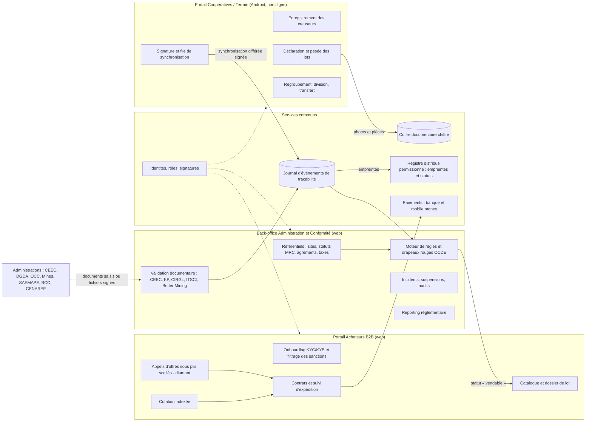
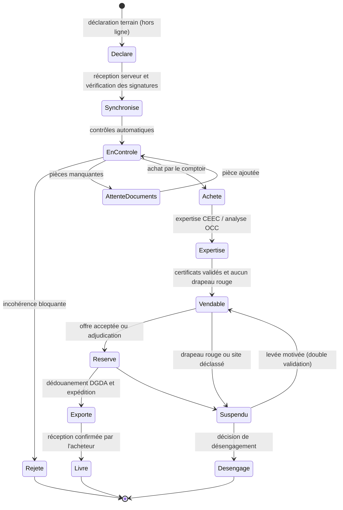

# Comptoir de vente en ligne de minerais certifiés issus de l'exploitation artisanale en RDC

## Dossier de spécifications fonctionnelles et techniques. Partie 1/3 : sections 1 et 2

| Élément | Valeur |
|---|---|
| Version | 0.1 (projet, à relire) |
| Date | 23 septembre 2026 |
| Périmètre de cette partie | §1 Cartographie des acteurs et cadre réglementaire ; §2 Architecture fonctionnelle |
| Parties suivantes | Partie 2 : §3 Modèle de données et traçabilité, §4 Architecture technique. Partie 3 : §5 Flux financiers, §6 Workflow mine-port, §7 Risques et feuille de route |
| Relecture obligatoire | Juriste minier inscrit au barreau en RDC (§1 en entier), responsable conformité LBC/FT (§1.3, §2.b), expert du MRC/CIRGL (§1.4) |

---

## 0. Conventions de lecture et hypothèses de cadrage

### 0.1 Qualification des exigences

Chaque exigence porte l'une des étiquettes suivantes :

| Étiquette | Signification | Conséquence si elle n'est pas respectée |
|---|---|---|
| **[LÉGAL-RDC]** | Obligation découlant du droit congolais (loi, décret, arrêté, instruction BCC) | Sanction administrative ou pénale, retrait d'agrément, saisie, blocage à l'export |
| **[LÉGAL-EXT]** | Obligation légale étrangère qui s'impose à l'**acheteur** ou à l'importateur, et qui se répercute par contrat sur la plateforme (Règlement UE 2017/821, Dodd-Frank §1502, régimes de sanctions) | Pas de sanction directe pour l'opérateur congolais, mais perte du débouché commercial |
| **[NORME]** | Norme ou programme volontaire (Guide OCDE hors transposition, LBMA RGG, RMI RMAP, ITSCI, Better Mining) | Pas de sanction légale ; exclusion de fait des chaînes des raffineries et fonderies conformes |
| **[BP]** | Bonne pratique recommandée par l'équipe projet | Risque opérationnel ou réputationnel accru |
| **⚠ À vérifier** | Référence dont la version en vigueur, le numéro exact, le taux ou le champ d'application n'est pas confirmé par l'équipe projet à la date du document | La règle doit être confirmée dans le texte en vigueur avant d'être codée |

Deux remarques de méthode :

1. **Le Guide OCDE est une norme volontaire dans sa nature, mais il est rendu obligatoire en RDC** par voie réglementaire pour la filière 3T et or (arrêtés du Ministère des Mines relatifs au devoir de diligence et au MRC, ⚠ à vérifier : références exactes et existence d'une extension au diamant). Il est aussi rendu obligatoire pour les importateurs de l'UE par le Règlement 2017/821. Selon l'acteur, il est donc à la fois [LÉGAL-RDC], [LÉGAL-EXT] et [NORME].
2. **Aucune interface informatique (API) officielle n'est supposée exister** avec une administration congolaise (CEEC, DGDA, SAEMAPE, Division des Mines, BCC, CENAREF, CAMI) ni avec les programmes ITSCI ou Better Mining. Là où une intégration est nécessaire, le document prévoit une saisie manuelle validée à deux personnes, ou un échange de fichiers signés. Si une API est confirmée plus tard, elle remplacera ce mode sans changer le modèle de données.

### 0.2 Hypothèses de cadrage (paramètres non renseignés)

Les paramètres du projet n'ont pas été fournis. Les hypothèses ci-dessous servent de base de travail. **Chacune doit être confirmée ou remplacée par le porteur de projet** : plusieurs d'entre elles changent la conception, en particulier H1, H2 et H5.

| # | Paramètre | Hypothèse retenue | Justification / effet sur la conception |
|---|---|---|---|
| H1 | Opérateur et statut juridique | Société de droit congolais **en cours d'agrément comme comptoir d'achat et de vente** de substances minérales d'exploitation artisanale. En attendant l'agrément, elle opère comme **prestataire technologique d'un comptoir agréé partenaire**, qui reste l'acheteur et l'exportateur légal. | La plateforme ne doit jamais placer un acheteur étranger en position d'acheter directement à une coopérative : le titre de propriété passe coopérative → comptoir agréé → acheteur. Le modèle « marketplace » pur (mise en relation entre coopérative et acheteur étranger) est écarté, car il expose à un exercice illégal de l'activité de comptoir ou de négociant (⚠ à vérifier avec le juriste). |
| H2 | Un agrément distinct par substance | Agréments séparés pour l'or, le diamant et les 3T (un comptoir agréé pour le diamant ne l'est pas d'office pour l'or) | Le back-office gère un registre des agréments par substance et bloque toute vente hors périmètre. ⚠ À vérifier : régime d'agrément par substance et, pour le coltan, articulation avec l'ARECOMS. |
| H3 | Provinces et sites | Or : **Haut-Uele et Tshopo** (sites hors zones de conflit actif). Diamant : **Kasaï et Kasaï-Central**. 3T : **Tanganyika et Haut-Lomami** (cassitérite, coltan), **Maniema** (cassitérite, wolframite). Nord-Kivu, Sud-Kivu et Ituri sont **exclus du MVP**. | Depuis 2025, une partie du Nord-Kivu et du Sud-Kivu (dont Goma, Bukavu et la zone de Rubaya) est contrôlée par des groupes armés non étatiques (⚠ situation à réévaluer à la date du lancement). Ces zones relèvent de l'Annexe II du Guide OCDE (soutien à des groupes armés) et rendraient les lots invendables aux raffineries conformes. L'Ituri connaît des violences armées récurrentes sur des sites aurifères. |
| H4 | Volumes annuels visés (année 2) | Or : 300 kg bruts. Diamant brut : 60 000 ct. Cassitérite : 600 t. Coltan : 120 t. Wolframite : 60 t. | Ordres de grandeur pour dimensionner le système (≈ 3 000 à 8 000 lots par an, ≈ 50 000 événements de traçabilité par an). À remplacer par les volumes réels du plan d'affaires. |
| H5 | Marchés acheteurs | Or : Émirats arabes unis, Suisse, Inde. Diamant : Belgique (Anvers), Émirats, Inde. 3T : UE et Chine, via des fonderies RMAP. | Détermine les normes à satisfaire : LBMA RGG (or, raffineries accréditées), Processus de Kimberley (diamant), RMAP (3T), Règlement UE 2017/821 (importateurs de l'UE). Les exigences des Émirats pour l'or (réglementation UAE Good Delivery et diligence du Ministère de l'Économie) sont ⚠ à vérifier. |
| H6 | Points d'exportation | Or et diamant : **aéroport international de N'Djili (Kinshasa)**. 3T : **Kasumbalesa** (route vers Dar es Salaam ou Durban) et **Kalemie** (lac Tanganyika, vers Kigoma et Dar es Salaam). Goma et Bukavu sont exclus (voir H3). | Chaque point de sortie doit disposer d'un bureau DGDA, d'une présence CEEC ou OCC et d'un agent des Mines. ⚠ À vérifier : le point de sortie autorisé pour chaque substance. |
| H7 | Budget et délai du MVP | 450 000 à 600 000 USD ; 9 mois jusqu'au pilote sur un site. | Pousse vers des composants éprouvés, un registre permissionné géré, une seule substance pilote (voir §7 dans la partie 3). |
| H8 | Équipe technique | 7 ETP : 1 architecte ou tech lead, 2 développeurs backend, 1 développeur mobile Android, 1 développeur frontend, 1 ingénieur DevOps/SecOps, 1 analyste QA et données. Plus un responsable conformité, un juriste minier (temps partiel) et deux agents de terrain formateurs. | Taille compatible avec une stack unifiée (TypeScript ou Kotlin) et des services managés. |
| H9 | Substance pilote | **Cassitérite** dans un site vert déjà couvert par un programme d'étiquetage (ITSCI ou Better Mining) | Chaîne documentaire la plus standardisée, risque de fraude par unité de valeur plus faible que l'or. Permet de roder le terrain avant l'or. |
| H10 | Langues | Français, swahili, lingala **et tshiluba** | Le lingala et le swahili couvrent mal les sites diamantifères du Kasaï, où le tshiluba est la langue véhiculaire. Ajout signalé par l'équipe, à confirmer. |

---

## 1. Cartographie des acteurs et cadre réglementaire

### 1.1 Sources juridiques et normatives

| Source | Nature | Institution compétente | Ce que la plateforme doit en tirer | Statut de la référence |
|---|---|---|---|---|
| Loi n°007/2002 du 11 juillet 2002 portant Code minier, **modifiée et complétée par la loi n°18/001 du 9 mars 2018** | [LÉGAL-RDC] | Ministère des Mines ; Divisions provinciales des Mines ; CAMI | Régime des zones d'exploitation artisanale (ZEA), cartes d'exploitant artisanal, coopératives, négociants, comptoirs, redevance minière, substances stratégiques, obligations de traçabilité | Texte identifié. ⚠ Numéros d'articles à vérifier sur la version consolidée |
| Décret n°038/2003 du 26 mars 2003 portant Règlement minier, **modifié par le décret n°18/024 du 8 juin 2018** | [LÉGAL-RDC] | Ministère des Mines | Procédures d'agrément (coopératives, comptoirs), cartes de négociant, registres, déclarations périodiques, formulaires | ⚠ Contenu des annexes et formulaires à vérifier |
| Décret portant déclaration de substances minérales stratégiques (cobalt, germanium, **columbo-tantalite** ; décret n°18/042 du 24 novembre 2018) | [LÉGAL-RDC] | Premier ministre, Ministère des Mines | Redevance majorée, régime particulier de commercialisation du coltan | ⚠ À vérifier : liste en vigueur (elle peut avoir été modifiée depuis) |
| Décret créant l'**ARECOMS** (Autorité de régulation et de contrôle des marchés des substances minérales stratégiques, 2019) | [LÉGAL-RDC] | ARECOMS | Contrôle des prix, des quotas et des conditions de commercialisation des substances stratégiques | ⚠ À vérifier : champ d'intervention effectif sur le coltan artisanal, procédures et documents exigés. En 2025, l'ARECOMS a appliqué une suspension puis des quotas d'exportation au cobalt ; un dispositif comparable sur le coltan ne peut pas être exclu. |
| Arrêtés du Ministère des Mines relatifs à la mise en œuvre du **MRC de la CIRGL** et du **Guide OCDE** (dont l'arrêté ministériel n°0057 de 2012, ⚠ numéro et date à vérifier), arrêtés de qualification et de validation des sites miniers | [LÉGAL-RDC] | Ministère des Mines ; équipes conjointes de qualification | Commercialisation limitée aux sites qualifiés vert ; devoir de diligence obligatoire ; certificat CIRGL pour l'export | ⚠ À vérifier : liste des arrêtés en vigueur, publication de la liste des sites qualifiés |
| Protocole de la CIRGL contre l'exploitation illégale des ressources naturelles (2006) ; Déclaration de Lusaka (2010) ; **Manuel de certification du MRC** | Engagement régional, transposé en droit interne | CIRGL ; point focal national | Critères d'inspection des sites, format du certificat régional, base de données régionale | ⚠ Version du manuel à vérifier |
| **Processus de Kimberley** (système de certification, 2003) | Engagement intergouvernemental, transposé en droit interne | Ministère des Mines ; **CEEC** comme autorité d'émission (⚠ à vérifier) | Certificat KP obligatoire à chaque exportation de diamant brut ; conteneur scellé | Identifié |
| Réglementation de change de la **BCC** (instructions administratives relatives aux opérations d'exportation, au rapatriement et à la domiciliation) | [LÉGAL-RDC] | Banque Centrale du Congo | Domiciliation bancaire des exportations, déclaration d'exportation, délai et quotité de rapatriement des recettes | ⚠ Numéros d'instructions, délais et pourcentages à vérifier |
| Loi n°22/068 du 27 décembre 2022 portant lutte contre le blanchiment de capitaux, le financement du terrorisme et de la prolifération | [LÉGAL-RDC] | **CENAREF** ; autorités de contrôle sectorielles | Les négociants en métaux et pierres précieux sont des entreprises et professions non financières désignées (EPNFD) : vigilance clientèle, bénéficiaire effectif, déclarations de soupçon, conservation des pièces | ⚠ Numéro, date et textes d'application à vérifier |
| Recommandations du **GAFI** (R.10, R.12, R.22, R.23, R.24, R.25) | [NORME] internationale, transposée en loi nationale | GAFI ; GABAC (organisme régional) | Base des règles KYC/KYB et de la déclaration de soupçon | La RDC figurait sur la liste grise du GAFI depuis octobre 2022 (⚠ statut actuel à vérifier). Cela entraîne une vigilance renforcée des banques correspondantes étrangères. |
| Ordonnance-loi n°23/010 du 13 mars 2023 portant **Code du numérique** (protection des données à caractère personnel, services de confiance, signature électronique) | [LÉGAL-RDC] | Autorité de protection des données prévue par le Code (⚠ à vérifier : autorité opérationnelle ou non) | Base légale du traitement des données des creuseurs ; valeur juridique de la signature électronique des déclarations | ⚠ Textes d'application et prestataires de services de confiance qualifiés à vérifier |
| Réglementation de la monnaie électronique (instructions BCC) | [LÉGAL-RDC] | BCC | Plafonds des portefeuilles mobile money, KYC par niveaux (détaillé en partie 3) | ⚠ À vérifier |
| **Guide OCDE** sur le devoir de diligence (3e édition, 2016) et ses suppléments sur l'or et sur l'étain, le tantale et le tungstène | [NORME], rendue [LÉGAL-RDC] et [LÉGAL-EXT] selon le cas | OCDE | Démarche en 5 étapes, Annexe II (risques), gestion des risques par suspension ou désengagement | Identifié |
| **Règlement (UE) 2017/821** (applicable depuis le 1er janvier 2021) | [LÉGAL-EXT] | Autorités compétentes des États membres | S'impose aux importateurs de l'UE au-delà des seuils annuels de l'Annexe I (étain, tantale, tungstène, leurs minerais et l'or). Les importateurs demanderont les données de l'étape 2 du Guide OCDE (mine d'origine, quantités, dates, fournisseurs). | La révision de l'Annexe I et la liste indicative des zones de conflit ou à haut risque (CAHRA) sont ⚠ à vérifier |
| **Dodd-Frank Act, section 1502** et règle SEC 13p-1 | [LÉGAL-EXT] | SEC (États-Unis) | Les émetteurs cotés aux États-Unis déposent un Form SD et un Conflict Minerals Report pour les 3TG originaires de la RDC et des pays voisins | ⚠ À vérifier : maintien ou abrogation au moment du lancement (des propositions d'abrogation ont circulé) |
| **RMI** : RMAP et modèle CMRT | [NORME] | Responsible Minerals Initiative | Les fonderies et raffineries 3T conformes exigent la preuve d'origine de chaque lot, et en général la couverture par un programme en amont | Identifié |
| **LBMA Responsible Gold Guidance** (version 9 ; ⚠ à vérifier si une version 10 est en vigueur) | [NORME] | LBMA | Les raffineries Good Delivery doivent appliquer une diligence renforcée à l'or artisanal (ASM), en particulier en provenance d'une CAHRA | Identifié |
| **ITSCI** (programme de traçabilité et de diligence 3T) ; **Better Mining** (RCS Global) | [NORME] | Opérateurs privés des programmes | Étiquettes par sac ou par lot, registres, rapports d'incidents, surveillance indépendante | Aucune API publique supposée (voir §0.1) |
| Régimes de sanctions : Conseil de sécurité de l'ONU (**Comité 1533 relatif à la RDC**), OFAC (États-Unis), UE, Royaume-Uni (OFSI) | [LÉGAL-EXT] pour les acheteurs ; [LÉGAL-RDC] pour les résolutions de l'ONU | ONU, Trésor américain, Conseil de l'UE, HM Treasury | Filtrage obligatoire des contreparties et des bénéficiaires effectifs. Les rapports du Groupe d'experts de l'ONU sur la RDC sont une source de drapeaux rouges. | Listes à interroger en continu |

### 1.2 Cartographie des acteurs

Colonne « Intégration » : **M** saisie manuelle validée à deux personnes ; **F** échange de fichiers signés ; **U** utilisateur de la plateforme ; **—** aucune interaction directe.

| Acteur | Nature | Rôle dans la chaîne | Documents émis | Documents exigés | Point d'intervention | Intégration |
|---|---|---|---|---|---|---|
| **Creuseur (exploitant artisanal)** | Personne physique de nationalité congolaise (le Code de 2018 réserve l'exploitation artisanale aux nationaux, ⚠ à vérifier) | Extraction dans une ZEA | Aucun document formel ; déclaration de production faite via la coopérative | **Carte d'exploitant artisanal** en cours de validité, délivrée par la Division provinciale des Mines (⚠ autorité et durée de validité à vérifier) | Extraction | U (indirect, via la coopérative) |
| **Coopérative minière agréée** | Personne morale ; agrément ministériel (⚠ à vérifier : autorité compétente et avis préalable du SAEMAPE) | Encadre les creuseurs, regroupe la production, vend aux négociants ou aux comptoirs | Liste des membres, registre de production, fiche de déclaration de lot, bon de vente, plan de gestion environnementale | Arrêté d'agrément, statuts, liste des membres titulaires de cartes, droit d'exploiter dans la ZEA | Regroupement, première vente | **U** (portail terrain) |
| **Négociant** | Personne physique congolaise, **carte de négociant** (⚠ autorité de délivrance à vérifier) | Achète aux creuseurs ou aux coopératives, revend aux comptoirs | Bon d'achat, registre d'achats, déclarations périodiques | Carte de négociant, registre tenu à jour | Entre le site et le comptoir | U (optionnel ; à limiter, voir remarque 1) |
| **Comptoir d'achat et de vente agréé** (opérateur, H1) | Personne morale ; agrément par le Ministre des Mines, par substance | Achète, conditionne, fait expertiser et certifier, exporte | Factures, déclarations d'exportation, rapports de diligence OCDE (étape 5), registres | Agrément de comptoir, garantie financière le cas échéant, chaîne documentaire complète des lots achetés | Achat, export | **U** (back-office) |
| **Entité de traitement** (fonderie locale de l'or, laverie ou unité de concentration des 3T) | Personne morale ; autorisation spécifique (⚠ à vérifier) | Transformation : fonte de l'or en lingots dorés, concentration des 3T | Certificat de fonte ou de traitement, bilan matière entrée/sortie | Chaîne documentaire des intrants | Traitement | U ou F |
| **SAEMAPE** (Service d'assistance et d'encadrement de l'exploitation minière artisanale et à petite échelle, anciennement SAESSCAM) | Service public technique, Ministère des Mines | Encadrement technique des creuseurs, statistiques de production, présence sur les sites | Statistiques de production, fiches de suivi, attestations | Déclarations de production des coopératives | Site | M (agents SAEMAPE éventuellement utilisateurs en lecture) |
| **Division provinciale des Mines** / **Ministère des Mines** | Administration | Délivrance des cartes, contrôle des registres, agents de traçabilité sur site, qualification des sites, agréments | Cartes d'exploitant et de négociant, fiches ou cahiers de traçabilité, attestations d'origine, procès-verbaux de contrôle, arrêtés de qualification des sites | Registres et déclarations des opérateurs | Site, transport, export | M |
| **CAMI** (Cadastre minier) | Établissement public | Institution, délimitation et publication des ZEA et des titres miniers | Coordonnées officielles des ZEA et des périmètres | — | Référentiel géographique | F (import des périmètres publiés, si disponibles) |
| **CEEC** (Centre d'expertise, d'évaluation et de certification des substances minérales précieuses et semi-précieuses) | Établissement public | Expertise (poids, teneur, valeur) de l'or et du diamant ; émission du certificat KP ; émission du certificat CIRGL (⚠ à vérifier pour les 3T, où l'intervention de la CEEC et de l'OCC se partage selon les provinces) | Rapport d'expertise et d'évaluation, certificat KP, certificat CIRGL, scellés | Lot physique, documents d'origine, déclaration d'exportation | Avant export | M (vérification documentaire en back-office) |
| **ARECOMS** | Autorité de régulation | Contrôle de la commercialisation du **coltan** en tant que substance stratégique | Autorisations, avis, prix de référence (⚠ à vérifier) | Déclarations de vente et d'exportation (⚠ à vérifier) | Vente, export (coltan) | M |
| **DGDA** (Direction générale des douanes et accises) | Administration fiscale | Dédouanement à l'export, liquidation des droits et taxes | Déclaration en douane, quittances, bon à enlever / autorisation de sortie | Facture, certificats CEEC/KP/CIRGL, déclaration d'exportation visée par la banque, liste de colisage | Point de sortie | M (saisie du numéro de déclaration et téléversement des pièces) |
| **OCC** (Office congolais de contrôle) | Établissement public | Contrôle de la qualité et de la quantité à l'export ; échantillonnage et analyse des 3T (⚠ répartition CEEC/OCC selon la substance à vérifier) | Certificat d'analyse, rapport de pesée et d'échantillonnage | Accès au lot, demande de contrôle | Avant export | M |
| **BCC** (Banque Centrale du Congo) et banques commerciales agréées | Autorité monétaire ; intermédiaires agréés | Encadrement du change, domiciliation des exportations, rapatriement des devises | Déclaration d'exportation domiciliée, attestation de rapatriement | Contrat de vente, facture proforma, preuve de rapatriement | Contractualisation, encaissement | F (relevés bancaires, attestations) |
| **CENAREF** (Cellule nationale des renseignements financiers) | Cellule de renseignement financier | Réception et analyse des déclarations de soupçon | Accusés de réception, demandes d'information | Déclarations de soupçon, déclarations d'opérations en espèces au-delà des seuils (⚠ seuils à vérifier) | Transversal | M (déclaration faite par le responsable conformité ; la plateforme prépare le dossier) |
| **Police des mines et des hydrocarbures** / services de sécurité | Force publique | Sécurisation des sites et des convois | Procès-verbaux | — | Site, transport | — (sa présence sur un site est une donnée de risque OCDE, Annexe II §3) |
| **ITSCI** | Programme sectoriel | Étiquetage des sacs aux points de production et de traitement, registres, suivi des incidents | Numéros d'étiquettes, registres, rapports d'incidents, résumés de risque | Adhésion de l'exportateur, cotisations, registres tenus par les agents | Site → export | M ou F (aucune API publique supposée) |
| **Better Mining** (RCS Global) | Programme sectoriel | Surveillance des sites, gestion des incidents, données de traçabilité | Rapports de surveillance, alertes | Adhésion, accès aux sites | Site → export | M ou F |
| **Acheteurs** (négociants internationaux, raffineries, fonderies, diamantaires) | Personnes morales étrangères | Achètent au comptoir | Contrat, lettre de crédit, questionnaires de diligence, CMRT | KYB du vendeur, dossier de lot, certificats, rapports de diligence | Vente | **U** (portail acheteurs) |
| **Raffineries d'or** (LBMA Good Delivery, UAE Good Delivery) et **fonderies 3T** (RMAP) | Aval | Transformation finale ; font l'objet d'audits de conformité | Rapports d'essai (teneur réelle), confirmation de réception | Dossier de diligence complet par lot, preuve d'origine | Aval | U (lecture du dossier) ou F |
| **Auditeurs tiers** (audit de la diligence, étape 4 OCDE) | Prestataires indépendants | Audit de la conformité de la plateforme et du comptoir | Rapports d'audit | Accès en lecture aux registres et aux preuves | Annuel | U (rôle auditeur en lecture seule) |
| **Société civile et comités locaux de suivi** | Organisations non gouvernementales | Surveillance et alerte au niveau des sites ; participation aux équipes conjointes de qualification des sites | Alertes, rapports | — | Site | U (canal d'alerte, [BP]) |

**Remarque 1 : réduire les intermédiaires.** [BP] Chaque négociant supplémentaire entre la coopérative et le comptoir est un point possible de mélange de production d'origine inconnue. Le MVP privilégie l'achat direct aux coopératives agréées. Un lot passant par un négociant n'est accepté que si le négociant utilise lui-même le portail terrain.

**Remarque 2 : la plateforme n'est pas une autorité.** Aucune donnée saisie dans la plateforme ne remplace un document officiel. La plateforme **enregistre, contrôle la cohérence et scelle cryptographiquement** les documents officiels et les déclarations. L'original papier ou numérique reste la preuve juridique.

### 1.3 Exigences spécifiques par substance

#### 1.3.1 Or artisanal (poudre, pépites, lingots dorés)

| Domaine | Exigence | Qualification | Institution | Statut |
|---|---|---|---|---|
| Origine | Production issue d'une ZEA et d'un site qualifié **vert** (ou jaune, sous conditions) au titre du MRC | [LÉGAL-RDC] | Ministère des Mines, équipes conjointes | ⚠ Arrêté en vigueur à vérifier |
| Traçabilité amont | Fiche ou cahier de traçabilité tenu par l'agent des Mines ; bon d'achat coopérative → comptoir | [LÉGAL-RDC] | Division provinciale des Mines | ⚠ Formulaires à vérifier |
| Expertise | Pesée, essai de teneur (titre en millièmes), évaluation de la valeur, apposition de scellés | [LÉGAL-RDC] | CEEC | Identifié |
| Certificat régional | Certificat CIRGL par expédition | [LÉGAL-RDC] (transposition du MRC) | CEEC (⚠ à vérifier) | Identifié |
| Diligence | Guide OCDE, supplément sur l'or : diligence renforcée pour l'or ASM | [LÉGAL-RDC], [LÉGAL-EXT] (importateur UE), [NORME] (LBMA) | Comptoir ; auditeurs | Identifié |
| Acceptation raffinerie | LBMA RGG : vérification du fournisseur, visite de site, plan de gestion des risques, suivi des transactions ; certaines raffineries refusent l'or ASM des zones à haut risque sans programme en amont reconnu | [NORME] | LBMA ; raffinerie | ⚠ Politique propre à chaque raffinerie cible |
| Redevance minière | Taux de référence de **3,5 %** pour les métaux précieux (article 241 du Code modifié), assis sur la valeur commerciale brute | [LÉGAL-RDC] | DGRAD / Ministère des Mines ; perception à l'export | ⚠ Taux et modalités applicables à la filière artisanale, et éventuels taux réduits provinciaux ou incitatifs, à vérifier |
| Autres prélèvements | Frais ou rémunération de la CEEC, taxes provinciales, droits de sortie DGDA, frais OCC le cas échéant | [LÉGAL-RDC] | CEEC, provinces, DGDA, OCC | ⚠ **Aucun taux n'est codé en dur** : table paramétrable, versionnée et datée |
| Change | Domiciliation de l'exportation auprès d'une banque agréée ; rapatriement des recettes selon les délais et quotités de la BCC | [LÉGAL-RDC] | BCC | ⚠ Délais et pourcentages à vérifier |
| LBC/FT | Vigilance renforcée : or = actif de valeur, facile à transporter et à échanger, fréquemment utilisé pour le blanchiment ; filtrage des acheteurs ; déclaration de soupçon | [LÉGAL-RDC] | CENAREF | Identifié |
| Transport | Transport sécurisé, colis scellés, convoyeur identifié | [BP] ; exigences de sécurité aérienne [LÉGAL] | Compagnie aérienne, autorités aéroportuaires | — |

#### 1.3.2 Diamants bruts

| Domaine | Exigence | Qualification | Institution | Statut |
|---|---|---|---|---|
| Origine | Production issue d'une ZEA diamantifère ; achat par un comptoir agréé pour le diamant | [LÉGAL-RDC] | Ministère des Mines | Identifié |
| MRC | **Le MRC ne couvre pas le diamant** (il vise les 3T et l'or). Le diamant relève du Processus de Kimberley. La qualification vert/jaune/rouge ne s'applique pas formellement ; la plateforme applique néanmoins une évaluation de risque du site selon l'Annexe II OCDE. | [NORME] et [BP] | — | ⚠ À vérifier : dispositif national de qualification des sites diamantifères |
| Expertise | Tri, pesée en carats, classement (taille, forme, couleur, pureté, modèle), évaluation de la valeur par la CEEC ; possible contre-expertise | [LÉGAL-RDC] | CEEC | Identifié |
| Certificat | **Certificat du Processus de Kimberley** par expédition ; colis inviolable ; notification de l'autorité KP du pays importateur | [LÉGAL-RDC] (KP) | CEEC (émission, ⚠ à vérifier), Ministère des Mines | Identifié |
| Déclaration de garanties | Chaîne de déclarations « le diamant provient de sources exemptes de conflits » (système de garanties du WDC) sur les factures en aval | [NORME] | World Diamond Council | Identifié |
| Redevance | Taux de référence de **6 %** pour les pierres précieuses (article 241) | [LÉGAL-RDC] | DGRAD / Ministère des Mines | ⚠ Taux applicable au diamant artisanal à vérifier (un régime spécifique a pu s'appliquer) |
| Autres prélèvements | Rémunération de la CEEC, taxes provinciales, DGDA | [LÉGAL-RDC] | — | ⚠ Table paramétrable |
| Évaluation de prix | La valeur déclarée à l'export est confrontée à l'évaluation CEEC : **un prix de vente inférieur à l'évaluation CEEC** constitue un indice de sous-facturation | [LÉGAL-RDC] (contrôle) et [BP] (alerte) | CEEC, DGDA | ⚠ Règle de tolérance à vérifier |
| Change et LBC/FT | Identiques à l'or ; le diamant est aussi un actif à haut risque de blanchiment | [LÉGAL-RDC] | BCC, CENAREF | — |

#### 1.3.3 Minerais 3T : cassitérite (Sn), coltan (Ta), wolframite (W)

| Domaine | Exigence | Qualification | Institution | Statut |
|---|---|---|---|---|
| Origine | Site qualifié **vert** (ou jaune sous conditions) au titre du MRC | [LÉGAL-RDC] | Ministère des Mines | Identifié |
| Étiquetage | Étiquettes « mine » et « négociant/traitement » par sac, registres (ITSCI) ou dispositif équivalent (Better Mining) | [NORME] ; de fait exigé par les fonderies RMAP | ITSCI / Better Mining | La plateforme **enregistre** les numéros d'étiquettes et **n'en émet pas** |
| Analyse | Échantillonnage et analyse de la teneur (Sn %, Ta₂O₅ %, WO₃ %), de l'humidité et de la radioactivité (le coltan peut contenir de l'uranium et du thorium) | [LÉGAL-RDC] (contrôle export) ; exigence de transport des matières radioactives [LÉGAL] | OCC ou CEEC (⚠ à vérifier) ; autorité de radioprotection (CGEA, ⚠ à vérifier) | Identifié |
| Certificat régional | Certificat CIRGL par expédition | [LÉGAL-RDC] | CEEC (⚠ à vérifier) | Identifié |
| Coltan : substance stratégique | Redevance majorée (**10 %** pour les substances stratégiques, article 241 ; ⚠ à vérifier), contrôle de l'ARECOMS | [LÉGAL-RDC] | ARECOMS, Ministère des Mines | ⚠ **Priorité de vérification** |
| Cassitérite, wolframite | Redevance de référence de **3,5 %** pour les métaux non ferreux et de base (article 241) | [LÉGAL-RDC] | DGRAD | ⚠ Modalités à vérifier |
| Diligence aval | Données « étape 2 OCDE » exigées par les importateurs de l'UE (Règlement 2017/821) et par les fonderies RMAP : mine d'origine, localisation, quantités, dates, taxes payées | [LÉGAL-EXT], [NORME] | Importateur, fonderie | Identifié |
| Change | Identique à l'or | [LÉGAL-RDC] | BCC | ⚠ À vérifier |
| Transport | Transport routier ou lacustre vers le point de sortie ; plombage des camions et conteneurs ; transit (COMESA / SADC) | [LÉGAL-RDC] ; conventions de transit | DGDA | ⚠ Régime de transit à vérifier |

### 1.4 Statut des sites au titre du MRC et conséquences sur la commercialisation

Le MRC prévoit une inspection des sites par une **équipe conjointe** (administration des mines, SAEMAPE, société civile et autres parties prenantes, selon la composition fixée par l'arrêté national, ⚠ à vérifier). Le résultat est publié par arrêté ministériel. La plateforme importe cette liste officielle (mode **M** : saisie validée à deux personnes, avec la référence de l'arrêté et le document source) et **ne qualifie jamais un site elle-même**.

| Statut | Critères (résumé du manuel MRC, ⚠ formulation exacte à vérifier) | Conséquence réglementaire | Règle appliquée par la plateforme |
|---|---|---|---|
| **Vert** | Aucune présence de groupes armés non étatiques ni de forces de sécurité publiques ou privées illégales ; pas de travail des enfants ; pas de travail forcé ; droit d'exploiter en règle ; traçabilité en place | Production commercialisable et exportable avec certificat CIRGL | Lot **vendable** si aucun drapeau rouge ouvert |
| **Jaune** | Atteintes mineures ou irrégularités corrigibles (par exemple : taxation illégale ponctuelle, lacunes de traçabilité, conditions de sécurité insuffisantes), sans lien avec un groupe armé | Commercialisation possible **pendant un délai de mise en conformité** (délai de 6 mois cité dans le manuel, ⚠ à vérifier), sous plan d'atténuation et suivi | Lot vendable **avec bandeau « site jaune »** visible par l'acheteur ; plan d'atténuation joint au dossier ; **blocage automatique** à l'expiration du délai sans nouvelle inspection |
| **Rouge** | Présence ou contrôle d'un groupe armé, taxation illégale par un groupe armé ou par des éléments incontrôlés des forces publiques, pires formes de travail des enfants, travail forcé, atteintes graves aux droits humains | **Commercialisation interdite** ; les minerais ne peuvent pas être certifiés | Enregistrement de nouveaux lots **refusé** ; lots en stock **suspendus** ; alerte au responsable conformité ; **désengagement** du fournisseur au sens du Guide OCDE |
| **Non inspecté / non qualifié** | Aucune inspection publiée ou inspection périmée | Production non certifiable (⚠ à vérifier : existence d'un régime transitoire) | Enregistrement possible (pour la traçabilité et la mesure de la production), **mise en vente bloquée** |

Règles complémentaires [BP] :

- **Le statut est daté.** Chaque lot conserve le statut du site à la date d'extraction **et** le statut courant. Un site qui passe au rouge après l'extraction déclenche un réexamen manuel de tous les lots non encore exportés qui en proviennent.
- **Les informations externes priment sur un statut vert périmé.** Un rapport du Groupe d'experts de l'ONU, une alerte ITSCI ou Better Mining, ou un signalement de la société civile qui mentionne un site vert ouvre un drapeau rouge et suspend les ventes jusqu'à décision motivée du responsable conformité.
- **Couverture géographique.** Un lot dont la géolocalisation de déclaration est hors du périmètre de la ZEA (publié par le CAMI ou relevé lors de l'inspection) avec une marge de tolérance paramétrable (proposition : 2 km, à ajuster selon la qualité des périmètres) est bloqué.

### 1.5 Conséquences sur le modèle d'affaires

1. **Chaîne de propriété imposée.** Creuseur → coopérative agréée → (négociant titulaire d'une carte) → comptoir agréé → acheteur étranger. La plateforme matérialise chaque transfert de propriété par un événement signé et un document de vente.
2. **La vente en ligne est une vente du comptoir.** Le contrat de vente à l'export est conclu entre le comptoir agréé et l'acheteur. La plateforme est l'outil commercial et de conformité du comptoir, pas une place de marché ouverte.
3. **Opérateur non encore agréé (H1).** Tant que l'agrément n'est pas obtenu, l'opérateur ne doit ni acheter, ni détenir, ni vendre de minerais pour son compte. Le contrat avec le comptoir partenaire doit préciser la répartition des responsabilités de diligence et d'LBC/FT, ainsi que la propriété des données. ⚠ À vérifier avec le juriste : la rémunération de l'opérateur (commission sur les ventes) peut-elle être requalifiée en activité d'intermédiaire soumise à agrément ?
4. **Blockchain : limite structurelle.** Un registre distribué garantit que les données enregistrées n'ont pas été modifiées après coup. Il ne garantit pas que la déclaration initiale est vraie : qu'un sac de cassitérite déclaré « site A, 50 kg » vient réellement du site A (**problème de l'oracle**). Les contrôles physiques et documentaires qui comblent cette faille sont définis au §2 (captures au point d'origine, co-signatures, contrôles croisés de volumes) et seront détaillés aux §3 et §6 (bilan de masse, scellés, contre-pesées, analyses, audits inopinés, empreintes minéralogiques).

---

## 2. Architecture fonctionnelle

### 2.0 Vue d'ensemble

**Principe directeur : un lot n'est visible et achetable au catalogue que si le moteur de règles lui attribue l'état « vendable ».** Cet état est calculé, jamais saisi. Il combine le statut du site, la complétude documentaire, le bilan de masse, l'absence de drapeau rouge ouvert et la validité des agréments de toute la chaîne.

**Cycle de vie d'un lot (vue fonctionnelle, détaillée au §3) :**

### 2.0.1 Rôles

| Rôle | Portail | Périmètre |
|---|---|---|
| `AGENT_COOP` | Terrain | Déclare les lots et enregistre les creuseurs de sa coopérative |
| `RESP_COOP` | Terrain | Valide et co-signe les déclarations et les ventes de sa coopérative |
| `NEGOCIANT` | Terrain | Enregistre ses achats et ses reventes au comptoir |
| `AGENT_COMPTOIR` | Terrain et back-office | Réceptionne, contre-pèse et achète les lots |
| `OBSERVATEUR_ETAT` | Terrain (lecture et visa) | Agent des Mines ou du SAEMAPE qui vise une déclaration (optionnel, selon accord avec l'administration) |
| `CONFORMITE` | Back-office | Valide les documents, traite les drapeaux rouges, suspend et lève les suspensions |
| `RESP_CONFORMITE` | Back-office | Décisions de désengagement, préparation des déclarations CENAREF, levées de suspension (seconde validation) |
| `ADMIN_REF` | Back-office | Maintient les référentiels (sites, statuts MRC, taxes, cours). Toute modification est validée par un second rôle. |
| `COMMERCIAL` | Back-office | Publication des lots, cotations, gestion des appels d'offres |
| `ACHETEUR_ADMIN` / `ACHETEUR_USER` | Acheteurs | Organisation acheteuse et ses utilisateurs |
| `AUDITEUR` | Back-office (lecture seule) | Accès daté et limité dans le temps, journal de consultation |
| `SUPERADMIN_TECH` | Technique | Aucun accès aux données métier en clair ; opérations d'exploitation uniquement |

Règle générale de séparation des tâches [BP] : **nul ne valide sa propre saisie**. Toute décision de conformité qui rend un lot vendable, lève une suspension ou modifie un référentiel exige deux personnes distinctes (principe des quatre yeux).

---

### 2.a Portail Coopératives / Terrain (application mobile hors ligne)

#### 2.a.1 Principes de conception

| Contrainte | Réponse fonctionnelle |
|---|---|
| Connectivité nulle pendant plusieurs jours | Toutes les fonctions de saisie marchent sans réseau. Chaque saisie est un **événement immuable**, signé et mis en file. La synchronisation se fait dès qu'un réseau est disponible (2G/EDGE suffisant), par petits paquets reprenables. Les photos sont envoyées après les données, avec compression progressive. |
| Faible littératie numérique | Parcours linéaires en 3 à 6 écrans, un pictogramme par action, grands boutons, retour vocal optionnel (messages audio pré-enregistrés dans chaque langue), saisie numérique par pavé géant, aucune saisie libre obligatoire. |
| Langues | Français, swahili, lingala, tshiluba (H10). Langue choisie par utilisateur. Pictogrammes identiques dans toutes les langues. |
| Terminaux d'entrée de gamme | Android 8.0 ou supérieur, 2 Go de RAM, 16 Go de stockage ; taille de l'application inférieure à 40 Mo ; aucune dépendance aux services Google obligatoires (certains terminaux vendus en RDC n'en disposent pas de façon fiable). |
| Alimentation instable | Sauvegarde à chaque champ (aucune perte en cas de coupure) ; mode économie d'énergie (GPS à la demande, écran sombre) ; compatibilité avec des batteries externes et des panneaux solaires ; alerte en dessous de 15 % de batterie avant une opération longue. |
| Terminaux partagés | Plusieurs comptes par terminal ; connexion par code PIN à 6 chiffres et, si le terminal le permet, biométrie ; verrouillage automatique après 2 minutes d'inactivité. |
| Perte ou vol du terminal | Données locales chiffrées ; révocation à distance de la clé du terminal à la synchronisation suivante ; les événements signés après la date de révocation déclarée sont rejetés. |

#### 2.a.2 Fonctions

**Enregistrement d'un lot (déclaration d'origine)**

Données capturées, par ordre d'écran :

1. **Substance** : pictogramme (or / diamant / cassitérite / coltan / wolframite).
2. **Site d'origine** : choix dans la liste des sites de la coopérative synchronisée depuis le référentiel. La liste affiche la couleur du statut MRC. Un site rouge ou non qualifié est grisé avec un message explicatif ; pour un site non qualifié, la déclaration reste possible mais le lot est marqué « non vendable ».
3. **Géolocalisation** : capture automatique (GNSS). Précision affichée par un code couleur. En l'absence de fixation après 60 secondes, le lot est enregistré « sans position » et un drapeau de contrôle est ouvert. Le système détecte les positions simulées (option développeur « position fictive » active) et les refuse.
4. **Horodatage** : horloge du terminal **et** horloge GNSS quand elle est disponible. Un écart de plus de 10 minutes entre les deux ouvre un drapeau.
5. **Pesée** : saisie du poids affiché sur la balance, **plus une photo obligatoire de l'afficheur de la balance avec le lot**. Identification de la balance (numéro inscrit au référentiel, date du dernier étalonnage). Unités : grammes pour l'or, carats pour le diamant, kilogrammes pour les 3T.
6. **Photos** : au minimum 2 (lot, afficheur de balance), 4 au maximum. Empreinte SHA-256 calculée **au moment de la capture**, avant toute compression. Métadonnées (position, horodatage) conservées.
7. **Tag ou scellé** : lecture du code-barres ou du QR code de l'étiquette ITSCI ou Better Mining, ou saisie du numéro ; pour l'or et le diamant, numéro du scellé posé sur le contenant. La plateforme vérifie que le numéro n'a jamais été utilisé (vérification locale sur les numéros déjà synchronisés ; vérification définitive côté serveur).
8. **Creuseurs contributeurs** : sélection dans la liste des membres (photo et nom) avec la part déclarée ; obligatoire pour l'or et le diamant, facultatif pour les 3T regroupés au puits.
9. **Déclarant et co-signataire** : signature par code PIN du déclarant et **co-signature** d'une seconde personne présente (responsable de coopérative, agent des Mines ou du SAEMAPE si disponible).
10. **Récapitulatif** lu à voix haute (audio optionnel), puis validation.

**Gestion des creuseurs membres**

- Enregistrement : nom, date de naissance, sexe, photo du visage, numéro de la carte d'exploitant artisanal, date de validité, photo de la carte, numéro de téléphone mobile money (facultatif), consentement au traitement des données (recueilli dans la langue de l'intéressé, avec lecture audio).
- **Contrôle de l'âge** : toute personne dont la date de naissance déclarée indique moins de 18 ans est refusée comme membre et ouvre un drapeau « travail des enfants » (Annexe II OCDE).
- **Détection des doublons** : même numéro de carte, même numéro de téléphone, photo très similaire (comparaison faite côté serveur, pas sur le terminal).
- **Alerte d'expiration** 30 jours avant la fin de validité de la carte ; au-delà, le creuseur ne peut plus être déclaré contributeur.
- **Plafond de production individuelle** [BP] : une production déclarée anormalement élevée pour un creuseur (par exemple au-delà du 99e centile du site sur 30 jours) ouvre un drapeau d'incohérence de volume (voir §3, bilan de masse).

**Regroupement, division et transfert**

- **Regroupement** (fusion) de plusieurs lots d'une même substance, d'un même site ou de sites de même statut, en un lot parent ; les lots enfants sont clôturés ; le poids du parent est pesé à nouveau et comparé à la somme des enfants.
- **Division** d'un lot en plusieurs sous-lots, avec pesée de chacun.
- **Transfert de garde** (remise au transporteur, au négociant, au comptoir) : scan du tag et du scellé, contre-pesée par le destinataire, double signature (remettant et destinataire).
- **Achat par le comptoir** : génération du bon d'achat avec le prix, le mode de paiement (mobile money ou espèces encadrées ; voir partie 3) et les signatures.

**Signature électronique des déclarations**

- Chaque utilisateur possède une **paire de clés liée au terminal et à son compte**, générée dans le magasin de clés matériel d'Android (Keystore, avec StrongBox quand le terminal le permet). L'accès à la clé exige le code PIN de l'utilisateur.
- La signature porte sur le contenu canonique de l'événement (y compris les empreintes des photos), l'identifiant du terminal, un compteur monotone et l'empreinte de l'événement précédent sur ce terminal. Cela forme une **chaîne locale** qui rend visible toute suppression ou réorganisation d'événements.
- Le certificat de la clé est émis par l'autorité de certification de la plateforme au moment de l'enrôlement du terminal, fait en présence physique d'un agent de l'opérateur.
- ⚠ À vérifier : la valeur probante de cette signature au regard du Code du numérique (signature électronique simple ou avancée). La signature électronique ne dispense pas des signatures manuscrites exigées sur les formulaires officiels : l'application peut produire le formulaire pré-rempli à imprimer et faire signer, puis photographier la version signée.

**Gestion des conflits de synchronisation**

Le terminal ne modifie ni ne supprime jamais un événement déjà signé. Une correction est un **nouvel événement** qui référence l'événement corrigé et porte un motif. Les conflits sont donc des conflits métier, pas des conflits d'écriture :

| Cas | Exemple | Résolution |
|---|---|---|
| Double utilisation d'un tag ou d'un scellé | Deux terminaux hors ligne déclarent le même numéro d'étiquette | Le premier événement reçu par le serveur est retenu provisoirement ; **les deux lots sont mis « en contrôle »** et un drapeau de substitution possible est ouvert. Résolution manuelle par la conformité, jamais automatique. |
| Opération sur un lot déjà clôturé | Division d'un lot qui a déjà été fusionné par un autre terminal | Événement rejeté ; notification au déclarant à la synchronisation suivante ; incident enregistré |
| Référentiel périmé sur le terminal | Déclaration sur un site passé au rouge pendant que le terminal était hors ligne | Événement accepté (c'est un fait déclaré) ; lot **suspendu d'office** ; drapeau ouvert |
| Horloge incohérente | Horodatage postérieur à la réception serveur ou antérieur au dernier événement du terminal | Accepté avec marqueur « horodatage non fiable » ; drapeau ouvert |
| Certificat de terminal révoqué | Terminal déclaré volé | Événements signés après la date de révocation rejetés et conservés en quarantaine pour enquête |
| Transfert non confirmé | Remise déclarée par le remettant, jamais confirmée par le destinataire après 72 h (délai paramétrable) | Lot marqué « en transit non confirmé » ; drapeau ; le lot ne peut plus être divisé ni fusionné |

Paramètre de rétention [BP] : les événements restent sur le terminal jusqu'à l'**accusé de réception signé** par le serveur. Si plus de 7 jours d'événements ne sont pas synchronisés, l'application affiche une alerte permanente et limite les nouvelles saisies (paramétrable).

#### 2.a.3 User stories et critères d'acceptation

Priorité (méthode MoSCoW) : **M** indispensable au MVP ; **S** souhaitable au MVP ; **C** phase pilote ou montée en charge.

| ID | Prio. | User story | Critères d'acceptation |
|---|---|---|---|
| T-01 | M | En tant qu'**agent de coopérative**, je veux **enregistrer un lot sans réseau** afin de **déclarer la production au moment de la pesée, sur le site**. | 1) Le mode avion étant activé, l'enregistrement complet (substance, site, position, pesée, 2 photos, tag, signatures) aboutit et le lot apparaît « en attente de synchronisation ». 2) Une coupure d'alimentation à n'importe quel écran ne fait perdre aucun champ déjà saisi. 3) Le parcours complet se fait en moins de 3 minutes par un utilisateur formé (mesure lors des tests terrain). |
| T-02 | M | En tant qu'**agent de coopérative**, je veux que **le site proposé et son statut MRC s'affichent clairement** afin de **ne pas déclarer par erreur une production d'un site non autorisé**. | 1) Seuls les sites rattachés à ma coopérative sont proposés. 2) Chaque site affiche sa couleur et la date de son statut. 3) Un site rouge ne peut pas être sélectionné. 4) Un site non qualifié peut être sélectionné, mais un avertissement « lot non vendable » s'affiche et doit être confirmé. |
| T-03 | M | En tant qu'**agent de coopérative**, je veux **photographier l'afficheur de la balance avec le lot** afin de **prouver le poids déclaré**. | 1) La validation est impossible sans photo de la balance. 2) L'empreinte de la photo est calculée à la capture et incluse dans la signature. 3) La photo ne peut pas être choisie dans la galerie : seule la capture directe par l'appareil photo est autorisée. |
| T-04 | M | En tant qu'**agent de coopérative**, je veux **scanner l'étiquette ou le scellé** afin d'**éviter les erreurs de saisie et les réutilisations**. | 1) La lecture du code-barres et du QR code fonctionne hors ligne. 2) Un numéro déjà présent dans les données locales est refusé. 3) La saisie manuelle du numéro exige une double saisie identique. |
| T-05 | M | En tant que **responsable de coopérative**, je veux **co-signer chaque déclaration** afin de **garantir qu'au moins deux personnes ont constaté la pesée**. | 1) Le déclarant et le co-signataire sont deux comptes distincts. 2) Sans co-signature, le lot reste « brouillon » et n'est pas synchronisé comme déclaration. 3) La co-signature se fait sur le même terminal (PIN du co-signataire). |
| T-06 | M | En tant qu'**agent de coopérative**, je veux **enregistrer un creuseur avec sa carte d'exploitant** afin de **l'associer légalement à la production**. | 1) Numéro de carte, date de validité et photo de la carte sont obligatoires. 2) Une date de naissance indiquant moins de 18 ans bloque l'enregistrement et crée un drapeau « travail des enfants » à la synchronisation. 3) Une carte expirée empêche de désigner ce creuseur comme contributeur. 4) Le consentement est enregistré (horodatage et langue). |
| T-07 | M | En tant qu'**agent de coopérative**, je veux **utiliser l'application dans ma langue avec des pictogrammes** afin de **l'utiliser sans aide**. | 1) Toutes les chaînes existent en français, swahili, lingala et tshiluba. 2) Chaque action principale a un pictogramme et un message audio. 3) Test d'utilisabilité : 8 utilisateurs sur 10 issus du public cible réussissent T-01 sans aide après une formation de 2 heures. |
| T-08 | M | En tant qu'**agent de coopérative**, je veux que **la synchronisation reprenne seule et par morceaux** afin de **profiter d'un réseau faible et intermittent**. | 1) La synchronisation reprend là où elle s'est arrêtée après une coupure. 2) Les données passent avant les photos. 3) Un lot n'est marqué « synchronisé » qu'après l'accusé de réception signé du serveur. 4) Consommation de données inférieure à 50 Ko par lot hors photos. |
| T-09 | M | En tant que **responsable conformité**, je veux que **les conflits de synchronisation ne soient jamais résolus automatiquement lorsqu'ils touchent un tag ou un scellé** afin d'**empêcher une substitution silencieuse de lots**. | 1) Deux lots avec le même tag passent tous les deux « en contrôle ». 2) Un drapeau est créé avec les deux déclarations côte à côte. 3) Aucun des deux lots n'est vendable avant une décision motivée. |
| T-10 | M | En tant qu'**agent du comptoir**, je veux **contre-peser un lot à la réception et comparer au poids déclaré** afin de **détecter les pertes, les ajouts ou les substitutions**. | 1) L'écart est calculé et affiché. 2) Au-delà du seuil de la substance (défini au §3), le lot est bloqué et un drapeau est créé. 3) La contre-pesée comporte sa propre photo de balance. |
| T-11 | M | En tant qu'**agent de coopérative**, je veux **regrouper ou diviser des lots** afin de **refléter les opérations physiques réelles**. | 1) Un regroupement n'accepte que des lots de même substance et de sites vendables. 2) Le poids du lot parent est pesé et comparé à la somme des lots enfants. 3) Une division exige la pesée de chaque sous-lot ; la somme est comparée au lot d'origine. 4) Le lien parent-enfant est conservé et affiché. |
| T-12 | M | En tant qu'**agent du comptoir**, je veux **enregistrer un transfert de garde avec double signature** afin de **savoir à tout moment qui détient physiquement le lot**. | 1) Le transfert exige la signature du remettant et du destinataire. 2) Un transfert non confirmé sous 72 heures crée un drapeau. 3) Un lot en transit ne peut pas être modifié. |
| T-13 | S | En tant qu'**agent des Mines ou du SAEMAPE**, je veux **viser une déclaration de lot sur le terminal de la coopérative** afin d'**attester ma présence lors de la pesée**. | 1) Le visa est une signature distincte liée au compte de l'agent. 2) Le visa augmente le niveau de confiance du lot (indicateur au §3). 3) L'absence de visa n'est pas bloquante au MVP (dépend d'un accord avec l'administration). |
| T-14 | S | En tant que **responsable de coopérative**, je veux **imprimer ou photographier le formulaire officiel pré-rempli** afin de **satisfaire aux exigences papier de l'administration sans double saisie**. | 1) Le formulaire est généré au format prévu (⚠ modèle à obtenir auprès de la Division des Mines). 2) La photo du formulaire signé est rattachée au lot avec son empreinte. |
| T-15 | S | En tant que **creuseur**, je veux **recevoir un SMS récapitulatif de ma contribution et du paiement** afin de **vérifier que ma production a été correctement enregistrée**. | 1) SMS dans la langue du creuseur, sans donnée sensible autre que le poids, la date et le montant. 2) Un numéro court ou un code USSD permet de signaler une anomalie (⚠ à vérifier : coût d'un code USSD auprès des opérateurs). |
| T-16 | S | En tant que **responsable conformité**, je veux **révoquer à distance un terminal perdu** afin qu'**aucune déclaration frauduleuse ne soit faite avec**. | 1) La révocation prend effet côté serveur immédiatement. 2) Les événements signés après la date de révocation déclarée sont rejetés et mis en quarantaine. 3) Le terminal efface ses données locales à sa prochaine connexion. |
| T-17 | C | En tant que **membre de la société civile**, je veux **signaler anonymement un incident sur un site** afin d'**alerter sur la présence armée, le travail des enfants ou la taxation illégale**. | 1) Canal accessible sans compte (SMS, formulaire web ou messagerie). 2) Le signalement crée un drapeau lié au site. 3) L'identité du lanceur d'alerte n'est jamais visible par la coopérative. |

---

### 2.b Portail Acheteurs B2B

#### 2.b.1 Onboarding KYC/KYB et vérification de conformité

Exigences :

- [LÉGAL-RDC] Vigilance à l'égard de la clientèle au titre de la loi LBC/FT : identification de l'entité et de ses représentants, **bénéficiaires effectifs** (le seuil de détention qui définit un bénéficiaire effectif est à vérifier dans la loi ; par défaut 25 % selon la pratique GAFI, ⚠ à vérifier), objet et nature de la relation d'affaires, origine des fonds.
- [LÉGAL-EXT] et [LÉGAL-RDC] Filtrage **des sanctions** (ONU dont le Comité 1533, OFAC, UE, Royaume-Uni) sur l'entité, les dirigeants, les bénéficiaires effectifs et les banques déclarées, **à l'entrée en relation et en continu** (à chaque mise à jour des listes et avant chaque transaction).
- [LÉGAL-RDC] Détermination du statut de **personne politiquement exposée** (PPE), nationale ou étrangère, des dirigeants et des bénéficiaires effectifs.
- [NORME] Preuves de conformité propres à l'acheteur : politique de chaîne d'approvisionnement conforme à l'Annexe II OCDE, statut RMAP, accréditation LBMA, enregistrement Kimberley (pour les diamantaires), selon le cas.

Parcours :

1. Création de l'organisation (dénomination, pays, numéro d'immatriculation, adresse, site web).
2. Téléversement des pièces : extrait du registre de commerce de moins de 3 mois, statuts, liste des dirigeants, déclaration des bénéficiaires effectifs avec pièces d'identité, justificatif de domicile social, licences sectorielles, dernier rapport de diligence publié.
3. Questionnaire LBC/FT et devoir de diligence (activité, pays d'approvisionnement, clients finaux, destination prévue des minerais).
4. Filtrage automatique (sanctions, PPE, médias défavorables) via un **prestataire de données de conformité sous contrat**. La plateforme ne constitue pas ses propres listes ; elle conserve la réponse du prestataire, la version de la liste et l'horodatage.
5. Revue humaine par l'analyste conformité ; **décision du responsable conformité** pour les profils à risque élevé (PPE, pays à risque, structure opaque).
6. Signature du contrat-cadre et des conditions générales (clauses d'audit, de désengagement et de conformité aux sanctions).
7. Attribution d'un **niveau de risque** (faible, moyen, élevé), qui fixe la fréquence de révision (par exemple 24, 12 ou 6 mois) et les plafonds de transaction.

#### 2.b.2 Catalogue, recherche et dossier de lot

- **Seuls les lots « vendables » sont listés.** Un lot qui devient suspendu disparaît du catalogue ; un acheteur qui l'a réservé en est informé, avec un motif générique qui ne révèle aucune donnée confidentielle.
- Filtres par substance :
  - Or : poids brut, titre estimé (millièmes) et source du titre (estimation terrain, essai CEEC, essai de la raffinerie), forme (poudre, pépite, lingot doré).
  - Diamant : carats totaux, nombre de pierres, fourchettes de taille, classement (gemme, quasi-gemme, industriel), couleur, pureté, forme, fluorescence si elle est connue ; présentation par **colis** (« parcel ») tel que classé par la CEEC.
  - 3T : tonnage, teneur (Sn %, Ta₂O₅ %, WO₃ %), humidité, impuretés et pénalités, radioactivité (coltan).
  - Tous : province et site d'origine (nom affiché selon les accords de confidentialité), statut MRC et date, programme en amont (ITSCI, Better Mining, aucun), date d'extraction, date de disponibilité, lieu de livraison (Incoterm).
- **Dossier documentaire du lot** : chronologie des événements de traçabilité, certificats (CEEC, KP, CIRGL), rapports d'analyse, résumé de l'évaluation de risque OCDE, plan d'atténuation (site jaune), empreintes cryptographiques et **preuve d'inscription au registre distribué** vérifiable par l'acheteur.
- **Accès échelonné** [BP] : l'acheteur qualifié voit une fiche résumée ; le dossier complet (pièces nominatives exceptées) n'est ouvert qu'après la signature d'un accord de confidentialité et l'expression d'un intérêt ferme. Les **données personnelles des creuseurs ne sont jamais exposées** aux acheteurs : ceux-ci voient des agrégats (nombre de contributeurs, part vérifiée par carte valide).

#### 2.b.3 Cotation indexée

Principe : **prix = cours de référence × quantité payable − décotes explicites**. Chaque composante est affichée avec sa source, son horodatage et sa formule.

| Substance | Référence | Formule indicative (paramétrable par contrat) |
|---|---|---|
| Or | Prix LBMA Gold (fixation du matin ou de l'après-midi, en USD par once troy), administré par ICE Benchmark Administration | `Prix = cours × (poids brut g × titre / 31,1035) × (1 − décote %) − frais fixes`. La décote couvre l'écart de titre, l'affinage, le transport, l'assurance et le risque. Le décompte final se fait sur l'**essai de la raffinerie**, avec un règlement de l'écart. |
| Étain (cassitérite) | LME Tin, cash settlement (USD par tonne) | `Prix = cours × (tonnage sec × Sn % × taux payable %) − frais de traitement (TC) − pénalités (impuretés, humidité au-delà du seuil)` |
| Tantale (coltan) | Aucune cotation en bourse. Prix publiés par des agences d'information spécialisées (par exemple Fastmarkets, Argus) en USD par livre de Ta₂O₅ contenu | `Prix = prix publié × (poids sec kg × 2,20462 × Ta₂O₅ %) × (1 − décote %)`. ⚠ Prix de référence éventuellement imposé ou contrôlé par l'ARECOMS, à vérifier. |
| Tungstène (wolframite) | Aucune cotation en bourse. Prix publiés du concentré de wolframite ou de l'APT (paratungstate d'ammonium), en USD par unité de tonne métrique (mtu) de WO₃ | `Prix = prix publié × (tonnage sec × WO₃ % × 100 mtu/t) × (1 − décote %) − pénalités` |
| Diamant | Aucun cours de référence public fiable pour le brut artisanal | Pas de formule indexée : **appel d'offres sous plis scellés** (2.b.4), avec comme référence l'**évaluation CEEC** du colis |

Règles :

- **Licences de données** : les prix LBMA, LME et ceux des agences spécialisées sont des données sous licence. Leur affichage aux acheteurs exige une licence de redistribution. **Aucune API n'est supposée gratuite ni ouverte**. Au MVP, il est possible de saisir manuellement le cours du jour avec la capture de la source, validée par deux personnes.
- La **décote** est transparente : chaque ligne (frais, taxes, redevance, marge du comptoir) est affichée. La **fiscalité** (redevance, taxes à l'export) est calculée à partir de la table paramétrable du back-office et **jamais saisie à la main dans une cotation**.
- Une cotation a une **durée de validité** (par exemple 15 minutes pour l'or, 24 heures pour les 3T). Au-delà, elle est recalculée.
- **Contrôle d'écart de prix** [BP] (indice de blanchiment par manipulation de prix, typologie GAFI) : un prix convenu qui s'écarte du prix indexé de plus de X % (proposition : 5 % pour l'or, 10 % pour les 3T) exige une justification et une validation par la conformité.

#### 2.b.4 Appels d'offres sous plis scellés (diamant brut)

Fonctionnement :

1. **Publication** : lots (colis) avec leur description CEEC, photos, rapport d'évaluation ; calendrier (période de visite, date limite de dépôt, date d'ouverture) ; prix de réserve **scellé** (non publié).
2. **Visite physique** : le diamant brut s'achète après examen de la marchandise. Les visites se font dans une salle sécurisée à Kinshasa, sur rendez-vous pris via la plateforme, avec registre de présence. ⚠ À vérifier : conditions de présentation de lots expertisés mais non encore exportés à des acheteurs étrangers.
3. **Dépôt** : chaque offre est **chiffrée côté client** avec la clé publique de l'appel d'offres. La plateforme horodate et inscrit **l'empreinte de l'offre chiffrée** sur le registre distribué au moment du dépôt. Personne, y compris l'opérateur, ne peut lire une offre avant l'ouverture. Un soumissionnaire peut remplacer son offre jusqu'à la date limite ; seule la dernière compte.
4. **Ouverture** : la clé privée de l'appel d'offres est **partagée entre au moins 3 détenteurs** (par exemple : responsable conformité, directeur commercial, officier ministériel ou auditeur indépendant), dont 2 sont nécessaires pour la reconstituer (partage de secret à seuil). Séance d'ouverture journalisée ; procès-verbal généré automatiquement et signé.
5. **Adjudication** : au plus offrant par colis, si l'offre dépasse le prix de réserve. Les règles de départage (égalité) sont publiées à l'avance.
6. **Contrôle final** : l'attributaire repasse le filtrage des sanctions avant la signature du contrat.

Règles anti-collusion :

| Mesure | Détail |
|---|---|
| Déclaration d'indépendance | Chaque soumissionnaire certifie ne pas s'être concerté ; clause contractuelle de sanction (exclusion, pénalité) |
| Détection des liens | Refus de soumissions concurrentes d'entités qui partagent un bénéficiaire effectif, un dirigeant, une adresse, un compte bancaire ou une adresse IP ou un terminal au moment du dépôt ; alerte à la conformité |
| Nombre minimal de soumissionnaires | Si moins de 3 offres valides (paramétrable), l'adjudication n'est pas automatique ; décision motivée |
| Opacité | Aucun soumissionnaire ne voit le nombre ni le montant des autres offres avant l'ouverture ; résultats publiés ensuite, de façon agrégée et anonymisée |
| Analyse a posteriori | Détection statistique des schémas suspects (rotation des gagnants, offres de couverture systématiquement proches, retraits coordonnés) |
| Journal d'audit | Chaque action (publication, visite, dépôt, remplacement, ouverture, adjudication) est journalisée, horodatée et scellée par empreinte sur le registre distribué |
| Séparation des tâches | Les commerciaux n'ont pas accès au prix de réserve avant l'ouverture ; la personne qui fixe le prix de réserve ne détient pas de part de clé |

#### 2.b.5 User stories et critères d'acceptation

| ID | Prio. | User story | Critères d'acceptation |
|---|---|---|---|
| A-01 | M | En tant qu'**acheteur**, je veux **m'inscrire et soumettre mon dossier KYB en ligne** afin d'**être qualifié sans échanges de courriels**. | 1) Le parcours sauvegarde l'avancement. 2) Chaque pièce obligatoire manquante est signalée. 3) Le statut (en cours, informations demandées, approuvé, refusé) est visible. 4) Aucune fonction d'achat n'est accessible avant l'approbation. |
| A-02 | M | En tant qu'**analyste conformité**, je veux **que chaque acheteur, dirigeant et bénéficiaire effectif soit filtré automatiquement contre les listes de sanctions et de PPE** afin de **ne jamais contracter avec une personne sanctionnée**. | 1) Le filtrage couvre ONU, OFAC, UE et Royaume-Uni. 2) Chaque résultat conserve la version de la liste et la date. 3) Une correspondance potentielle bloque le dossier jusqu'à une revue humaine. 4) Le filtrage est rejoué automatiquement à chaque mise à jour des listes et avant chaque signature de contrat. |
| A-03 | M | En tant qu'**acheteur**, je veux **rechercher et filtrer les lots par substance, teneur, poids, origine et statut de certification** afin de **trouver rapidement les lots qui correspondent à mes besoins et à ma politique d'approvisionnement**. | 1) Les filtres propres à chaque substance (2.b.2) sont disponibles. 2) Seuls les lots vendables sont affichés. 3) Un filtre « exclure les sites jaunes » existe. 4) Temps de réponse inférieur à 2 secondes pour 10 000 lots. |
| A-04 | M | En tant qu'**acheteur**, je veux **consulter le dossier documentaire complet d'un lot** afin de **mener ma propre diligence et répondre à mes obligations (UE 2017/821, RMAP, LBMA)**. | 1) La chronologie des événements, les certificats et les analyses sont consultables et téléchargeables. 2) Aucune donnée personnelle de creuseur n'est visible. 3) Chaque consultation est journalisée. 4) Un export « données étape 2 OCDE » (mine, localisation, quantités, dates, fournisseurs, taxes payées) est disponible. |
| A-05 | M | En tant qu'**acheteur**, je veux **vérifier moi-même que les documents du dossier n'ont pas été modifiés** afin de **ne pas dépendre de la seule parole de la plateforme**. | 1) Chaque document affiche son empreinte. 2) Un outil de vérification recalcule l'empreinte d'un fichier téléchargé et la compare à la preuve inscrite au registre distribué. 3) La page explique clairement que cette preuve atteste l'intégrité du document, pas l'exactitude de son contenu. |
| A-06 | M | En tant qu'**acheteur d'or ou de 3T**, je veux **voir une cotation indexée avec toutes les décotes détaillées** afin de **comprendre et comparer le prix proposé**. | 1) La cotation affiche le cours, sa source et son horodatage, la quantité payable, chaque décote, les taxes et le prix net. 2) La cotation expire après sa durée de validité. 3) Le calcul est reproductible à partir des paramètres affichés. |
| A-07 | M | En tant qu'**acheteur**, je veux **réserver un lot et recevoir un projet de contrat** afin de **sécuriser mon achat en attendant le paiement**. | 1) La réservation bloque le lot pendant une durée paramétrable. 2) Le contrat reprend l'Incoterm, les documents à remettre et les conditions de paiement. 3) Si le lot est suspendu pendant la réservation, je suis informé et aucun paiement n'est appelé. |
| A-08 | M | En tant que **diamantaire**, je veux **déposer une offre chiffrée sur un colis** afin qu'**elle reste confidentielle jusqu'à l'ouverture**. | 1) L'offre est chiffrée dans le navigateur avant l'envoi. 2) Un accusé de dépôt contenant l'empreinte et l'horodatage m'est remis. 3) Je peux remplacer mon offre avant la date limite. 4) Aucun rôle de la plateforme ne peut lire l'offre avant l'ouverture. |
| A-09 | M | En tant que **responsable conformité**, je veux **que l'ouverture des plis exige la présence d'au moins deux détenteurs de clé** afin qu'**aucune personne seule ne puisse lire ou manipuler les offres**. | 1) Avec une seule part de clé, le déchiffrement échoue. 2) Le procès-verbal d'ouverture liste les offres, les participants et l'horodatage ; il est signé et son empreinte est inscrite au registre distribué. |
| A-10 | M | En tant que **responsable conformité**, je veux **être alerté quand deux soumissionnaires partagent un bénéficiaire effectif, une adresse ou un terminal** afin de **prévenir la collusion**. | 1) Le contrôle se fait au dépôt de l'offre. 2) L'alerte bloque l'adjudication du colis concerné jusqu'à décision motivée. |
| A-11 | S | En tant qu'**acheteur**, je veux **suivre l'avancement de l'expédition et de chaque étape de conformité** afin de **planifier la réception et le paiement**. | 1) Les étapes (expertise, certificats, dédouanement, départ, arrivée) s'affichent avec leur date. 2) Une notification est envoyée à chaque changement d'étape. |
| A-12 | S | En tant que **raffinerie ou fonderie**, je veux **déclarer le résultat de mon essai de teneur à réception** afin de **déclencher le règlement final et nourrir le bilan de masse**. | 1) La saisie est rattachée au lot. 2) Un écart de teneur au-delà du seuil (§3) ouvre un drapeau. 3) Le règlement de l'écart est calculé selon la formule du contrat. |
| A-13 | C | En tant qu'**acheteur**, je veux **programmer une visite de colis de diamants** afin d'**examiner la marchandise avant de soumettre une offre**. | 1) Créneaux disponibles visibles. 2) Registre de présence signé. 3) Le nombre de visiteurs par créneau est limité. |
| A-14 | C | En tant qu'**acheteur**, je veux **recevoir mon fichier CMRT ou de diligence pré-rempli pour mes achats** afin de **simplifier mon reporting à mes propres clients**. | 1) Export au format du modèle RMI en vigueur (⚠ version à vérifier). 2) Les champs proviennent des données du dossier, sans ressaisie. |

---

### 2.c Back-office Administration et Conformité

#### 2.c.1 Référentiels

- Sites (identifiant interne, province, territoire, ZEA de rattachement, polygone ou point, coopératives autorisées) et **historique daté des statuts MRC** avec la référence de l'acte (arrêté, rapport d'inspection).
- Agréments et cartes : coopératives, négociants, comptoirs, entités de traitement ; numéros **tels qu'ils figurent sur les actes officiels**, dates de validité, copie numérisée. La plateforme ne génère jamais de numéro d'agrément.
- Balances et instruments de mesure (identifiant, étalonnage).
- **Table fiscale versionnée** : type de prélèvement, substance, assiette, taux ou montant, date d'entrée en vigueur, texte de référence, statut de vérification (« vérifié par le juriste le … » / « à vérifier »). Une cotation ne peut pas utiliser une ligne marquée « à vérifier » en production.
- Cours de référence (source, horodatage, valeur, mode de saisie).
- Seuils du moteur de règles (bilan de masse, prix, volumes), versionnés, avec l'identité de la personne qui a modifié chaque seuil et de celle qui a validé la modification.

#### 2.c.2 Validation des certificats

Aucune interface de vérification en ligne n'est supposée exister pour les certificats CEEC, KP, CIRGL ni pour les données ITSCI et Better Mining (⚠ à vérifier auprès de chaque organisme ; certains programmes proposent un portail réservé à leurs membres). Procédure appliquée :

| Document | Vérifications | Mode |
|---|---|---|
| Rapport d'expertise CEEC | Concordance du numéro de lot, du poids, de la teneur et du scellé avec les données de la plateforme ; comparaison avec la contre-pesée du comptoir ; contrôle de forme (en-tête, cachet, signataires connus inscrits au référentiel des signataires) | Saisie à deux personnes (**M**) et photo ou PDF du document |
| Certificat KP | Numéro unique non réutilisé ; concordance des carats, de la valeur et du nombre de colis ; pays de destination ; validité | **M**. ⚠ Il n'existe pas de registre public central de vérification des certificats KP, à la connaissance de l'équipe ; la confirmation de réception se fait entre autorités KP. |
| Certificat CIRGL | Concordance substance, poids, site d'origine, statut MRC du site ; numéro non réutilisé | **M** ; ⚠ à vérifier : accès à la base de données régionale de la CIRGL |
| Étiquettes et registres ITSCI / Better Mining | Correspondance entre les numéros d'étiquettes, les poids et les sites ; absence d'incident ouvert du programme | **F** si un export est convenu par contrat avec le programme, sinon **M** |
| Certificat d'analyse OCC | Teneur, humidité, radioactivité ; concordance avec le lot | **M** |
| Déclaration DGDA | Numéro de déclaration, droits liquidés et payés, bon à enlever | **M** et quittances numérisées |

Pour chaque document : **empreinte au téléversement**, statut (reçu, vérifié, rejeté, expiré), vérificateur et validateur, commentaire. En cas de doute sur l'authenticité [BP], le document est confirmé **directement auprès de l'organisme émetteur** par un canal indépendant (appel à un numéro connu du référentiel, pas au numéro inscrit sur le document), et la confirmation est journalisée.

#### 2.c.3 Moteur de règles et tableau de bord des drapeaux rouges OCDE

Catégories de drapeaux, alignées sur l'Annexe II du Guide OCDE et sur les indicateurs de l'annexe sur l'or :

| Catégorie | Exemples de règles | Sévérité par défaut | Effet |
|---|---|---|---|
| Groupes armés et forces de sécurité | Site déclassé rouge ; signalement de présence armée ; lot provenant d'une zone signalée dans un rapport du Groupe d'experts de l'ONU | Critique | Suspension immédiate de tous les lots du site ; désengagement à examiner |
| Travail des enfants et travail forcé | Creuseur de moins de 18 ans ; signalement d'une ONG ou d'un programme | Critique | Suspension ; enquête |
| Incohérence de volume | Production du site supérieure à sa capacité estimée ; production par creuseur anormale ; écart de bilan de masse au-delà du seuil (§3) | Élevée | Lot en contrôle |
| Origine | Position hors ZEA ; absence de position ; position simulée ; horodatage incohérent | Élevée | Lot en contrôle |
| Substitution | Tag ou scellé réutilisé ; photo en double (même empreinte ou forte similarité) ; teneur de l'essai aval incompatible avec l'historique du site | Élevée | Lot en contrôle |
| Documents | Certificat réutilisé, expiré, incohérent ou non confirmé ; agrément expiré dans la chaîne | Élevée | Lot non vendable |
| Contrepartie et LBC/FT | Correspondance de sanction ; PPE ; prix anormal ; demande de paiement à un tiers ; paiement fractionné ; pays de transit inhabituel | Critique ou élevée | Blocage de la transaction ; préparation d'une éventuelle déclaration de soupçon |
| Taxation illégale | Prélèvement signalé par une entité non habilitée | Élevée | Site en observation ; plan d'atténuation |

Tableau de bord : compteurs par catégorie et par sévérité, carte des sites avec leur statut et les drapeaux ouverts, délai moyen de traitement, drapeaux en dépassement de délai (proposition : 48 heures pour « critique »), tendances par site et par coopérative.

#### 2.c.4 Incidents, suspension de lots, audits

- **Incident** : ouverture (automatique ou manuelle), qualification, enquête (pièces jointes, entretiens), décision parmi : poursuite du commerce, **poursuite avec plan d'atténuation mesurable** (délai, indicateurs), **suspension temporaire**, **désengagement** (conformément à l'étape 3 du Guide OCDE). Chaque décision est motivée et validée par deux personnes, dont le responsable conformité pour les suspensions levées et les désengagements.
- **Suspension de lot** : effet immédiat sur le catalogue, les réservations et les paiements (blocage du déblocage des fonds, voir partie 3). La levée exige la fermeture de tous les drapeaux bloquants.
- **Audits tiers** : création d'un espace d'audit à durée limitée, extraction d'un échantillon de lots, accès en lecture aux preuves, dépôt du rapport et suivi des recommandations (plan d'action, échéances, statut).

#### 2.c.5 Reporting réglementaire exportable

| Rapport | Destinataire | Contenu | Format |
|---|---|---|---|
| Registre des achats et des ventes du comptoir | Ministère des Mines / Division provinciale | Lots, fournisseurs, quantités, prix, dates | ⚠ Format réglementaire à obtenir ; au MVP : tableur et PDF signés |
| Déclarations périodiques de production | SAEMAPE / Division des Mines | Production par site et par coopérative | ⚠ Idem |
| Rapport annuel de diligence (étape 5 OCDE) | Public (publication) | Politique, système de gestion, risques identifiés, mesures prises | PDF |
| Dossier de lot « étape 2 OCDE » | Importateurs de l'UE, fonderies, raffineries | Origine, quantités, dates, fournisseurs, taxes | JSON, tableur, PDF |
| Préparation de déclaration de soupçon | CENAREF | Faits, parties, transactions, pièces | Dossier structuré ; **la déclaration est faite par le responsable conformité selon le canal prévu par la CENAREF**. La plateforme n'automatise pas l'envoi. ⚠ Canal et formulaire à vérifier. |
| Suivi de rapatriement des devises | Banque domiciliataire / BCC | Exportations, montants, dates d'encaissement | Tableur signé |
| Journal d'audit | Auditeurs | Toutes les actions, avec les empreintes | Export signé |

Tous les exports portent : période, date de génération, auteur, empreinte du fichier, et sont eux-mêmes journalisés.

**Règle de confidentialité** [LÉGAL-RDC] : l'existence d'une préparation de déclaration de soupçon n'est **jamais visible** par les rôles commerciaux ni par la contrepartie (interdiction d'avertir le client, principe GAFI R.21 transposé dans la loi LBC/FT, ⚠ article à vérifier). Seuls `RESP_CONFORMITE` et son suppléant désigné y accèdent.

#### 2.c.6 User stories et critères d'acceptation

| ID | Prio. | User story | Critères d'acceptation |
|---|---|---|---|
| C-01 | M | En tant qu'**administrateur des référentiels**, je veux **enregistrer le statut MRC d'un site avec la référence de l'acte officiel** afin que **la vendabilité des lots repose sur une source traçable**. | 1) Le statut, la date d'effet, la référence et le document source sont obligatoires. 2) La modification n'est effective qu'après la validation d'une seconde personne. 3) L'historique des statuts est conservé et consultable. 4) Le passage au rouge suspend automatiquement tous les lots non exportés du site. |
| C-02 | M | En tant qu'**analyste conformité**, je veux **valider un certificat CEEC, KP ou CIRGL en comparant ses données à celles du lot** afin de **détecter les incohérences et les faux**. | 1) L'écran affiche côte à côte le document et les données du lot, avec les écarts mis en évidence. 2) Un numéro de certificat déjà utilisé est refusé. 3) La validation exige un second validateur. 4) Le document et son empreinte sont conservés. |
| C-03 | M | En tant que **responsable conformité**, je veux **un tableau de bord des drapeaux rouges par sévérité et par site** afin de **traiter en premier les risques les plus graves**. | 1) Les drapeaux critiques sont en tête et signalés en temps réel (notification). 2) Chaque drapeau renvoie au lot, au site et aux preuves. 3) Les drapeaux en dépassement de délai sont signalés. |
| C-04 | M | En tant qu'**analyste conformité**, je veux **suspendre un lot en un clic avec un motif** afin de **bloquer immédiatement sa vente et son paiement**. | 1) Le lot disparaît du catalogue en moins d'une minute. 2) Les réservations et les déblocages de fonds liés sont bloqués. 3) L'acheteur concerné reçoit une notification au motif générique. |
| C-05 | M | En tant que **responsable conformité**, je veux **que la levée d'une suspension exige la clôture des drapeaux et une double validation** afin qu'**aucune personne seule ne puisse remettre en vente un lot à risque**. | 1) Levée impossible avec un drapeau bloquant ouvert. 2) Levée impossible par la personne qui a demandé la levée. 3) La décision et sa justification sont journalisées et leur empreinte est inscrite au registre distribué. |
| C-06 | M | En tant que **responsable conformité**, je veux **enregistrer une décision de désengagement d'un fournisseur ou d'un site** afin d'**appliquer l'étape 3 du Guide OCDE**. | 1) Tous les lots et les nouvelles déclarations du fournisseur ou du site sont bloqués. 2) La décision est motivée et datée. 3) Elle figure dans le rapport annuel de diligence. |
| C-07 | M | En tant qu'**administrateur des référentiels**, je veux **maintenir une table fiscale versionnée avec le texte de référence et le statut de vérification** afin que **les calculs de prix et de taxes soient justes et justifiables**. | 1) Une ligne a une date d'entrée en vigueur et, le cas échéant, de fin. 2) Une ligne « à vérifier » ne peut pas être utilisée en production. 3) Chaque cotation conserve la version de la table utilisée. |
| C-08 | M | En tant que **responsable conformité**, je veux **préparer un dossier de déclaration de soupçon à partir d'une alerte** afin de **respecter mes obligations envers la CENAREF**. | 1) Le dossier rassemble automatiquement les parties, les transactions et les pièces. 2) Il n'est visible que par les rôles habilités. 3) La date de transmission et le numéro d'accusé de réception sont saisis après l'envoi. |
| C-09 | M | En tant qu'**auditeur**, je veux **un accès en lecture seule et limité dans le temps aux lots, aux événements et aux preuves** afin de **réaliser l'audit de diligence sans risque de modification**. | 1) L'accès expire automatiquement. 2) Toute consultation est journalisée. 3) Je peux vérifier l'empreinte de n'importe quel document ou événement contre le registre distribué. |
| C-10 | S | En tant qu'**analyste conformité**, je veux **importer les rapports d'incidents ITSCI ou Better Mining** afin de **croiser leurs alertes avec les lots**. | 1) Import d'un fichier convenu avec le programme, signé ou accompagné de son empreinte. 2) Chaque incident est rattaché aux sites et aux lots concernés et ouvre un drapeau. |
| C-11 | S | En tant que **responsable conformité**, je veux **générer le rapport annuel de diligence (étape 5)** afin de **le publier dans les délais**. | 1) Le rapport est pré-rempli à partir des données de l'année (risques, incidents, décisions). 2) Il est modifiable avant publication et sa version finale est figée et scellée. |
| C-12 | S | En tant que **commercial**, je veux **publier un lot vendable avec sa fiche et sa cotation** afin de **le proposer aux acheteurs qualifiés**. | 1) Publication impossible pour un lot non vendable. 2) La fiche est générée à partir des données du lot, sans ressaisie. |
| C-13 | C | En tant que **responsable conformité**, je veux **programmer des contrôles inopinés (contre-pesée, prélèvement pour analyse, visite de site)** afin de **tester la véracité des déclarations au-delà des documents**. | 1) Sélection aléatoire pondérée par le risque. 2) Le résultat du contrôle est rattaché au lot et au site. 3) Un résultat non conforme ouvre un drapeau. |
| C-14 | C | En tant qu'**administrateur**, je veux **exporter les registres réglementaires aux formats exigés par l'administration** afin de **supprimer la double saisie**. | 1) Formats conformes aux modèles officiels une fois obtenus. 2) Chaque export est signé et journalisé. |

#### 2.c.7 Contrôles qui comblent le problème de l'oracle (vue fonctionnelle)

Récapitulatif des fonctions ci-dessus qui réduisent l'écart entre le lot physique et son enregistrement. Le détail technique figurera aux §3 et §6.

| Faille | Contrôle | Où |
|---|---|---|
| Fausse origine déclarée | Géolocalisation au moment de la pesée, périmètre de la ZEA, détection des positions simulées, visa d'un agent de l'État, contrôle de cohérence avec la capacité du site | T-01, T-02, T-13, 2.c.3 |
| Substitution de lot en cours de route | Scellés et tags uniques, contre-pesée à chaque transfert, double signature, blocage d'un lot en transit | T-04, T-10, T-12 |
| Mélange avec une production d'origine inconnue | Bilan de masse à chaque regroupement et transfert, plafonds par creuseur et par site | T-11, 2.c.3 |
| Faux documents | Rapprochement des données, numéros uniques, confirmation directe auprès de l'émetteur, référentiel des signataires | 2.c.2 |
| Complicité locale | Séparation des tâches, quatre yeux, contrôles inopinés, canal d'alerte anonyme, rotation des agents [BP] | 2.0.1, C-13, T-17 |
| Teneur ou nature du minerai falsifiée | Analyses CEEC ou OCC, retour de l'essai de la raffinerie ou de la fonderie, comparaison avec la signature minéralogique habituelle du site [BP] (empreinte géochimique, par exemple la méthode de l'Institut fédéral allemand des géosciences (BGR) pour le coltan ; ⚠ disponibilité d'un laboratoire à vérifier) | A-12, C-13 |

---

## Hypothèses formulées dans cette partie

1. **H1 à H10** (§0.2) : statut de l'opérateur, agréments par substance, provinces et sites retenus, volumes, marchés, points d'exportation, budget, équipe, substance pilote (cassitérite), langues (ajout du tshiluba).
2. Le Nord-Kivu, le Sud-Kivu et l'Ituri sont exclus du MVP en raison de la situation sécuritaire. La situation doit être réévaluée à la date de lancement.
3. La plateforme est l'outil du comptoir agréé, et non une place de marché ouverte ; l'acheteur étranger achète toujours au comptoir.
4. Aucune API n'existe avec les administrations congolaises, la CIRGL, le Processus de Kimberley, ITSCI ou Better Mining ; la plateforme fonctionne par saisie à deux personnes et échange de fichiers signés.
5. Le diamant n'est pas couvert par le MRC ; une évaluation de risque des sites diamantifères selon l'Annexe II OCDE est appliquée à titre de bonne pratique.
6. Seuils proposés à titre provisoire, à calibrer pendant le pilote : tolérance de 2 km hors périmètre de la ZEA ; 10 minutes d'écart d'horloge ; 72 heures pour confirmer un transfert ; 7 jours de données non synchronisées ; écart de prix de 5 % (or) et 10 % (3T) ; 3 soumissionnaires minimum ; délai de 48 heures pour traiter un drapeau critique.
7. Les cours de référence (LBMA, LME, agences spécialisées) sont des données sous licence, saisies manuellement au MVP.
8. L'ouverture des plis des appels d'offres de diamants repose sur un partage de clé à seuil 2 sur 3 entre des personnes indépendantes.
9. Les signatures électroniques de la plateforme complètent les formulaires officiels signés à la main ; elles ne les remplacent pas.

## Points à vérifier auprès des autorités et des experts

| # | Point | Interlocuteur |
|---|---|---|
| V1 | Version consolidée du Code minier et du Règlement minier ; numéros d'articles cités (dont l'article 241 sur la redevance) | Ministère des Mines ; juriste minier |
| V2 | Régime d'agrément des comptoirs par substance ; possibilité pour un prestataire technologique d'être rémunéré à la commission sans agrément | Ministère des Mines (Direction des Mines) ; juriste |
| V3 | Taux de redevance et des autres prélèvements applicables à la filière artisanale pour l'or, le diamant et chaque 3T, y compris les taxes provinciales des provinces retenues | Ministère des Mines, DGRAD, DGDA, gouvernements provinciaux |
| V4 | Statut du coltan comme substance stratégique ; procédures, documents et éventuels quotas ou prix de référence de l'ARECOMS | ARECOMS ; Ministère des Mines |
| V5 | Arrêtés en vigueur relatifs au MRC et au Guide OCDE ; composition des équipes conjointes ; publication et durée de validité de la qualification des sites ; délai de mise en conformité des sites jaunes ; régime des sites non inspectés | Ministère des Mines (CTCPM) ; point focal national de la CIRGL |
| V6 | Répartition des rôles entre la CEEC et l'OCC pour l'expertise, l'analyse et la certification des 3T, et émission du certificat CIRGL | CEEC ; OCC |
| V7 | Autorité émettrice du certificat KP en RDC ; procédure de confirmation de l'authenticité d'un certificat | Ministère des Mines ; CEEC ; autorité KP nationale |
| V8 | Existence d'un dispositif national de qualification des sites diamantifères | Ministère des Mines ; SAEMAPE |
| V9 | Autorité de délivrance et durée de validité des cartes d'exploitant artisanal et de négociant ; formulaires officiels de traçabilité (fiches, bons d'achat, registres) et modèles de rapports périodiques | Divisions provinciales des Mines ; SAEMAPE |
| V10 | Réglementation de change applicable aux exportations de minerais : domiciliation, délais et quotités de rapatriement | BCC ; banque domiciliataire |
| V11 | Loi LBC/FT en vigueur, textes d'application, seuils de déclaration, seuil de définition du bénéficiaire effectif, canal de transmission des déclarations de soupçon ; statut actuel de la RDC au regard du GAFI | CENAREF ; conseil LBC/FT |
| V12 | Textes d'application du Code du numérique : autorité de protection des données, formalités préalables au traitement des données des creuseurs, valeur probante de la signature électronique | Ministère du Numérique ; autorité de protection des données (si opérationnelle) |
| V13 | Autorité de radioprotection et règles de transport du coltan radioactif | CGEA (Commissariat général à l'énergie atomique) ; ⚠ à confirmer |
| V14 | Points de sortie autorisés par substance et présence de la CEEC, de l'OCC, de la DGDA et des Mines à chacun | DGDA ; Ministère des Mines |
| V15 | Conditions d'accès aux données ITSCI et Better Mining (exports, portail membre, clauses contractuelles) | ITSCI (ITA) ; RCS Global |
| V16 | Conditions de visite, par des acheteurs étrangers, de diamants expertisés en attente d'exportation | CEEC ; Ministère des Mines |
| V17 | Exigences de diligence pour l'or dans les pays acheteurs retenus (en particulier les Émirats) et politique d'acceptation de l'or ASM de RDC des raffineries cibles | Raffineries cibles ; conseil local |
| V18 | Maintien de la section 1502 du Dodd-Frank Act et état de la révision de l'Annexe I du Règlement (UE) 2017/821 | Conseil en droit américain et européen |

---

*Fin de la partie 1. Les sections 3 (modèle de données et traçabilité) et 4 (architecture technique) seront livrées après votre confirmation. Merci d'indiquer au passage les paramètres réels du projet qui remplacent les hypothèses H1 à H10.*
