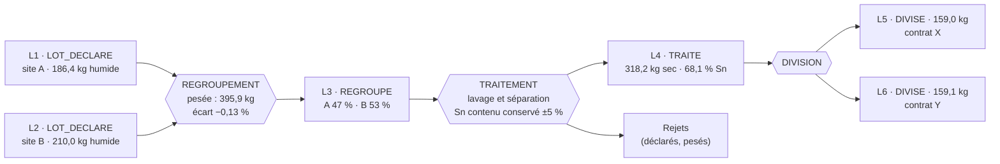
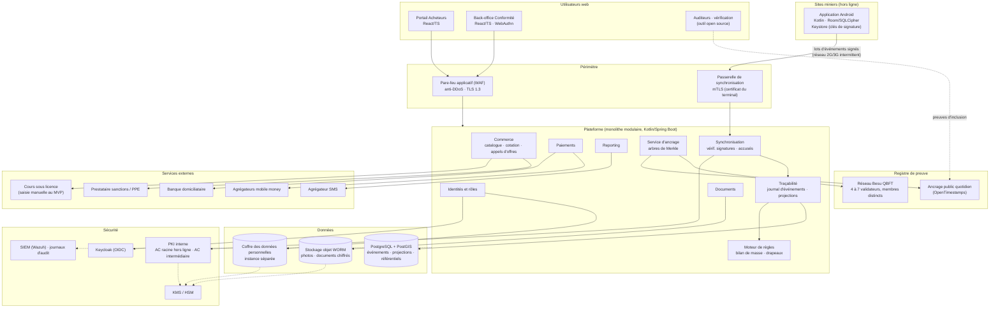
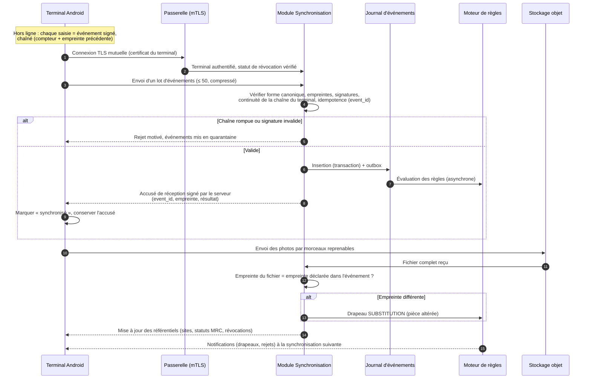

# Comptoir de vente en ligne de minerais certifiés issus de l'exploitation artisanale en RDC

## Dossier de spécifications fonctionnelles et techniques. Partie 2/3 : sections 3 et 4

| Élément | Valeur |
|---|---|
| Version | 0.1 (projet, à relire) |
| Date | 23 septembre 2026 |
| Périmètre de cette partie | §3 Modèle de données et traçabilité ; §4 Architecture technique |
| Prérequis | Partie 1 (§1 et §2). Les hypothèses H1 à H10 ont été validées par le porteur de projet le 23 septembre 2026. |
| Relecture obligatoire | Architecte sécurité (§3.9, §3.10, §4.5) ; juriste spécialisé en protection des données (§4.6) ; juriste minier (§4.7, localisation des données) |

Les étiquettes **[LÉGAL-RDC]**, **[LÉGAL-EXT]**, **[NORME]**, **[BP]** et **⚠ À vérifier** ont le sens défini au §0.1 de la partie 1.

---

## 3. Modèle de données et traçabilité

### 3.0 Principes de modélisation

| # | Principe | Conséquence |
|---|---|---|
| P1 | **Le journal d'événements est la source de vérité.** Un lot n'est pas un enregistrement que l'on met à jour ; c'est une **projection** calculée à partir des événements qui le concernent. | Rien n'est modifié ni supprimé. Une erreur se corrige par un événement `CORRECTION` qui référence l'événement erroné. L'état d'un lot à n'importe quelle date passée se reconstitue. |
| P2 | **Les lots forment un graphe orienté sans cycle.** Un regroupement a plusieurs lots en entrée et un lot en sortie ; une division a un lot en entrée et plusieurs lots en sortie ; un traitement transforme un lot en un autre. | Remonter de n'importe quel lot exporté jusqu'à tous les sites, déclarations et creuseurs d'origine se fait par un parcours du graphe. |
| P3 | **Quantités en entiers, dans la plus petite unité utile.** Or : milligrammes (`mg`). Diamant : centièmes de carat (`cct`, 1 ct = 100 cct = 200 mg). 3T : grammes (`g`). Montants : chaînes décimales, avec la devise. | Aucune erreur d'arrondi sur les nombres à virgule flottante dans les bilans de masse ni dans les empreintes. |
| P4 | **Représentation canonique unique** de chaque événement : JSON Canonicalization Scheme (JCS, RFC 8785), encodage UTF-8. | Le terminal Android et le serveur calculent la même empreinte, octet pour octet. C'est la condition pour que les signatures soient vérifiables. |
| P5 | **Aucune donnée personnelle dans l'objet lot.** Les creuseurs, déclarants et agents y figurent par des **références pseudonymes**. Leur identité est dans un coffre séparé (§4.6). | Le dossier de lot peut être partagé avec un acheteur ou un auditeur sans exposer de données personnelles. |
| P6 | **Les identifiants officiels sont recopiés, jamais générés.** Les numéros d'agrément, de carte, de certificat, de déclaration en douane ou d'étiquette ITSCI sont des chaînes libres saisies telles qu'elles figurent sur la pièce, accompagnées de l'empreinte du document numérisé. | La plateforme ne peut pas créer de faux numéro officiel. Elle détecte les doublons et les incohérences. |
| P7 | **Schémas versionnés.** Chaque objet porte `schema_version`. Une évolution incompatible crée une nouvelle version ; les anciens événements restent lisibles avec leur version d'origine. | Des terminaux restés hors ligne plusieurs semaines avec une ancienne version de l'application peuvent encore se synchroniser. |

### 3.1 Identifiants

| Identifiant | Format | Généré par | Usage | Inscrit sur le registre distribué ? |
|---|---|---|---|---|
| `lot_id` | UUID version 7 (horodaté) | Terminal, à la création | Identifiant technique du lot | Oui |
| `code_lot` | `SS-AAAA-XXXXXX` : `SS` = substance (`AU`, `DI`, `SN`, `TA`, `W`), `AAAA` = année, `XXXXXX` = 6 caractères en base 32 Crockford (sans I, L, O, U) plus une clé de contrôle | Terminal | Code imprimé sur l'étiquette interne du comptoir, lisible et dictable par téléphone. **Ce n'est pas un identifiant officiel.** | Non (dérivé du `lot_id`) |
| `event_id` | UUID version 7 | Terminal ou serveur | Identifiant de l'événement | Oui |
| `creuseur_ref`, `personne_ref` | UUID version 4 aléatoire | Serveur | Référence pseudonyme d'une personne physique. La table de correspondance est dans le coffre des données personnelles. | **Non** |
| `site_id`, `cooperative_id`, `organisation_id` | UUID version 4 | Serveur | Référentiels | Oui pour `site_id` (le statut MRC d'un site est une information publique) ; oui pour les personnes morales |
| `device_id` | Empreinte SHA-256 de la clé publique d'attestation du terminal | Serveur, à l'enrôlement | Rattacher une signature au terminal | Oui |
| `document_id` | UUID version 4 | Serveur | Pièce stockée dans le coffre documentaire | Oui (avec l'empreinte du document) |

### 3.2 Schéma commun à tous les lots

Les schémas sont écrits en JSON Schema (version 2020-12). Le format JSON n'accepte pas les commentaires : les explications figurent dans les champs `description` et `$comment`, ce qui les rend aussi disponibles pour la génération de documentation et de formulaires.

```json
{
  "$schema": "https://json-schema.org/draft/2020-12/schema",
  "$id": "urn:comptoir-rdc:schema:lot-base:1.0",
  "title": "Lot - socle commun",
  "description": "Projection d'un lot calculée à partir du journal d'événements. Ce document n'est jamais saisi directement : il est reconstruit par le serveur (et partiellement par le terminal pour l'affichage hors ligne).",
  "type": "object",
  "required": ["schema_version", "lot_id", "code_lot", "substance", "nature_lot", "origine", "quantite", "garde", "conformite", "cree_le", "version_projection"],
  "properties": {
    "schema_version": { "const": "1.0" },
    "lot_id": {
      "type": "string", "format": "uuid",
      "description": "UUID version 7 généré sur le terminal à la déclaration. Identifiant pseudonyme inscrit sur le registre distribué."
    },
    "code_lot": {
      "type": "string", "pattern": "^(AU|DI|SN|TA|W)-[0-9]{4}-[0-9A-HJKMNP-TV-Z]{6}[0-9A-HJKMNP-TV-Z*~$=]$",
      "description": "Code lisible imprimé sur l'étiquette interne (le dernier caractère est une clé de contrôle). N'est pas un identifiant officiel."
    },
    "substance": { "enum": ["OR", "DIAMANT", "CASSITERITE", "COLTAN", "WOLFRAMITE"] },
    "nature_lot": {
      "enum": ["ORIGINE", "REGROUPE", "DIVISE", "TRAITE"],
      "description": "ORIGINE : déclaré sur site. REGROUPE : issu d'une fusion. DIVISE : issu d'une division. TRAITE : issu d'une transformation (fonte, concentration)."
    },
    "lots_parents": {
      "type": "array",
      "description": "Vide pour un lot d'origine. Pour les autres : lots en entrée de l'opération qui a créé ce lot, avec la quantité apportée par chacun.",
      "items": {
        "type": "object",
        "required": ["lot_id", "quantite_apportee"],
        "properties": {
          "lot_id": { "type": "string", "format": "uuid" },
          "quantite_apportee": { "$ref": "#/$defs/quantite" }
        }
      }
    },
    "evenement_creation_id": {
      "type": "string", "format": "uuid",
      "description": "Événement qui a créé le lot (LOT_DECLARE, REGROUPEMENT, DIVISION ou TRAITEMENT)."
    },
    "origine": { "$ref": "#/$defs/origine" },
    "quantite": {
      "$ref": "#/$defs/quantite",
      "description": "Dernière quantité mesurée. L'historique complet des pesées est dans le journal d'événements."
    },
    "garde": {
      "type": "object",
      "description": "Qui détient physiquement le lot, et qui en est propriétaire. Les deux peuvent différer (transporteur, dépôt CEEC).",
      "required": ["detenteur_organisation_id", "proprietaire_organisation_id", "etat_garde"],
      "properties": {
        "detenteur_organisation_id": { "type": "string", "format": "uuid" },
        "proprietaire_organisation_id": { "type": "string", "format": "uuid" },
        "etat_garde": {
          "enum": ["EN_STOCK", "EN_TRANSIT", "TRANSIT_NON_CONFIRME", "EN_EXPERTISE", "EN_DOUANE", "EXPEDIE", "LIVRE", "CLOTURE"],
          "description": "CLOTURE : le lot a été entièrement consommé par un regroupement, une division ou un traitement ; il n'existe plus physiquement sous cette identité."
        },
        "lieu": { "$ref": "#/$defs/position" }
      }
    },
    "scelles": {
      "type": "array",
      "description": "Scellés posés sur le contenant (sac, boîte, colis). Posés par le comptoir, la CEEC, l'OCC ou la DGDA.",
      "items": {
        "type": "object",
        "required": ["numero", "pose_par", "pose_le", "etat"],
        "properties": {
          "numero": { "type": "string", "description": "Numéro imprimé sur le scellé, recopié tel quel." },
          "pose_par": { "enum": ["COMPTOIR", "COOPERATIVE", "CEEC", "OCC", "DGDA", "AUTRE"] },
          "pose_le": { "type": "string", "format": "date-time" },
          "etat": { "enum": ["INTACT", "ROMPU_AUTORISE", "ROMPU_NON_EXPLIQUE", "REMPLACE"] },
          "photo_empreinte_sha256": { "$ref": "#/$defs/sha256" }
        }
      }
    },
    "etiquettes_programme": {
      "type": "array",
      "description": "Étiquettes posées par un programme de traçabilité en amont. La plateforme les enregistre ; elle n'en émet jamais.",
      "items": {
        "type": "object",
        "required": ["programme", "numero", "type_etiquette"],
        "properties": {
          "programme": { "enum": ["ITSCI", "BETTER_MINING", "AUTRE"] },
          "numero": { "type": "string" },
          "type_etiquette": { "enum": ["MINE", "NEGOCIANT", "TRAITEMENT", "EXPORT"] },
          "sac_ref": { "type": "string", "description": "Référence du sac concerné quand le lot en comporte plusieurs (3T)." }
        }
      }
    },
    "documents": {
      "type": "array",
      "items": { "$ref": "#/$defs/document_ref" }
    },
    "conformite": {
      "type": "object",
      "required": ["etat_vendabilite", "calcule_le", "statut_mrc_a_extraction", "statut_mrc_courant"],
      "properties": {
        "etat_vendabilite": {
          "enum": ["DECLARE", "EN_CONTROLE", "ATTENTE_DOCUMENTS", "ACHETE", "EN_EXPERTISE", "VENDABLE", "RESERVE", "EXPORTE", "LIVRE", "SUSPENDU", "REJETE", "DESENGAGE"],
          "description": "Calculé par le moteur de règles ; jamais saisi (partie 1, §2.0)."
        },
        "calcule_le": { "type": "string", "format": "date-time" },
        "version_regles": { "type": "string", "description": "Version du jeu de règles et de seuils utilisé pour le calcul." },
        "statut_mrc_a_extraction": { "$ref": "#/$defs/statut_mrc" },
        "statut_mrc_courant": { "$ref": "#/$defs/statut_mrc" },
        "drapeaux_ouverts": {
          "type": "array",
          "items": {
            "type": "object",
            "required": ["drapeau_id", "categorie", "severite"],
            "properties": {
              "drapeau_id": { "type": "string", "format": "uuid" },
              "categorie": { "enum": ["GROUPES_ARMES", "TRAVAIL_ENFANTS_FORCE", "VOLUME", "ORIGINE", "SUBSTITUTION", "DOCUMENTS", "CONTREPARTIE_LBCFT", "TAXATION_ILLEGALE", "AUTRE"] },
              "severite": { "enum": ["CRITIQUE", "ELEVEE", "MOYENNE", "INFO"] },
              "bloquant": { "type": "boolean" }
            }
          }
        },
        "niveau_confiance": {
          "enum": ["A", "B", "C"],
          "description": "Indicateur informatif présenté à l'acheteur (§3.8.5). Il ne remplace pas l'état de vendabilité."
        },
        "plan_attenuation_document_id": {
          "type": ["string", "null"], "format": "uuid",
          "description": "Obligatoire si le site est JAUNE."
        }
      }
    },
    "ancrage": {
      "type": "object",
      "description": "Preuve que le dernier état du lot a été inscrit sur le registre distribué.",
      "properties": {
        "derniere_empreinte_evenement": { "$ref": "#/$defs/sha256" },
        "racine_merkle": { "$ref": "#/$defs/sha256" },
        "transaction_registre": { "type": "string", "description": "Identifiant de transaction sur le registre permissionné." },
        "preuve_ancrage_public": { "type": ["string", "null"], "description": "Preuve d'ancrage sur une chaîne publique (§3.10.4), quand elle est disponible." }
      }
    },
    "cree_le": { "type": "string", "format": "date-time" },
    "version_projection": {
      "type": "integer", "minimum": 1,
      "description": "Nombre d'événements appliqués. Permet de détecter une projection obsolète."
    }
  },
  "$defs": {
    "sha256": { "type": "string", "pattern": "^[0-9a-f]{64}$" },
    "decimal": { "type": "string", "pattern": "^-?[0-9]+(\\.[0-9]+)?$", "description": "Nombre décimal exact sous forme de chaîne." },
    "statut_mrc": {
      "type": "object",
      "required": ["valeur", "date_effet"],
      "properties": {
        "valeur": { "enum": ["VERT", "JAUNE", "ROUGE", "NON_QUALIFIE", "NON_APPLICABLE"], "$comment": "NON_APPLICABLE pour le diamant, qui ne relève pas du MRC (partie 1, §1.3.2)." },
        "date_effet": { "type": "string", "format": "date" },
        "reference_acte": { "type": "string", "description": "Référence de l'arrêté ou du rapport d'inspection, recopiée telle quelle." },
        "echeance_mise_en_conformite": { "type": ["string", "null"], "format": "date", "description": "Pour un site JAUNE uniquement." }
      }
    },
    "quantite": {
      "type": "object",
      "required": ["valeur", "unite", "methode"],
      "properties": {
        "valeur": { "type": "integer", "minimum": 0 },
        "unite": { "enum": ["mg", "cct", "g"], "$comment": "mg pour l'or, cct (centième de carat) pour le diamant, g pour les 3T." },
        "base": { "enum": ["BRUT", "NET", "SEC", "HUMIDE"], "default": "NET", "description": "Pour les 3T : la base de comparaison des bilans de masse est le poids SEC." },
        "methode": { "enum": ["PESEE_TERRAIN", "CONTRE_PESEE_COMPTOIR", "PESEE_CEEC", "PESEE_OCC", "PESEE_AVAL", "CALCULEE"] },
        "balance_id": { "type": ["string", "null"], "format": "uuid" },
        "resolution_balance": { "type": ["integer", "null"], "description": "Résolution de la balance dans la même unité (par exemple 10 mg). Sert au calcul de la tolérance (§3.8.2)." },
        "photo_afficheur_sha256": { "$ref": "#/$defs/sha256" },
        "mesure_le": { "type": "string", "format": "date-time" }
      }
    },
    "position": {
      "type": "object",
      "required": ["source"],
      "properties": {
        "lat": { "type": "number", "minimum": -14, "maximum": 6, "$comment": "Bornes approximatives du territoire de la RDC ; contrôle grossier, le contrôle fin se fait sur le polygone de la ZEA." },
        "lon": { "type": "number", "minimum": 12, "maximum": 32 },
        "precision_m": { "type": "number", "minimum": 0 },
        "source": { "enum": ["GNSS", "RESEAU", "AUCUNE"] },
        "position_fictive_detectee": { "type": "boolean" },
        "horloge_gnss": { "type": ["string", "null"], "format": "date-time" }
      }
    },
    "origine": {
      "type": "object",
      "required": ["composition"],
      "description": "Pour un lot d'origine, une seule entrée dans 'composition'. Pour un lot regroupé ou divisé, la composition est héritée des parents, au prorata des quantités (§3.7.3).",
      "properties": {
        "composition": {
          "type": "array", "minItems": 1,
          "items": {
            "type": "object",
            "required": ["site_id", "cooperative_id", "part_ppm"],
            "properties": {
              "site_id": { "type": "string", "format": "uuid" },
              "zea_reference": { "type": "string", "description": "Référence de la ZEA telle que publiée (CAMI ou arrêté)." },
              "province": { "type": "string" },
              "territoire": { "type": "string" },
              "cooperative_id": { "type": "string", "format": "uuid" },
              "part_ppm": { "type": "integer", "minimum": 1, "maximum": 1000000, "description": "Part de ce site dans le lot, en millionièmes. La somme vaut 1 000 000." },
              "periode_extraction": {
                "type": "object",
                "properties": {
                  "debut": { "type": "string", "format": "date" },
                  "fin": { "type": "string", "format": "date" }
                }
              }
            }
          }
        },
        "position_declaration": { "$ref": "#/$defs/position" },
        "contributeurs": {
          "type": "object",
          "description": "Creuseurs ayant contribué au lot. Références pseudonymes uniquement.",
          "properties": {
            "nombre": { "type": "integer", "minimum": 0 },
            "nombre_avec_carte_valide": { "type": "integer", "minimum": 0 },
            "refs": {
              "type": "array",
              "$comment": "Liste nominative (pseudonyme). Masquée dans toute vue destinée aux acheteurs, qui ne voient que 'nombre' et 'nombre_avec_carte_valide'.",
              "items": {
                "type": "object",
                "required": ["creuseur_ref", "part_ppm"],
                "properties": {
                  "creuseur_ref": { "type": "string", "format": "uuid" },
                  "part_ppm": { "type": "integer", "minimum": 0, "maximum": 1000000 }
                }
              }
            }
          }
        },
        "declarant_ref": { "type": "string", "format": "uuid" },
        "cosignataire_ref": { "type": "string", "format": "uuid" },
        "visa_etat_ref": { "type": ["string", "null"], "format": "uuid", "description": "Agent des Mines ou du SAEMAPE ayant visé la déclaration (partie 1, T-13)." }
      }
    },
    "document_ref": {
      "type": "object",
      "required": ["document_id", "type", "empreinte_sha256", "statut_verification"],
      "properties": {
        "document_id": { "type": "string", "format": "uuid" },
        "type": {
          "enum": ["BON_ACHAT", "FICHE_TRACABILITE_MINES", "CARTE_EXPLOITANT", "RAPPORT_EXPERTISE_CEEC", "CERTIFICAT_KP", "CERTIFICAT_CIRGL", "CERTIFICAT_ANALYSE_OCC", "RAPPORT_ANALYSE_LABO", "CERTIFICAT_FONTE", "DECLARATION_DGDA", "QUITTANCE_TAXE", "AUTORISATION_ARECOMS", "DECLARATION_EXPORT_BANCAIRE", "REGISTRE_ITSCI", "RAPPORT_BETTER_MINING", "PLAN_ATTENUATION", "LETTRE_TRANSPORT", "LISTE_COLISAGE", "FACTURE", "ESSAI_AVAL", "AUTRE"]
        },
        "numero_officiel": { "type": ["string", "null"], "description": "Numéro tel qu'il figure sur la pièce. Jamais généré par la plateforme." },
        "emetteur": { "type": "string" },
        "date_emission": { "type": "string", "format": "date" },
        "date_expiration": { "type": ["string", "null"], "format": "date" },
        "empreinte_sha256": { "$ref": "#/$defs/sha256" },
        "statut_verification": { "enum": ["RECU", "VERIFIE", "CONFIRME_EMETTEUR", "REJETE", "EXPIRE"] },
        "verifie_par_ref": { "type": ["string", "null"], "format": "uuid" },
        "valide_par_ref": { "type": ["string", "null"], "format": "uuid" },
        "confidentialite": { "enum": ["ACHETEUR_QUALIFIE", "ACHETEUR_APRES_NDA", "INTERNE", "CONFORMITE_SEULEMENT"] }
      }
    }
  }
}
```

### 3.3 Lot d'or

```json
{
  "$schema": "https://json-schema.org/draft/2020-12/schema",
  "$id": "urn:comptoir-rdc:schema:lot-or:1.0",
  "title": "Lot d'or artisanal",
  "description": "Poudre, pépites ou lingot doré. La quantité de référence est le poids brut en milligrammes ; le poids fin (or pur contenu) est calculé à partir du titre.",
  "allOf": [{ "$ref": "urn:comptoir-rdc:schema:lot-base:1.0" }],
  "type": "object",
  "required": ["substance", "or"],
  "properties": {
    "substance": { "const": "OR" },
    "quantite": { "properties": { "unite": { "const": "mg" } } },
    "or": {
      "type": "object",
      "required": ["forme", "mesures_titre"],
      "properties": {
        "forme": { "enum": ["POUDRE", "PEPITES", "MIXTE", "LINGOT_DORE"], "description": "LINGOT_DORE : or fondu localement, non affiné (typiquement 800 à 950 millièmes, à titre indicatif)." },
        "nombre_pieces": { "type": ["integer", "null"], "minimum": 1, "description": "Nombre de pépites ou de lingots, quand il est dénombrable. Contrôlé à chaque transfert." },
        "mesures_titre": {
          "type": "array",
          "description": "Toutes les mesures de titre, de la plus approximative à la plus fiable. Aucune n'est écrasée : les écarts entre mesures sont eux-mêmes des contrôles (§3.8).",
          "items": {
            "type": "object",
            "required": ["titre_milliemes", "methode", "mesure_le"],
            "properties": {
              "titre_milliemes": { "type": "integer", "minimum": 0, "maximum": 1000 },
              "argent_milliemes": { "type": ["integer", "null"], "minimum": 0, "maximum": 1000, "description": "Teneur en argent, payable ou non selon le contrat." },
              "methode": {
                "enum": ["ESTIMATION_VISUELLE", "PIERRE_DE_TOUCHE", "DENSITE_HYDROSTATIQUE", "XRF", "ESSAI_CEEC", "ESSAI_FEU_RAFFINERIE"],
                "$comment": "Hiérarchie de fiabilité croissante. Le prix provisoire utilise la meilleure mesure disponible ; le règlement final utilise l'essai de la raffinerie (partie 1, §2.b.3)."
              },
              "laboratoire_ou_operateur": { "type": "string" },
              "document_id": { "type": ["string", "null"], "format": "uuid" },
              "mesure_le": { "type": "string", "format": "date-time" }
            }
          }
        },
        "poids_fin_mg": {
          "type": "integer", "minimum": 0,
          "description": "Calculé : poids brut × titre de la meilleure mesure / 1000, arrondi à l'inférieur. Jamais saisi."
        },
        "fonte": {
          "type": ["object", "null"],
          "description": "Renseigné si le lot est issu d'une fonte locale (nature_lot = TRAITE).",
          "properties": {
            "entite_traitement_id": { "type": "string", "format": "uuid" },
            "poids_entree_mg": { "type": "integer" },
            "poids_sortie_mg": { "type": "integer" },
            "perte_au_feu_ppm": { "type": "integer", "description": "Calculée : (entrée − sortie) / entrée, en millionièmes." },
            "certificat_fonte_document_id": { "type": ["string", "null"], "format": "uuid" }
          }
        },
        "usage_mercure": {
          "type": "object",
          "description": "Information environnementale et sanitaire (Convention de Minamata : ⚠ statut de ratification par la RDC et obligations nationales à vérifier). Non bloquant ; alimente l'évaluation de risque et les attentes des raffineries.",
          "properties": {
            "declare": { "enum": ["OUI", "NON", "INCONNU"] },
            "observe_lors_visite": { "type": ["boolean", "null"] }
          }
        },
        "expertise_ceec": {
          "type": ["object", "null"],
          "properties": {
            "document_id": { "type": "string", "format": "uuid" },
            "poids_mg": { "type": "integer" },
            "titre_milliemes": { "type": "integer" },
            "valeur_declaree": { "type": "object", "properties": { "montant": { "type": "string", "pattern": "^[0-9]+(\\.[0-9]{1,2})?$" }, "devise": { "const": "USD" } } },
            "date": { "type": "string", "format": "date" }
          }
        },
        "certificat_cirgl_document_id": { "type": ["string", "null"], "format": "uuid" }
      }
    }
  }
}
```

### 3.4 Lot de diamants bruts

Le lot de diamants est un **colis** (« parcel ») classé. Les pierres de grande taille sont enregistrées une par une : leur valeur justifie un suivi individuel, et elles sont la cible privilégiée de la substitution.

```json
{
  "$schema": "https://json-schema.org/draft/2020-12/schema",
  "$id": "urn:comptoir-rdc:schema:lot-diamant:1.0",
  "title": "Lot (colis) de diamants bruts",
  "description": "Quantité de référence en centièmes de carat (cct). Le nombre de pierres est contrôlé aussi strictement que le poids.",
  "allOf": [{ "$ref": "urn:comptoir-rdc:schema:lot-base:1.0" }],
  "type": "object",
  "required": ["substance", "diamant"],
  "properties": {
    "substance": { "const": "DIAMANT" },
    "quantite": { "properties": { "unite": { "const": "cct" } } },
    "conformite": {
      "properties": {
        "statut_mrc_a_extraction": { "properties": { "valeur": { "const": "NON_APPLICABLE" } } },
        "evaluation_risque_site": {
          "type": "object",
          "description": "Le MRC ne couvre pas le diamant : évaluation de risque du site selon l'Annexe II OCDE, appliquée comme bonne pratique (partie 1, §1.3.2).",
          "properties": {
            "niveau": { "enum": ["FAIBLE", "MOYEN", "ELEVE", "INACCEPTABLE"] },
            "date": { "type": "string", "format": "date" },
            "document_id": { "type": "string", "format": "uuid" }
          }
        }
      }
    },
    "diamant": {
      "type": "object",
      "required": ["nombre_pierres", "classement"],
      "properties": {
        "nombre_pierres": { "type": "integer", "minimum": 1 },
        "seuil_pierre_individuelle_cct": {
          "type": "integer", "default": 1080,
          "description": "Au-delà de ce poids (10,80 ct par défaut, seuil paramétrable), chaque pierre est enregistrée individuellement dans 'pierres_individuelles'."
        },
        "classement": {
          "type": "array",
          "description": "Répartition du colis par catégorie et par taille. Somme des nombres = nombre_pierres ; somme des poids = quantite.valeur.",
          "items": {
            "type": "object",
            "required": ["categorie", "taille", "nombre", "poids_cct"],
            "properties": {
              "categorie": { "enum": ["GEMME", "QUASI_GEMME", "INDUSTRIEL", "BOART"] },
              "taille": { "type": "string", "description": "Classe de taille : numéro de tamis ou fourchette de poids par pierre (par exemple '+11', '3-4 gr', '1 ct'), selon la nomenclature utilisée par la CEEC (⚠ nomenclature à obtenir)." },
              "forme_modele": { "type": ["string", "null"], "description": "Octaèdre, dodécaèdre, macle, clivage, etc." },
              "couleur": { "type": ["string", "null"] },
              "purete": { "type": ["string", "null"] },
              "nombre": { "type": "integer", "minimum": 1 },
              "poids_cct": { "type": "integer", "minimum": 1 }
            }
          }
        },
        "pierres_individuelles": {
          "type": "array",
          "items": {
            "type": "object",
            "required": ["pierre_ref", "poids_cct", "photos_empreintes"],
            "properties": {
              "pierre_ref": { "type": "string", "format": "uuid" },
              "poids_cct": { "type": "integer", "minimum": 1 },
              "couleur": { "type": ["string", "null"] },
              "purete": { "type": ["string", "null"] },
              "forme_modele": { "type": ["string", "null"] },
              "fluorescence": { "type": ["string", "null"] },
              "dimensions_mm": { "type": ["array", "null"], "items": { "type": "number" }, "minItems": 3, "maxItems": 3 },
              "photos_empreintes": {
                "type": "array", "minItems": 2,
                "items": { "$ref": "urn:comptoir-rdc:schema:lot-base:1.0#/$defs/sha256" },
                "$comment": "Photos sous plusieurs angles, prises à la réception au comptoir, puis comparées lors de l'expertise CEEC et de la visite des acheteurs."
              },
              "empreinte_optique_ref": { "type": ["string", "null"], "description": "[BP, phase C] Référence d'un relevé optique ou d'un scan 3D si un équipement est disponible." }
            }
          }
        },
        "evaluation_ceec": {
          "type": ["object", "null"],
          "properties": {
            "document_id": { "type": "string", "format": "uuid" },
            "poids_cct": { "type": "integer" },
            "nombre_pierres": { "type": "integer" },
            "valeur": { "type": "object", "properties": { "montant": { "type": "string", "pattern": "^[0-9]+(\\.[0-9]{1,2})?$" }, "devise": { "const": "USD" } } },
            "date": { "type": "string", "format": "date" }
          }
        },
        "certificat_kp_document_id": { "type": ["string", "null"], "format": "uuid" },
        "appel_offres_id": { "type": ["string", "null"], "format": "uuid" }
      }
    }
  }
}
```

### 3.5 Lot de cassitérite

Le même schéma sert pour le coltan et la wolframite, en remplaçant le bloc `analyse` (Ta₂O₅ % et radioactivité pour le coltan, WO₃ % pour la wolframite). Un lot 3T se compose de **sacs**, chacun portant une étiquette de programme.

```json
{
  "$schema": "https://json-schema.org/draft/2020-12/schema",
  "$id": "urn:comptoir-rdc:schema:lot-cassiterite:1.0",
  "title": "Lot de cassitérite",
  "description": "Minerai ou concentré d'étain. La base de comparaison des bilans de masse est le poids SEC (poids humide corrigé de l'humidité mesurée).",
  "allOf": [{ "$ref": "urn:comptoir-rdc:schema:lot-base:1.0" }],
  "type": "object",
  "required": ["substance", "cassiterite"],
  "properties": {
    "substance": { "const": "CASSITERITE" },
    "quantite": { "properties": { "unite": { "const": "g" } } },
    "cassiterite": {
      "type": "object",
      "required": ["sacs", "programme_amont"],
      "properties": {
        "programme_amont": {
          "enum": ["ITSCI", "BETTER_MINING", "AUCUN"],
          "$comment": "Hypothèse H9 : le pilote porte sur un site couvert par un programme. AUCUN rend le lot non vendable aux fonderies RMAP dans la configuration par défaut."
        },
        "sacs": {
          "type": "array", "minItems": 1,
          "items": {
            "type": "object",
            "required": ["sac_ref", "poids_brut_g"],
            "properties": {
              "sac_ref": { "type": "string", "description": "Référence interne du sac (unique dans le lot)." },
              "numero_etiquette_mine": { "type": ["string", "null"], "description": "Numéro de l'étiquette du programme posée au site, recopié tel quel." },
              "numero_etiquette_traitement": { "type": ["string", "null"] },
              "poids_brut_g": { "type": "integer", "minimum": 1 },
              "tare_g": { "type": "integer", "minimum": 0, "default": 0 },
              "photo_empreinte_sha256": { "$ref": "urn:comptoir-rdc:schema:lot-base:1.0#/$defs/sha256" }
            }
          }
        },
        "analyses": {
          "type": "array",
          "description": "Toutes les analyses conservées (terrain, comptoir, OCC/CEEC, fonderie).",
          "items": {
            "type": "object",
            "required": ["sn_pct", "humidite_pct", "methode", "mesure_le"],
            "properties": {
              "sn_pct": { "$ref": "urn:comptoir-rdc:schema:lot-base:1.0#/$defs/decimal", "description": "Teneur en étain métal (Sn), en pourcentage du poids sec." },
              "humidite_pct": { "$ref": "urn:comptoir-rdc:schema:lot-base:1.0#/$defs/decimal" },
              "impuretes": {
                "type": "object",
                "description": "Éléments pénalisants selon le contrat (par exemple As, Bi, Pb, Sb, Fe, WO3, Ta2O5, Nb2O5), en pourcentage.",
                "additionalProperties": { "$ref": "urn:comptoir-rdc:schema:lot-base:1.0#/$defs/decimal" }
              },
              "methode": { "enum": ["XRF_PORTABLE", "LABO_COMPTOIR", "OCC", "CEEC", "LABO_INDEPENDANT", "FONDERIE"] },
              "echantillon_ref": { "type": ["string", "null"], "description": "Référence de l'échantillon scellé conservé en contre-analyse." },
              "document_id": { "type": ["string", "null"], "format": "uuid" },
              "mesure_le": { "type": "string", "format": "date-time" }
            }
          }
        },
        "poids_sec_g": { "type": "integer", "description": "Calculé : Σ(poids brut − tare) × (1 − humidité de la meilleure analyse)." },
        "sn_contenu_g": { "type": "integer", "description": "Calculé : poids_sec_g × sn_pct / 100. Grandeur conservée lors des traitements (§3.8)." },
        "incidents_programme": {
          "type": "array",
          "description": "Références d'incidents signalés par ITSCI ou Better Mining sur ce lot ou son site.",
          "items": { "type": "string" }
        },
        "certificat_cirgl_document_id": { "type": ["string", "null"], "format": "uuid" },
        "certificat_analyse_document_id": { "type": ["string", "null"], "format": "uuid" }
      }
    }
  }
}
```

**Spécificités du coltan** (même structure) : `ta2o5_pct`, `nb2o5_pct`, `radioactivite` (activité massique de l'uranium et du thorium, en Bq/g, avec le document de mesure). Au-delà du seuil réglementaire de transport des matières radioactives (⚠ seuil national à vérifier, auprès du CGEA), le lot porte un marqueur `MATIERE_RADIOACTIVE` qui impose des documents de transport spécifiques. Le coltan porte aussi `autorisation_arecoms_document_id` (⚠ à vérifier, partie 1, V4).

**Spécificités de la wolframite** : `wo3_pct`, impuretés (Sn, As, Mo, S, P, etc.).

**Exemple d'instance (extrait, valeurs fictives).** Les identifiants officiels sont remplacés par des marqueurs `EXEMPLE-...` pour éviter toute confusion avec un numéro réel.

```json
{
  "schema_version": "1.0",
  "lot_id": "01926f4a-8b3c-7d21-9e45-3a1b2c4d5e6f",
  "code_lot": "SN-2026-4KX9QT7",
  "substance": "CASSITERITE",
  "nature_lot": "ORIGINE",
  "lots_parents": [],
  "origine": {
    "composition": [
      {
        "site_id": "5b8e2f10-4c3a-4d9e-8f21-6a7b8c9d0e1f",
        "zea_reference": "EXEMPLE-ZEA-REF",
        "province": "Tanganyika",
        "cooperative_id": "a1b2c3d4-e5f6-4a7b-8c9d-0e1f2a3b4c5d",
        "part_ppm": 1000000,
        "periode_extraction": { "debut": "2026-09-14", "fin": "2026-09-20" }
      }
    ],
    "position_declaration": { "lat": -6.1234, "lon": 27.4567, "precision_m": 8.5, "source": "GNSS", "position_fictive_detectee": false, "horloge_gnss": "2026-09-21T09:42:11Z" },
    "contributeurs": { "nombre": 14, "nombre_avec_carte_valide": 14 },
    "declarant_ref": "0f1e2d3c-4b5a-4968-8776-5a4b3c2d1e0f",
    "cosignataire_ref": "9a8b7c6d-5e4f-4a3b-8c2d-1e0f9a8b7c6d",
    "visa_etat_ref": null
  },
  "quantite": { "valeur": 186400, "unite": "g", "base": "HUMIDE", "methode": "PESEE_TERRAIN", "resolution_balance": 100, "mesure_le": "2026-09-21T09:40:03Z" },
  "garde": { "detenteur_organisation_id": "a1b2c3d4-e5f6-4a7b-8c9d-0e1f2a3b4c5d", "proprietaire_organisation_id": "a1b2c3d4-e5f6-4a7b-8c9d-0e1f2a3b4c5d", "etat_garde": "EN_STOCK" },
  "etiquettes_programme": [
    { "programme": "ITSCI", "numero": "EXEMPLE-TAG-0001", "type_etiquette": "MINE", "sac_ref": "S1" },
    { "programme": "ITSCI", "numero": "EXEMPLE-TAG-0002", "type_etiquette": "MINE", "sac_ref": "S2" },
    { "programme": "ITSCI", "numero": "EXEMPLE-TAG-0003", "type_etiquette": "MINE", "sac_ref": "S3" },
    { "programme": "ITSCI", "numero": "EXEMPLE-TAG-0004", "type_etiquette": "MINE", "sac_ref": "S4" }
  ],
  "cassiterite": {
    "programme_amont": "ITSCI",
    "sacs": [
      { "sac_ref": "S1", "numero_etiquette_mine": "EXEMPLE-TAG-0001", "poids_brut_g": 46800 },
      { "sac_ref": "S2", "numero_etiquette_mine": "EXEMPLE-TAG-0002", "poids_brut_g": 47100 },
      { "sac_ref": "S3", "numero_etiquette_mine": "EXEMPLE-TAG-0003", "poids_brut_g": 46200 },
      { "sac_ref": "S4", "numero_etiquette_mine": "EXEMPLE-TAG-0004", "poids_brut_g": 46300 }
    ],
    "analyses": [
      { "sn_pct": "62.5", "humidite_pct": "4.0", "methode": "XRF_PORTABLE", "mesure_le": "2026-09-21T10:05:00Z" }
    ],
    "poids_sec_g": 178944,
    "sn_contenu_g": 111840
  },
  "conformite": {
    "etat_vendabilite": "EN_CONTROLE",
    "calcule_le": "2026-09-23T07:12:40Z",
    "version_regles": "2026.09.1",
    "statut_mrc_a_extraction": { "valeur": "VERT", "date_effet": "2026-03-02", "reference_acte": "EXEMPLE-ARRETE-REF" },
    "statut_mrc_courant": { "valeur": "VERT", "date_effet": "2026-03-02", "reference_acte": "EXEMPLE-ARRETE-REF" },
    "drapeaux_ouverts": [],
    "niveau_confiance": "B"
  },
  "cree_le": "2026-09-21T09:44:57Z",
  "version_projection": 3
}
```

### 3.6 Registres de référence (résumé)

Les référentiels n'ont pas besoin d'un schéma détaillé dans ce dossier. Leurs champs obligatoires sont :

| Référentiel | Champs clés |
|---|---|
| Site | `site_id`, nom, province, territoire, ZEA de rattachement, polygone (PostGIS) ou point avec rayon, substances, coopératives autorisées, **historique daté des statuts MRC** avec référence de l'acte, capacité de production estimée (par substance et par mois, avec la méthode d'estimation), contacts de surveillance (programme, société civile) |
| Organisation | `organisation_id`, type (coopérative, négociant, comptoir, entité de traitement, transporteur, acheteur, laboratoire), dénomination, pays, agréments (numéro tel qu'il figure sur l'acte, autorité, substance, dates, document), niveau de risque, statut (active, suspendue, désengagée) |
| Balance | `balance_id`, organisation, modèle, portée, résolution, date et certificat du dernier étalonnage, statut |
| Signataire officiel | Organisme (CEEC, OCC, Division des Mines…), nom, fonction, période de validité, spécimen de signature et de cachet. Sert à la vérification de forme des documents (partie 1, §2.c.2). |
| Table fiscale | Voir partie 1, §2.c.1 |
| Paramètres du moteur de règles | Seuils du §3.8, versionnés, avec l'auteur et le validateur de chaque modification |

---

### 3.7 Modèle des événements de la chaîne de responsabilité

#### 3.7.1 Enveloppe commune

Tous les événements partagent la même enveloppe. Le `payload` dépend du type.

```json
{
  "$schema": "https://json-schema.org/draft/2020-12/schema",
  "$id": "urn:comptoir-rdc:schema:evenement:1.0",
  "title": "Événement de traçabilité",
  "description": "Unité immuable du journal. L'empreinte est calculée sur la forme canonique JCS (RFC 8785) de l'objet SANS les champs 'signatures' et 'reception'.",
  "type": "object",
  "required": ["schema_version", "event_id", "type", "lots_entree", "lots_sortie", "acteur", "horodatage", "payload", "pieces", "chaine_terminal", "signatures"],
  "properties": {
    "schema_version": { "const": "1.0" },
    "event_id": { "type": "string", "format": "uuid", "description": "UUID version 7." },
    "type": { "type": "string", "description": "Valeur du catalogue §3.7.2." },
    "lots_entree": {
      "type": "array",
      "description": "Lots consommés ou concernés, avec la quantité prise à chacun. Pour un événement qui ne transforme pas (pesée, transfert), le lot figure en entrée ET en sortie.",
      "items": { "$ref": "#/$defs/mouvement" }
    },
    "lots_sortie": {
      "type": "array",
      "items": { "$ref": "#/$defs/mouvement" }
    },
    "acteur": {
      "type": "object",
      "required": ["personne_ref", "organisation_id", "role"],
      "properties": {
        "personne_ref": { "type": "string", "format": "uuid" },
        "organisation_id": { "type": "string", "format": "uuid" },
        "role": { "type": "string" }
      }
    },
    "horodatage": {
      "type": "object",
      "required": ["terminal"],
      "properties": {
        "terminal": { "type": "string", "format": "date-time", "description": "Heure du terminal au moment de la signature." },
        "gnss": { "type": ["string", "null"], "format": "date-time" },
        "fiable": { "type": "boolean", "description": "Faux si l'écart terminal/GNSS dépasse le seuil ou si l'ordre des compteurs est incohérent. Calculé par le serveur." }
      }
    },
    "position": { "$ref": "urn:comptoir-rdc:schema:lot-base:1.0#/$defs/position" },
    "payload": { "type": "object", "description": "Données propres au type d'événement." },
    "pieces": {
      "type": "array",
      "description": "Empreintes des photos et documents attachés. Les fichiers eux-mêmes sont envoyés séparément et contrôlés contre ces empreintes à la réception.",
      "items": {
        "type": "object",
        "required": ["empreinte_sha256", "nature"],
        "properties": {
          "empreinte_sha256": { "$ref": "urn:comptoir-rdc:schema:lot-base:1.0#/$defs/sha256" },
          "nature": { "enum": ["PHOTO_LOT", "PHOTO_BALANCE", "PHOTO_SCELLE", "PHOTO_DOCUMENT", "DOCUMENT_PDF", "AUDIO"] },
          "taille_octets": { "type": "integer" }
        }
      }
    },
    "corrige_event_id": { "type": ["string", "null"], "format": "uuid", "description": "Renseigné uniquement pour un événement CORRECTION." },
    "chaine_terminal": {
      "type": "object",
      "description": "Chaîne locale propre au terminal : rend visible toute suppression ou réorganisation d'événements avant la synchronisation.",
      "required": ["device_id", "compteur", "empreinte_precedente"],
      "properties": {
        "device_id": { "type": "string" },
        "compteur": { "type": "integer", "minimum": 1, "description": "Monotone, stocké de façon protégée sur le terminal." },
        "empreinte_precedente": { "$ref": "urn:comptoir-rdc:schema:lot-base:1.0#/$defs/sha256" },
        "version_application": { "type": "string" },
        "version_referentiels": { "type": "string", "description": "Version des référentiels (sites, statuts) connue du terminal au moment de la saisie." }
      }
    },
    "signatures": {
      "type": "array", "minItems": 1,
      "items": {
        "type": "object",
        "required": ["role_signature", "personne_ref", "algorithme", "certificat_empreinte", "valeur"],
        "properties": {
          "role_signature": { "enum": ["DECLARANT", "COSIGNATAIRE", "REMETTANT", "DESTINATAIRE", "VISA_ETAT", "VALIDATEUR", "SERVEUR"] },
          "personne_ref": { "type": ["string", "null"], "format": "uuid" },
          "algorithme": { "const": "ECDSA-P256-SHA256" },
          "certificat_empreinte": { "$ref": "urn:comptoir-rdc:schema:lot-base:1.0#/$defs/sha256" },
          "valeur": { "type": "string", "contentEncoding": "base64" }
        }
      }
    },
    "reception": {
      "type": "object",
      "description": "Ajouté par le serveur. Ne fait pas partie de l'empreinte signée par le terminal ; il est signé séparément par le serveur (accusé de réception).",
      "properties": {
        "recu_le": { "type": "string", "format": "date-time" },
        "empreinte": { "$ref": "urn:comptoir-rdc:schema:lot-base:1.0#/$defs/sha256" },
        "resultat": { "enum": ["ACCEPTE", "ACCEPTE_AVEC_DRAPEAU", "REJETE", "QUARANTAINE"] },
        "motifs": { "type": "array", "items": { "type": "string" } }
      }
    }
  },
  "$defs": {
    "mouvement": {
      "type": "object",
      "required": ["lot_id", "quantite"],
      "properties": {
        "lot_id": { "type": "string", "format": "uuid" },
        "quantite": { "$ref": "urn:comptoir-rdc:schema:lot-base:1.0#/$defs/quantite" },
        "nombre_pieces": { "type": ["integer", "null"], "description": "Nombre de pierres (diamant) ou de pièces (or), quand il est dénombrable." }
      }
    }
  }
}
```

#### 3.7.2 Catalogue des événements

| Type | Étape | Signatures obligatoires | Données clés du `payload` | Pièces obligatoires | Effet sur les quantités et contrôles |
|---|---|---|---|---|---|
| `LOT_DECLARE` | Extraction | Déclarant + co-signataire (+ visa de l'État, facultatif) | Substance, site, période d'extraction, contributeurs et parts, étiquettes, scellé | Photo du lot, photo de l'afficheur de la balance | Crée un lot d'origine. Contrôles : site, périmètre, âge et cartes des contributeurs, unicité des étiquettes, plausibilité du volume |
| `PESEE` | Toute étape | Opérateur de pesée + témoin | Balance, poids, base (humide ou sec) | Photo de l'afficheur | Aucune création. Compare au dernier poids connu (§3.8) |
| `ANALYSE_RESULTAT` | Toute étape | Opérateur ou validateur de conformité (saisie d'un certificat) | Titre, teneur, humidité, impuretés, radioactivité, méthode | Photo ou PDF du certificat si laboratoire externe | Met à jour la meilleure mesure. Compare aux mesures antérieures |
| `TRANSFERT_GARDE_INITIE` | Transport | Remettant | Destinataire, transporteur, moyen de transport, scellés | Photo des scellés | Lot passe `EN_TRANSIT` ; aucune modification possible |
| `TRANSFERT_GARDE_CONFIRME` | Transport | Destinataire | Contre-pesée, état des scellés | Photo de l'afficheur, photo des scellés | Lot passe `EN_STOCK` chez le destinataire. Contrôle du bilan de masse de transport |
| `ACHAT` | Vente coopérative → comptoir (ou négociant → comptoir) | Vendeur + acheteur | Prix unitaire, montant, devise, mode de paiement, bon d'achat | Bon d'achat signé (photo) | Transfert de propriété. Déclenche le paiement terrain (partie 3) |
| `PAIEMENT_TERRAIN` / `PAIEMENT_ACHETEUR` | Paiement | Serveur (à réception de la référence de l'opérateur ou de la banque) ; espèces : payeur + témoin + bénéficiaire | Référence de transaction, montant, devise, mode (mobile money, banque, espèces), bénéficiaire pseudonyme | Bon de paiement photographié (espèces) | Aucun effet sur les quantités. Contrôles de plafonds et de titulaire (partie 3, §5.3.2) |
| `REGROUPEMENT` | Regroupement | Opérateur + témoin | Lots d'entrée, lot de sortie, pesée du lot de sortie | Photo de l'afficheur | Lots d'entrée `CLOTURE`. Contrôle : Σ entrées ≈ sortie. Composition d'origine héritée (§3.7.3) |
| `DIVISION` | Regroupement ou vente | Opérateur + témoin | Lot d'entrée, lots de sortie avec pesée de chacun | Photos de l'afficheur | Lot d'entrée `CLOTURE`. Contrôle : Σ sorties ≈ entrée |
| `TRAITEMENT` | Traitement | Entité de traitement + comptoir | Procédé (fonte, lavage, concentration, séparation magnétique), entrées, sorties, rejets, rendement | Certificat de traitement (si émis) | Crée un lot `TRAITE`. Contrôle sur la grandeur conservée (poids fin pour l'or, métal contenu pour les 3T) |
| `SCELLE_POSE` / `SCELLE_VERIFIE` / `SCELLE_ROMPU` | Toute étape | Poseur ou vérificateur (+ organisme officiel le cas échéant) | Numéro, organisme, motif de rupture | Photo | Rupture non expliquée = drapeau `SUBSTITUTION` |
| `EXPERTISE_CEEC` | Contrôle CEEC | Validateur de conformité (saisie) + second validateur | Poids, titre ou classement, valeur, numéro du rapport | Rapport d'expertise | Contrôle croisé avec la contre-pesée et les analyses |
| `CERTIFICAT_ENREGISTRE` | Certification | Validateur + second validateur | Type (KP, CIRGL, analyse OCC, autorisation ARECOMS), numéro, émetteur, dates | Certificat | Unicité du numéro ; concordance avec le lot |
| `DECLARATION_DGDA` | Dédouanement | Déclarant du comptoir + validateur | Numéro de déclaration, bureau, droits liquidés, quittances | Déclaration, quittances | Lot `EN_DOUANE` |
| `SORTIE_AUTORISEE` | Dédouanement | Validateur | Référence de l'autorisation de sortie | Document de sortie | Condition préalable à l'expédition |
| `EXPEDITION` | Expédition | Comptoir + transporteur | Lettre de transport aérien ou document de transport, scellés, poids | Lettre de transport, liste de colisage | Lot `EXPEDIE` |
| `RECEPTION_ACHETEUR` | Livraison | Acheteur | Date, poids reçu, état des scellés | Rapport de réception | Lot `LIVRE`. Contrôle du bilan de transport international |
| `ESSAI_AVAL` | Après livraison | Acheteur (raffinerie, fonderie) + validateur de conformité | Titre ou teneur de l'essai, poids | Rapport d'essai | Règlement final. Contrôle de cohérence avec la CEEC ou l'OCC |
| `DRAPEAU_OUVERT` / `DRAPEAU_CLOS` | Transversal | Moteur de règles (signature serveur) ou analyste | Catégorie, sévérité, règle, preuves, décision de clôture | Selon le cas | Recalcul de la vendabilité |
| `SUSPENSION` / `LEVEE_SUSPENSION` | Transversal | Analyste ; levée : deux validateurs distincts | Motif, drapeaux concernés | — | Retrait du catalogue, blocage des paiements (partie 3) |
| `DESENGAGEMENT` | Transversal | Responsable conformité + second validateur | Fournisseur ou site, motif, périmètre | Note de décision | Blocage de tout le périmètre |
| `CORRECTION` | Transversal | Auteur de l'événement corrigé + validateur | Événement corrigé, champs corrigés, motif | Justificatif | L'événement corrigé reste dans le journal, marqué « corrigé ». Une correction de quantité ou d'origine ouvre systématiquement un drapeau. |

#### 3.7.3 Fusions et divisions : règles

1. **Conservation.** Toute opération respecte le bilan de masse de la substance (§3.8). Le lot de sortie est **pesé**, pas calculé.
2. **Clôture.** Un lot d'entrée totalement consommé passe à l'état `CLOTURE`. Un lot `CLOTURE` n'accepte plus aucun événement, sauf une `CORRECTION` validée.
3. **Consommation partielle interdite.** Un regroupement consomme ses lots d'entrée en totalité. Pour n'en utiliser qu'une partie, il faut d'abord les diviser. Cette règle garde un graphe simple et évite les « reliquats » non pesés.
4. **Héritage de l'origine au prorata.** La composition d'origine du lot de sortie est la moyenne des compositions d'entrée pondérée par les quantités apportées. Pour une division, chaque lot de sortie hérite de la composition du lot d'entrée (hypothèse d'homogénéité).
5. **Compatibilité des lots regroupés :**

| Règle | Or | Diamant | 3T |
|---|---|---|---|
| Même substance | Obligatoire | Obligatoire | Obligatoire |
| Tous les lots d'entrée vendables ou achetés | Obligatoire | Obligatoire | Obligatoire |
| Même statut MRC | Obligatoire (on ne mélange pas du jaune avec du vert, sinon tout le lot hérite du statut le plus défavorable) | Sans objet | Obligatoire (même règle) |
| Plusieurs sites dans un même lot | **Interdit avant l'expertise CEEC** [BP] : un lot d'or par site d'origine jusqu'à l'export, pour satisfaire la diligence renforcée des raffineries LBMA | Autorisé après tri (le classement par taille mélange naturellement les origines), avec héritage de composition | Autorisé si tous les sites sont couverts par le **même programme** en amont |
| Plusieurs coopératives | Interdit avant l'achat par le comptoir | Interdit avant l'achat | Interdit avant l'achat |

6. **Traitement (`TRAITEMENT`)** : la grandeur conservée n'est pas le poids brut mais le **contenu utile** (poids fin pour la fonte de l'or ; métal contenu Sn, Ta₂O₅ ou WO₃ pour les 3T). Les rejets (scories, résidus) sont déclarés avec leur poids.

Exemple : deux déclarations de cassitérite regroupées, puis divisées pour deux contrats de vente.



---

### 3.8 Bilan de masse

#### 3.8.1 Principes

- **Un bilan à chaque changement de main et à chaque transformation.** On compare la quantité mesurée à la sortie d'une étape à la quantité attendue.
- **Les écarts à la hausse sont plus suspects que les écarts à la baisse.** Une perte peut s'expliquer (humidité, poussière, pertes au feu). Un **gain** signale presque toujours l'ajout de matière d'origine inconnue ou une erreur de pesée. Les seuils sont donc **asymétriques**.
- **La tolérance ne descend jamais sous l'incertitude de la balance.** Tolérance effective = max(seuil relatif × quantité, 2 × résolution de la balance la moins précise des deux pesées).
- **Comparer ce qui est comparable.** Pour les 3T, on compare des poids **secs** (corrigés de l'humidité mesurée). Pour l'or, après fonte, on compare des **poids fins**. Pour le diamant, on compare **le poids et le nombre de pierres**.
- **Seuils paramétrables et versionnés.** Les valeurs du §3.8.2 sont des **propositions de départ**, à calibrer pendant le pilote à partir des écarts réellement observés (voir partie 3, §7).

#### 3.8.2 Seuils proposés

Notation : écart relatif `e = (mesuré − attendu) / attendu`. « Alerte » ouvre un drapeau `VOLUME` de sévérité élevée et met le lot en contrôle. « Blocage » met le lot en contrôle **et** interdit toute opération jusqu'à décision.

| Étape comparée | Or | Diamant | 3T (cassitérite, coltan, wolframite) |
|---|---|---|---|
| Déclaration terrain → contre-pesée à la réception par le comptoir (même lot, sans transformation) | Perte : alerte si e < −0,5 %. Gain : alerte si e > +0,1 % | Nombre de pierres : **tout écart = blocage**. Poids : alerte si \|e\| > 0,1 % | Poids sec : alerte si e < −2 % ; alerte si e > +0,5 %. Poids humide seul (sans analyse) : alerte si \|e\| > 3 % |
| Transport sous scellé intact | Alerte si \|e\| > 0,05 % | Nombre : blocage si écart ; poids : alerte si \|e\| > 0,05 % | Alerte si \|e\| > 0,5 % (sec) |
| Regroupement : pesée du lot de sortie vs Σ entrées | Alerte si \|e\| > 0,2 % | Nombre : blocage ; poids : alerte si \|e\| > 0,05 % | Alerte si \|e\| > 1 % |
| Division : Σ sorties vs entrée | Alerte si \|e\| > 0,2 % | Nombre : blocage ; poids : alerte si \|e\| > 0,05 % | Alerte si \|e\| > 1 % |
| Traitement | **Fonte** : poids fin sortie vs poids fin entrée, alerte si \|e\| > 1 %. Perte au feu hors de la plage attendue (proposition : 2 à 15 % selon la forme et les impuretés) : alerte | Sans objet (la taille et le polissage ont lieu hors de la RDC dans le périmètre retenu) | **Concentration** : métal contenu sortie + rejets vs entrée, alerte si \|e\| > 5 %. Rendement hors de la plage historique du procédé : alerte |
| Comptoir → expertise CEEC ou analyse OCC | Poids : alerte si \|e\| > 0,2 %. Titre : alerte si écart > 20 millièmes avec la meilleure mesure précédente | Poids : alerte si \|e\| > 0,1 % ; nombre : blocage. **Valeur CEEC supérieure au prix de vente** : alerte de sous-facturation | Teneur : alerte si écart > 2 points de pourcentage. Poids sec : alerte si \|e\| > 1 % |
| Expédition → réception par l'acheteur | Alerte si \|e\| > 0,1 % | Nombre : blocage ; poids : alerte si \|e\| > 0,1 % | Alerte si \|e\| > 1 % (sec) |
| Expertise CEEC ou OCC → essai aval (raffinerie, fonderie) | Titre : alerte si écart > 10 millièmes. Un écart **défavorable** répété sur plusieurs lots d'un même site est plus grave qu'un écart isolé | Classement : écart significatif signalé par l'acheteur | Teneur : alerte si écart > 2 points |

#### 3.8.3 Contrôles de plausibilité au niveau du site et de l'acteur

Ces contrôles détectent le **blanchiment d'origine** : de la production d'une zone non conforme déclarée comme venant d'un site vert. Le bilan de masse lot par lot ne peut pas le voir, car les poids sont alors parfaitement cohérents.

| Contrôle | Règle proposée | Effet |
|---|---|---|
| Production mensuelle du site vs capacité estimée | Alerte si production > 120 % de la capacité estimée du référentiel ; blocage des nouvelles déclarations du site au-delà de 150 % | Drapeau `VOLUME` ; visite de vérification |
| Production vs historique | Alerte si production du mois > moyenne des 3 derniers mois + 3 écarts-types (après 6 mois d'historique) | Drapeau `VOLUME` |
| Productivité individuelle | Alerte si la production attribuée à un creuseur dépasse le 99e centile du site sur 30 jours glissants | Drapeau `VOLUME` |
| Nombre de creuseurs actifs | Alerte si le nombre de contributeurs actifs dépasse l'effectif enregistré de la coopérative sur le site | Drapeau `ORIGINE` |
| Stock théorique de chaque détenteur | Stock théorique = entrées − sorties. **Inventaire physique mensuel** obligatoire au comptoir ; alerte si l'écart dépasse les seuils de contre-pesée | Drapeau `VOLUME` |
| Achats vs exportations du comptoir | Sur une période donnée : exportations ≤ achats + stock initial − stock final (en contenu utile). Un excédent d'exportation est un **blocage** | Blocage des expéditions |
| Signature minéralogique [BP, phase C] | Teneur et impuretés d'un lot très différentes du profil habituel du site (par exemple Nb/Ta pour le coltan) | Drapeau `SUBSTITUTION` ; analyse par un laboratoire indépendant |

#### 3.8.4 Traitement des alertes

1. Le moteur de règles ouvre le drapeau (événement `DRAPEAU_OUVERT` signé par le serveur), avec les mesures comparées, la règle et sa version.
2. L'analyste recherche une explication documentée : erreur de saisie (correction avec justificatif), balance défaillante (vérification de l'étalonnage), humidité mal mesurée (nouvelle analyse), perte expliquée (procès-verbal).
3. La clôture exige une décision motivée ; la levée du blocage d'un lot exige deux validateurs distincts (partie 1, C-05).
4. Les écarts **inexpliqués** sont conservés et comptés par acteur et par site ; leur accumulation fait monter le niveau de risque de l'acteur (fréquence des contrôles inopinés, partie 1, C-13).

#### 3.8.5 Niveau de confiance d'un lot (indicateur pour l'acheteur)

| Niveau | Conditions (toutes requises) |
|---|---|
| **A** | Visa d'un agent de l'État lors de la déclaration ; position GNSS précise à moins de 20 m dans le périmètre ; aucune correction de quantité ou d'origine ; tous les bilans dans les seuils ; étiquettes d'un programme en amont (3T) ; analyses d'un laboratoire officiel |
| **B** | Position GNSS valide ; co-signature ; contre-pesée du comptoir dans les seuils ; analyses officielles |
| **C** | Lot vendable ne remplissant pas les conditions de B (par exemple : position absente, drapeau clos avec explication) |

Le niveau de confiance **n'autorise ni n'interdit la vente** : c'est l'état de vendabilité qui le fait. Il donne à l'acheteur une mesure lisible de la solidité de la preuve.

---

### 3.9 Stratégie on-chain / off-chain

#### 3.9.1 Répartition

| Donnée | Sur le registre (on-chain) | Hors registre (off-chain) | Justification |
|---|---|---|---|
| Empreinte de chaque événement (JCS + SHA-256) | ✅ (regroupées en arbre de Merkle, §3.9.2) | Événement complet dans PostgreSQL | Intégrité et horodatage prouvables sans révéler le contenu |
| `lot_id`, `event_id`, type d'événement | ✅ | ✅ | Identifiants pseudonymes, nécessaires pour la vérification par un tiers |
| **Transitions d'état de vendabilité** (`VENDABLE`, `SUSPENDU`, `LEVEE`, `DESENGAGE`, `EXPORTE`) | ✅ avec signatures des validateurs | ✅ | Ce sont les décisions de conformité : leur historique doit être infalsifiable, y compris vis-à-vis de l'opérateur |
| Statut MRC des sites (`site_id`, statut, date d'effet, empreinte de l'acte) | ✅ | ✅ avec l'acte | Donnée publique ; permet de prouver quel statut était connu à quelle date |
| Empreintes des documents (certificats, rapports, bons d'achat) | ✅ | Documents chiffrés dans le coffre documentaire | Intégrité des pièces sans divulgation |
| Engagements des offres d'appels d'offres de diamants (empreinte de l'offre chiffrée) | ✅ | Offre chiffrée | Prouver qu'aucune offre n'a été ajoutée ou modifiée après la date limite |
| Empreinte de la version des règles et des seuils | ✅ | ✅ | Prouver quelles règles étaient appliquées à une date |
| Certificats publics des terminaux et des signataires, et leurs révocations | ✅ (empreintes) | Autorité de certification | Vérifier une signature a posteriori, même après révocation |
| Quantités, teneurs, positions GPS | ❌ | ✅ | Données commerciales sensibles ; la position des sites peut aussi mettre en danger les creuseurs |
| Prix, montants, identité des acheteurs | ❌ | ✅ | Secret des affaires ; données soumises à la confidentialité LBC/FT |
| **Toute donnée personnelle**, même hachée | ❌ | ✅ coffre des données personnelles | Une empreinte de numéro de téléphone ou de carte se retrouve par force brute (l'espace des valeurs est petit). Le registre étant immuable, une donnée personnelle qui s'y trouve ne peut plus être effacée. |
| Préparations de déclarations de soupçon | ❌ | ✅ accès restreint | Interdiction d'avertir le client (partie 1, §2.c.5) ; aucune trace, même indirecte, visible par les membres du consortium |

**Remarque sur les empreintes d'événements qui mentionnent des personnes.** L'événement contient des références pseudonymes (`creuseur_ref`), pas les données d'identité. Son empreinte ne révèle donc rien. Lorsqu'une personne exerce son droit à l'effacement, on détruit sa clé dans le coffre des données personnelles (**effacement cryptographique**, §4.6) ; l'événement et son empreinte restent valides, mais la référence ne pointe plus vers une identité.

#### 3.9.2 Mécanisme d'inscription

1. Chaque événement accepté par le serveur reçoit son empreinte canonique.
2. Toutes les **5 minutes** (ou tous les 500 événements), le service d'ancrage construit un **arbre de Merkle** des empreintes de la période et inscrit la **racine** dans le registre permissionné, avec la liste des `lot_id` concernés et les transitions d'état.
3. Chaque événement conserve sa **preuve d'inclusion** (chemin de Merkle). Un tiers vérifie qu'un événement a été inscrit en recalculant la racine, sans accès au reste du journal.
4. Une fois par jour, la racine des racines de la journée est **ancrée sur une chaîne publique** (§3.10.4).
5. Les transitions de conformité (suspension, levée, désengagement) sont inscrites **immédiatement**, sans attendre le lot de 5 minutes.

#### 3.9.3 Ce que le registre prouve, et ce qu'il ne prouve pas

| Le registre prouve | Le registre **ne prouve pas** |
|---|---|
| Que tel événement, avec tel contenu, existait à telle date au plus tard | Que le contenu de l'événement est vrai (le sac vient bien du site A et pèse bien 46,8 kg) |
| Qu'il n'a pas été modifié ni supprimé depuis | Que le document officiel numérisé est authentique |
| Que telle personne, détentrice de telle clé, l'a signé | Que la personne a signé de son plein gré et en connaissance de cause, ou que sa clé n'a pas été utilisée par un tiers qui connaissait son code PIN |
| Quelle décision de conformité a été prise, quand, par qui, selon quelles règles | Que la décision était la bonne |

Les contrôles qui couvrent la colonne de droite sont listés à la partie 1, §2.c.7, et au §3.8 ci-dessus. Le §6 (partie 3) les placera à chaque étape de la chaîne.

### 3.10 Choix du registre et gouvernance

#### 3.10.1 Options comparées

| Critère | Chaîne publique (Ethereum, etc.) seule | Registre permissionné en consortium (Hyperledger Besu avec consensus QBFT) | Registre permissionné en consortium (Hyperledger Fabric) | Journal de transparence centralisé (arbre de Merkle) + ancrage public |
|---|---|---|---|---|
| Confidentialité | Tout est public : seules les empreintes peuvent y être écrites | Réseau privé ; seuls les membres lisent | Réseau privé ; canaux et collections privées | Journal privé ; seules les racines sont publiques |
| Indépendance vis-à-vis de l'opérateur | Maximale | **Réelle seulement si plusieurs organisations indépendantes exploitent des validateurs** | Idem | Faible pour le contenu ; l'ancrage public empêche seulement la réécriture de l'historique après l'ancrage |
| Coût d'exploitation | Frais de transaction variables en cryptomonnaie ; gestion d'un portefeuille | Modéré : 4 nœuds validateurs minimum | Élevé : autorités de certification, ordonnanceurs, pairs, chaincode | Faible |
| Compétences requises | Contrats Solidity | Solidity, exploitation d'un réseau EVM | Go ou Java, exploitation Fabric (plus complexe) | Classiques |
| Maturité et outillage | Élevés | Élevés (client Ethereum d'entreprise, projet de la Linux Foundation) | Élevés, mais exploitation lourde | Élevés (modèle éprouvé : transparence des certificats) |
| Adéquation aux données du §3.9 (empreintes et statuts seulement) | Bonne | Bonne | Surdimensionné : ses fonctions de confidentialité ne servent pas quand seules des empreintes sont inscrites | Bonne |

#### 3.10.2 Recommandation

**Registre permissionné en consortium, Hyperledger Besu avec consensus QBFT, doublé d'un ancrage quotidien sur une chaîne publique, et mis en place par étapes :**

| Phase | Dispositif | Raison |
|---|---|---|
| **MVP** | Journal de transparence (arbre de Merkle, service d'ancrage) opéré par l'opérateur, **avec ancrage public quotidien** ; nœud Besu unique de développement | À ce stade, seuls l'opérateur et le comptoir partenaire participent. Un « consortium » de deux membres dont l'un contrôle les deux nœuds n'apporterait aucune garantie supplémentaire : l'annoncer comme tel serait trompeur pour les acheteurs. L'ancrage public suffit à rendre toute réécriture de l'historique détectable. |
| **Pilote** | Réseau Besu à **4 validateurs** (QBFT tolère 1 validateur défaillant ou malveillant sur 4), dès qu'au moins **trois organisations indépendantes** s'engagent à exploiter un nœud ; ancrage public maintenu | La valeur d'un registre permissionné vient de ce que l'opérateur ne peut pas réécrire seul l'historique. |
| **Montée en charge** | 5 à 7 validateurs ; nœuds observateurs (lecture seule) pour les acheteurs, les raffineries et les auditeurs qui le souhaitent | Plus de validateurs indépendants = plus de résistance à la collusion |

Pourquoi Besu plutôt que Fabric : les données inscrites se limitent à des empreintes et à des statuts (§3.9.1). Les mécanismes de confidentialité de Fabric (canaux, collections privées) ne servent donc pas, alors que son exploitation est nettement plus lourde pour une équipe de 7 personnes (H8). Besu permet aussi d'utiliser les mêmes outils pour le réseau privé et pour une éventuelle vérification sur chaîne publique.

Pourquoi pas une chaîne publique seule : l'écriture de chaque transition d'état sur une chaîne publique implique des frais variables, la gestion d'une cryptomonnaie (difficile à justifier auprès de la BCC et des banques correspondantes, ⚠ réglementation des actifs virtuels en RDC à vérifier) et une exposition publique des métadonnées (volumes d'activité, rythme des transactions). L'ancrage quotidien d'une seule empreinte suffit à obtenir la garantie publique.

#### 3.10.3 Gouvernance du consortium

| Élément | Proposition |
|---|---|
| Membres validateurs cibles | 1) Opérateur ; 2) comptoir agréé partenaire ; 3) un auditeur indépendant ou un cabinet de certification ; 4) une organisation de la société civile ou un programme en amont (ITSCI, Better Mining) ; 5) si elle l'accepte, une institution publique (CEEC ou Ministère des Mines, ⚠ à explorer, sans en faire une condition) ; 6) un acheteur aval (raffinerie ou fonderie) en phase de montée en charge. **Aucun membre ne doit exploiter plus d'un validateur.** |
| Charte du consortium | Document contractuel : droits et obligations, niveau de disponibilité attendu de chaque nœud, confidentialité, responsabilité, sortie d'un membre, règlement des différends |
| Admission et exclusion | Vote des validateurs existants à la majorité des deux tiers (le mécanisme de vote de QBFT l'implémente nativement) |
| Mise à jour des contrats intelligents | Contrats avec délai d'activation (par exemple 7 jours) après vote aux deux tiers ; code publié aux membres ; audit de sécurité externe avant chaque déploiement |
| Gestion des clés des validateurs | Chaque membre garde sa clé dans un module de sécurité matériel (HSM) ou un service de gestion de clés ; aucune clé de validateur n'est détenue par l'opérateur pour le compte d'un autre membre |
| Hébergement des nœuds | Chaque membre héberge son nœud chez le fournisseur de son choix, **dans des infrastructures distinctes** (un nœud au moins en RDC, §4.7) |
| Défaillance | Si le nombre de validateurs actifs devient insuffisant pour le consensus, le service d'ancrage met les racines en file d'attente et continue d'ancrer sur la chaîne publique. **La plateforme continue de fonctionner** : le registre est une couche de preuve, pas une dépendance du traitement métier. |
| Sortie du consortium ou fin du projet | Export complet des blocs et des preuves à chaque membre ; l'ancrage public garantit la vérifiabilité à long terme même si le réseau privé s'arrête |

#### 3.10.4 Ancrage public

- **Procédé recommandé** : OpenTimestamps (ancrage agrégé dans la chaîne Bitcoin, sans frais pour l'utilisateur et sans gestion de portefeuille), ou, à défaut, une transaction quotidienne sur une chaîne publique EVM.
- **Donnée ancrée** : une empreinte de 32 octets par jour. Aucune métadonnée.
- **Vérification** : l'acheteur ou l'auditeur remonte d'un événement à la racine de Merkle, puis de la racine quotidienne à l'ancrage public, avec un outil de vérification publié en source ouverte (partie 1, A-05).

#### 3.10.5 Contrats intelligents

Volontairement minimaux : les règles métier complexes restent dans le moteur de règles hors chaîne, qui est testable et modifiable. Les contrats n'enregistrent que ce qui doit être infalsifiable.

| Contrat | Fonction | Contrôles appliqués par le contrat |
|---|---|---|
| `AncrageRegistry` | Enregistre les racines de Merkle (période, racine, nombre d'événements) | Seul le service d'ancrage autorisé écrit ; les périodes sont continues et croissantes |
| `StatutLotRegistry` | Enregistre les transitions d'état de conformité d'un `lot_id` | Transitions autorisées uniquement (par exemple `SUSPENDU → VENDABLE` exige **deux signatures de validateurs distincts** dont les certificats figurent dans `SignataireRegistry`) |
| `StatutSiteRegistry` | Enregistre les statuts MRC des sites avec l'empreinte de l'acte | Double signature (partie 1, C-01) |
| `SignataireRegistry` | Empreintes des certificats des signataires et des terminaux, avec révocations datées | Révocation par l'autorité de certification ; aucune suppression |
| `AppelOffresRegistry` | Engagements des offres (empreinte de l'offre chiffrée), dates limites, empreinte du procès-verbal d'ouverture | Aucun dépôt accepté après la date limite (heure du bloc) ; ouverture enregistrée une seule fois |
| `ReglesRegistry` | Empreintes des versions du jeu de règles et des seuils | Double signature |

---

## 4. Architecture technique

### 4.1 Principes d'architecture

1. **Monolithe modulaire, pas de microservices.** Avec 7 personnes (H8) et environ 50 000 événements par an (H4), un découpage en microservices multiplierait les coûts d'exploitation sans bénéfice. Les modules ont des frontières strictes (schémas de base de données séparés, interfaces internes explicites) pour pouvoir être extraits plus tard si nécessaire.
2. **Le terrain ne dépend jamais du serveur.** Toute la saisie fonctionne hors ligne ; le serveur valide après coup.
3. **Le registre distribué est une couche de preuve, pas une dépendance.** Son indisponibilité ne bloque aucune opération (§3.10.3).
4. **Code partagé entre le terminal et le serveur** pour tout ce qui touche à la forme canonique, aux empreintes et aux signatures. Une divergence ici rendrait des signatures invérifiables.
5. **Services éprouvés et sources ouvertes** de préférence, pour limiter la dépendance à un fournisseur et respecter le budget (H7).

### 4.2 Stack recommandée

| Couche | Choix | Justification | Alternatives écartées |
|---|---|---|---|
| **Application terrain** | **Android natif en Kotlin**, interface Jetpack Compose avec budget de performance (ou vues classiques sur les écrans lourds si les tests sur terminaux à 2 Go le justifient) ; Android 8.0 (API 26) minimum | Accès direct au **magasin de clés matériel** (Keystore, StrongBox, attestation de clé), à la caméra (CameraX) et au GNSS ; application légère ; aucune dépendance obligatoire aux services Google | Flutter et React Native : utilisables, mais l'accès au Keystore, à l'attestation et à la détection de position fictive passe par des greffons natifs, et la taille de l'application augmente. Application web progressive (PWA) : stockage et accès matériel insuffisants hors ligne sur Android d'entrée de gamme. |
| Stockage local | SQLite via Room, **chiffré avec SQLCipher** ; clé de la base protégée par le Keystore | Robuste aux coupures (transactions), chiffré au repos | Realm : moins standard, chiffrement propriétaire |
| Synchronisation en arrière-plan | WorkManager (contraintes de réseau et de batterie) ; envoi des fichiers par morceaux reprenables (protocole tus) | Reprise automatique après coupure ; respect de la batterie | Synchronisation au premier plan uniquement : perte de fenêtres de réseau |
| Lecture de codes | ML Kit en version **embarquée** (sans services Google) ; ZXing en secours | Fonctionne hors ligne et sans services Google | Version non embarquée de ML Kit (dépend des services Google) |
| **Module partagé** | **Kotlin Multiplatform** : modèles, forme canonique JCS, empreintes, vérification des signatures, règles de validation de premier niveau | Même code sur le terminal et le serveur : une empreinte calculée sur le terminal est identique à celle du serveur | Deux implémentations séparées : risque de divergence silencieuse |
| **Backend** | **Kotlin sur la JVM, Spring Boot 3**, monolithe modulaire ; API REST (OpenAPI) pour les portails web ; API de synchronisation dédiée pour les terminaux | Même langage que le terminal (partage de code) ; écosystème mature pour la sécurité, la cryptographie et l'accès aux bases de données | Node.js / TypeScript : viable, mais on perd le partage de code avec Android. Go : pas de partage de code. |
| Moteur de règles | Règles écrites en Kotlin, **seuils externalisés** en table versionnée (§3.6), tests unitaires par règle | Règles lisibles, testables, versionnées avec le code ; les seuils changent sans redéploiement | Moteurs de règles métier (Drools, etc.) : complexité injustifiée pour une trentaine de règles |
| **Base de données** | **PostgreSQL 16 + PostGIS** : journal d'événements en table append-only (droits limités à `INSERT`, déclencheurs qui refusent `UPDATE` et `DELETE`), projections des lots, référentiels ; recherche plein texte de PostgreSQL pour le catalogue | Une seule base, transactionnelle, géospatiale (contrôle des périmètres de ZEA) ; volumes modestes (H4) | Base orientée événements dédiée (EventStoreDB) : composant de plus à exploiter. Elasticsearch : inutile pour 10 000 lots. |
| Coffre des données personnelles | Base PostgreSQL **séparée** (instance distincte), chiffrement au niveau des champs avec une clé par personne (§4.6) | Isolation des données personnelles ; effacement cryptographique | Même base que le reste : surface d'accès trop large |
| Tâches asynchrones | Motif de la **boîte d'envoi transactionnelle** (outbox) dans PostgreSQL et travailleurs internes | Aucun courtier de messages à exploiter au MVP | RabbitMQ ou Kafka : à introduire seulement si la charge le justifie |
| **Portails web** (acheteurs et back-office) | **TypeScript, React, Vite** ; deux applications distinctes qui partagent un système de composants ; internationalisation (français, anglais pour les acheteurs) | Séparation des surfaces d'attaque : le back-office n'est pas exposé au même domaine que le portail public | Application unique : un défaut d'autorisation exposerait le back-office |
| Chiffrement des offres (appels d'offres) | API WebCrypto du navigateur : échange ECDH P-256 + AES-256-GCM (chiffrement hybride) ; partage de la clé privée de l'appel d'offres selon le schéma de Shamir, parts sur cartes à puce ou clés matérielles FIDO/PIV | Chiffrement côté client, standard, sans greffon | Chiffrement côté serveur : l'opérateur pourrait lire les offres |
| **Stockage des documents** | Stockage objet compatible S3, **verrouillage des objets (WORM)** pour les preuves, chiffrement par enveloppe (une clé de données par document, elle-même chiffrée par une clé maîtresse du KMS) | Preuves non modifiables ; volumes importants (photos) à faible coût | Stockage des fichiers en base : sauvegardes lourdes |
| **Registre distribué** | **Hyperledger Besu**, consensus QBFT ; contrats Solidity audités ; OpenTimestamps pour l'ancrage public | Voir §3.10 | Voir §3.10.1 |
| **Identité** | **Keycloak** (OpenID Connect) pour les portails web : authentification multifacteur obligatoire, **WebAuthn** (clé matérielle) obligatoire pour les rôles de conformité et d'administration ; **infrastructure à clés publiques interne** (autorité de certification racine hors ligne, autorité intermédiaire en ligne sur HSM, par exemple EJBCA ou step-ca) pour les terminaux et les signataires | Norme ouverte, auto-hébergeable (souveraineté) ; séparation entre l'identité web et les certificats de signature des terminaux | Fournisseur d'identité en SaaS : dépendance et localisation des données incertaines |
| Gestion des clés | Service de gestion de clés (KMS) adossé à un **HSM certifié FIPS 140-2 niveau 3** (ou FIPS 140-3) : KMS du fournisseur cloud avec HSM, ou HSM dédié en RDC si la localisation l'exige | Les clés maîtresses ne quittent jamais le HSM | Clés dans des fichiers de configuration : inacceptable |
| Filtrage des sanctions et des PPE | **Prestataire de données de conformité sous contrat**, appelé par API | Listes à jour et consolidées ; traçabilité des versions de listes | Listes maintenues en interne : risque d'obsolescence |
| Paiements | Détaillé en partie 3 (§5) : connecteurs vers les agrégateurs de mobile money et la banque domiciliataire | — | — |
| SMS et USSD | Agrégateur SMS local disposant d'accords avec les opérateurs congolais ; USSD ⚠ à vérifier (coûts, délais d'obtention d'un code court) | Notifications aux creuseurs (partie 1, T-15) | — |
| **Observabilité** | OpenTelemetry ; Prometheus et Grafana (métriques) ; Loki (journaux techniques) ; **Wazuh** comme SIEM (détection d'intrusion, corrélation) | Sources ouvertes, auto-hébergeables | Outils SaaS : données de journalisation hors de RDC |
| Infrastructure | Conteneurs ; **Kubernetes managé** dans la région cloud principale ; Terraform (infrastructure en code) ; site de Kinshasa en machines virtuelles gérées par Ansible | Reproductibilité ; le site de Kinshasa reste simple à exploiter avec peu de compétences locales | Kubernetes autogéré sur les deux sites : trop lourd pour l'équipe |
| Intégration et déploiement continus | Pipeline avec tests, analyse statique, analyse des dépendances (SCA), analyse des images, génération de la nomenclature logicielle (SBOM), signature des artefacts et des APK | Chaîne d'approvisionnement logicielle maîtrisée | — |

### 4.3 Diagramme d'architecture



### 4.4 Protocole de synchronisation



Points importants :

- **Idempotence** : renvoyer un événement déjà reçu n'a aucun effet et renvoie le même accusé.
- **Ordre** : le serveur n'exige pas l'ordre d'arrivée, mais il exige la continuité du compteur de chaque terminal. Un trou (événements manquants) est signalé et l'on attend l'événement manquant pendant un délai paramétrable avant d'ouvrir un drapeau.
- **Volume** : environ 3 à 5 Ko par événement compressé ; photos compressées côté terminal à environ 150 à 250 Ko (JPEG, 1600 px) **après** le calcul de l'empreinte de l'original. L'original est conservé sur le terminal jusqu'à la synchronisation et envoyé si le réseau le permet (Wi-Fi) ou à la demande d'un analyste. L'empreinte déclarée est celle de l'original ; l'image compressée porte une seconde empreinte liée à la première dans un événement serveur.

### 4.5 Sécurité

#### 4.5.1 Chiffrement

| Périmètre | Mesure |
|---|---|
| En transit | TLS 1.3 uniquement sur les interfaces publiques ; **TLS mutuel** entre terminaux et passerelle ; épinglage de la clé publique du serveur dans l'application ; TLS mutuel entre les nœuds du registre |
| Au repos, serveur | Chiffrement des volumes ; chiffrement par enveloppe des objets (clé de données AES-256-GCM par document) ; chiffrement au niveau des champs dans le coffre des données personnelles |
| Au repos, terminal | Base SQLCipher (AES-256) ; clé protégée par le Keystore et liée au code PIN ; photos chiffrées dans le stockage privé de l'application |
| Sauvegardes | Chiffrées avec une clé distincte de celle de production ; copie hors site |

#### 4.5.2 Gestion des clés

| Clé | Lieu de stockage | Usage | Rotation ou durée de vie |
|---|---|---|---|
| Autorité de certification racine | HSM **hors ligne**, dans un coffre ; cérémonie de clés filmée, en présence de 3 personnes dont un tiers indépendant | Signe les autorités intermédiaires | 10 ans ; usage exceptionnel |
| Autorité de certification intermédiaire | HSM en ligne | Émet les certificats des terminaux, des signataires et des serveurs | 3 ans |
| Clé de signature utilisateur × terminal (ECDSA P-256) | **Keystore Android**, non exportable, StrongBox si disponible ; **attestation de clé** vérifiée à l'enrôlement | Signature des événements terrain | 12 mois, ou révocation immédiate en cas de perte |
| Clé de signature du serveur (accusés, événements système) | HSM | Accusés de réception, drapeaux, décisions automatiques | 12 mois |
| Clé maîtresse des documents | KMS / HSM | Chiffre les clés de données des documents | Rotation annuelle (les clés de données sont rechiffrées, pas les documents) |
| Clés du coffre des données personnelles | KMS / HSM, **clé maîtresse distincte** | Chiffre une clé par personne | Destruction de la clé de la personne à la fin de la durée de conservation (effacement cryptographique) |
| Clés des validateurs du registre | HSM ou KMS **de chaque membre** du consortium | Consensus QBFT | Selon la charte du consortium |
| Clé privée d'un appel d'offres | Générée à l'ouverture de l'appel d'offres, **partagée en 3 parts (seuil 2)** sur cartes à puce détenues par des personnes indépendantes ; jamais stockée entière | Déchiffrement des offres à l'ouverture | Une clé par appel d'offres, détruite après l'archivage du procès-verbal |
| Clés de signature du code (APK, images) | HSM ; utilisées uniquement par le pipeline | Garantir l'authenticité de l'application distribuée | Selon les exigences d'Android pour la signature des APK |

Procédure de compromission [BP] : révocation, inscription de la révocation sur le registre, réémission, **réexamen de tous les événements signés avec la clé compromise depuis la dernière date de confiance**, rapport d'incident.

#### 4.5.3 Contrôle d'accès

- **RBAC** (rôles de la partie 1, §2.0.1) **complété par des attributs (ABAC)** : un agent de coopérative ne voit que sa coopérative ; un analyste peut être limité à une province ou une substance ; un acheteur ne voit que les lots publiés et ses propres transactions.
- **Séparation des tâches appliquée par le code** : une personne ne peut pas valider sa propre saisie ; les levées de suspension et les modifications de référentiels exigent deux personnes (vérifié côté serveur **et** par le contrat `StatutLotRegistry`).
- **Accès privilégiés** : WebAuthn obligatoire ; sessions courtes (15 minutes d'inactivité) ; accès au back-office limité à des réseaux connus ou via un VPN ; élévation temporaire des droits avec justification et journalisation (« juste à temps »).
- **Aucun accès direct aux données métier** pour les administrateurs techniques (`SUPERADMIN_TECH`) : l'accès aux bases de production passe par une procédure d'urgence (« bris de glace ») journalisée et notifiée au responsable conformité.
- **Revue des droits** trimestrielle.

#### 4.5.4 Journalisation

| Journal | Contenu | Protection | Conservation |
|---|---|---|---|
| Journal d'événements de traçabilité | Les événements du §3.7 | Append-only, chaîné, ancré sur le registre | Durée de vie de la plateforme + durée légale (⚠ à vérifier, §4.6.4) |
| Journal d'audit applicatif | Connexions, consultations de dossiers de lots, consultations de données personnelles, exports, modifications de droits, décisions | Chaîné (chaque entrée contient l'empreinte de la précédente), copie en temps réel vers un compte de stockage distinct en écriture seule | Au moins 10 ans (⚠ à aligner sur la loi LBC/FT) |
| Journaux techniques | Journaux d'application et d'infrastructure | Centralisés, sans données personnelles ni secrets | 12 mois |
| Alertes de sécurité | Corrélations du SIEM | Traitées selon le plan de réponse aux incidents | 3 ans |

#### 4.5.5 Sécurité de l'application mobile

- Attestation de clé matérielle à l'enrôlement (elle fonctionne sans les services Google). L'API Play Integrity est utilisée **si elle est disponible**, sans être exigée (partie 1, §2.a.1).
- Détection de terminal rooté ou d'émulateur et de position fictive : le terminal reste utilisable, mais les événements portent un marqueur de risque et ouvrent un drapeau.
- Écrans sensibles protégés contre les captures d'écran ; aucune donnée personnelle dans les notifications.
- Mise à jour de l'application : distribution par un magasin d'applications quand c'est possible, sinon **APK signé téléchargé depuis la plateforme** ou installé lors des visites de terrain ; les versions trop anciennes sont refusées à la synchronisation au-delà d'une période de grâce.

#### 4.5.6 Sécurité applicative et tests

- Référentiel : **OWASP ASVS niveau 2** pour les portails web, **OWASP MASVS** (niveaux L2 et R) pour l'application mobile.
- **Test d'intrusion externe** avant le pilote et avant chaque mise en production majeure ; **audit des contrats intelligents** avant chaque déploiement.
- Programme de divulgation responsable des vulnérabilités (phase de montée en charge).

#### 4.5.7 Plan de continuité

| Composant | RPO (perte de données maximale) | RTO (durée d'interruption maximale) | Mesures |
|---|---|---|---|
| Saisie terrain | 0 (les données restent sur le terminal jusqu'à l'accusé de réception) | 0 (fonctionne hors ligne) | Conception hors ligne |
| Base de données principale | 5 minutes | 4 heures | Réplication synchrone dans la région principale ; réplication asynchrone vers le second site ; sauvegardes quotidiennes complètes et journaux de transactions en continu |
| Stockage des documents | 0 pour les preuves (verrouillage WORM, réplication entre sites) | 8 heures | Réplication entre les deux sites |
| Portail acheteurs | 5 minutes | 8 heures | Redéploiement depuis l'infrastructure en code |
| Registre distribué | 0 (plusieurs validateurs) | Sans effet sur l'activité (§3.10.3) | Tolérance d'un validateur défaillant sur 4 |
| Paiements | Détaillé en partie 3 | — | — |

Exercices : restauration complète testée **chaque trimestre** ; exercice de bascule vers le second site **deux fois par an** ; test de la procédure de compromission de clé **une fois par an**.

### 4.6 Protection des données personnelles des creuseurs

#### 4.6.1 Enjeu particulier

Les creuseurs sont des personnes économiquement vulnérables. Leurs données (identité, lieu de travail, revenus, numéro de mobile money) peuvent servir à des fins d'**extorsion, de racket ou de représailles** par des groupes armés, des intermédiaires ou des agents publics indélicats. La protection des données est donc aussi une question de **sécurité physique** des personnes, au-delà de l'obligation légale.

#### 4.6.2 Cadre juridique

- [LÉGAL-RDC] Code du numérique (ordonnance-loi n°23/010 du 13 mars 2023), dispositions sur la protection des données à caractère personnel. ⚠ À vérifier : textes d'application, existence et fonctionnement de l'autorité de protection, formalités préalables (déclaration ou autorisation), règles sur les **transferts hors de la RDC** et sur les **données biométriques**.
- [LÉGAL-EXT] Le RGPD européen ne s'applique pas directement aux traitements réalisés en RDC pour des creuseurs congolais. Il peut s'appliquer indirectement si des données personnelles sont transmises à un acheteur établi dans l'UE. La plateforme n'en transmet pas (§3.9.1).
- [NORME] Le Guide OCDE et les programmes en amont demandent la traçabilité jusqu'au site, **pas** l'identification nominative des creuseurs auprès des acheteurs.

#### 4.6.3 Inventaire et règles de traitement

| Donnée | Finalité | Base légale envisagée | Accès | Visible des acheteurs ? |
|---|---|---|---|---|
| Nom, date de naissance, sexe | Vérifier le droit d'exploiter ; contrôle de l'âge (travail des enfants) | Obligation légale (Code minier : carte d'exploitant) ; ⚠ à confirmer | Coopérative (ses membres), conformité | Non |
| Numéro et photo de la carte d'exploitant | Idem | Idem | Idem | Non (seulement le nombre de cartes valides) |
| Photo du visage | Identification visuelle par la coopérative ; détection des doublons | ⚠ **Donnée biométrique si elle est traitée par reconnaissance automatique.** Au MVP : photo utilisée pour la seule identification visuelle ; **comparaison automatique désactivée** jusqu'à validation juridique | Coopérative, conformité | Non |
| Numéro de téléphone et de compte mobile money | Paiement ; SMS récapitulatif | Exécution du contrat de vente | Module de paiement, conformité | Non |
| Productions et paiements | Traçabilité ; LBC/FT ; bilan de masse | Obligation légale (traçabilité, LBC/FT) | Conformité ; agrégats pour la coopérative | Agrégats seulement |
| Signalements (alertes de la société civile) | Diligence OCDE | Intérêt légitime / obligation de diligence | Conformité seulement ; identité du lanceur d'alerte séparée et facultative | Non |

Le **consentement** n'est pas retenu comme base principale : dans une relation économique très déséquilibrée, un refus n'est pas réaliste et le consentement n'est donc pas libre. Il reste recueilli pour les traitements facultatifs (SMS, comparaison automatique de photos si elle est activée). **L'information des personnes** est faite dans leur langue, à l'oral (message audio) et par écrit, au moment de l'enregistrement.

#### 4.6.4 Mesures

| Mesure | Détail |
|---|---|
| Minimisation | Aucune donnée collectée sans finalité listée ci-dessus. Pas d'ethnie, de religion ni d'affiliation politique. |
| Pseudonymisation | Hors du coffre, les personnes n'existent que par leur `creuseur_ref` / `personne_ref` (§3.1). |
| Coffre séparé | Instance de base distincte, réseau distinct, clé maîtresse distincte, journal de chaque consultation. |
| Clé par personne | Chaque fiche est chiffrée avec sa propre clé ; détruire cette clé rend la fiche illisible, y compris dans les sauvegardes (**effacement cryptographique**). |
| Durée de conservation | Au moins **5 ans** pour les données de traçabilité (recommandation du Guide OCDE) ; durée de la loi LBC/FT pour les données de transaction (souvent 10 ans ; ⚠ à vérifier). À l'échéance : effacement cryptographique. |
| Mineurs | Si une personne de moins de 18 ans est détectée : aucune inscription comme membre ; seules les données strictement nécessaires au traitement de l'incident sont conservées, avec un accès limité au responsable conformité. |
| Droits des personnes | Accès et rectification par l'intermédiaire de la coopérative ou d'un canal direct (numéro court, ⚠ à vérifier) ; l'effacement est limité par les obligations de conservation. |
| Analyse d'impact | **Analyse d'impact relative à la protection des données** réalisée avant le pilote et mise à jour à chaque changement significatif (par exemple l'activation de la comparaison automatique des visages). |
| Géolocalisation | Les positions des sites et des déclarations ne sont jamais publiées avec une précision supérieure à celle du territoire administratif dans les vues destinées aux acheteurs. |

### 4.7 Hébergement : souveraineté et disponibilité

#### 4.7.1 Contraintes

- **Souveraineté** : le Code du numérique et, le cas échéant, d'autres textes sectoriels peuvent imposer que certaines données (données personnelles, données considérées comme stratégiques, données du secteur minier) soient **hébergées en RDC** ou ne soient transférées qu'à certaines conditions. ⚠ **À vérifier en priorité** : ce point détermine lequel des deux sites est le site principal.
- **Disponibilité en RDC** : l'offre de centres de données à Kinshasa s'est développée, mais le niveau de redondance électrique et réseau et la disponibilité de services managés (Kubernetes, KMS avec HSM) sont inférieurs à ceux des grandes régions cloud. La connectivité internationale dépend d'un nombre limité de câbles et de liaisons terrestres, avec des coupures connues.
- **Accès des acheteurs internationaux** : les portails web doivent rester rapides depuis Dubaï, Anvers, Mumbai ou Shanghai.

#### 4.7.2 Options

| Option | Description | Avantages | Inconvénients |
|---|---|---|---|
| A. Cloud régional seul | Région d'un grand fournisseur cloud en Afrique du Sud | Services managés, disponibilité, HSM | Données hors de la RDC : risque de non-conformité à une éventuelle obligation de localisation ; dépendance au lien international |
| B. Kinshasa seul | Colocation ou cloud local dans un centre de données certifié Tier III | Souveraineté ; proximité des administrations | Services managés limités ; compétences d'exploitation à constituer ; risque de disponibilité plus élevé |
| **C. Hybride (recommandé)** | Deux sites actifs, avec des rôles fixés en fonction de la réponse juridique | Combine souveraineté et disponibilité ; chaque site sert de secours à l'autre | Coût et complexité d'exploitation plus élevés |

#### 4.7.3 Recommandation (option C)

| Élément | Si **aucune obligation de localisation** n'est confirmée | Si une **obligation de localisation** est confirmée |
|---|---|---|
| Site principal | Région cloud en Afrique du Sud | Centre de données certifié Tier III à Kinshasa |
| Site secondaire | Kinshasa (copie à jour, reprise d'activité) | Région cloud (reprise d'activité), **uniquement pour les données dont le transfert est autorisé** |
| Coffre des données personnelles | **Kinshasa dans les deux cas** [BP] (les creuseurs sont congolais et le risque juridique est le plus élevé pour ces données) ; sauvegarde chiffrée dans un second centre de données en RDC | Idem |
| Nœuds du registre | Au moins un validateur en RDC, les autres chez les membres (§3.10.3) | Idem |
| HSM | KMS avec HSM du fournisseur cloud | HSM dédié à Kinshasa (achat ou location), avec une procédure de sauvegarde des clés sur un second HSM |
| Portails web | Réseau de diffusion de contenu (CDN) pour les contenus statiques ; API sur le site principal | Idem |

Le choix du prestataire à Kinshasa se fait par **appel d'offres** sur des critères vérifiables : certification Tier III (ou équivalent), redondance électrique (réseau, groupes électrogènes, autonomie en carburant), au moins deux opérateurs de transit, contrôle d'accès physique, possibilité d'héberger un HSM, conditions de réversibilité.

### 4.8 Dimensionnement et coûts indicatifs

Ordres de grandeur **à confirmer par des devis**. Ils servent à vérifier la compatibilité avec le budget du MVP (H7 : 450 000 à 600 000 USD).

| Poste | Dimensionnement de départ | Coût indicatif |
|---|---|---|
| Région cloud (Kubernetes managé 3 nœuds, PostgreSQL managé en haute disponibilité, stockage objet, WAF) | Environ 50 000 événements par an et 300 000 photos | 2 000 à 4 000 USD par mois |
| Site de Kinshasa (colocation, 3 à 4 serveurs virtuels ou physiques, connectivité redondante) | Coffre des données personnelles, copie, nœud du registre | 1 500 à 3 500 USD par mois (⚠ très variable selon l'offre) |
| KMS / HSM | Service managé ou HSM dédié | 1 000 à 2 500 USD par mois (service managé) ; achat d'un HSM dédié : de l'ordre de 20 000 à 40 000 USD par appareil |
| Prestataire de filtrage des sanctions et des PPE | Quelques centaines d'acheteurs | 10 000 à 40 000 USD par an |
| Licences de cours de référence (LBMA, LME, agences spécialisées) | Affichage aux acheteurs (redistribution) | ⚠ Sur devis ; peut être significatif. Au MVP : saisie manuelle sans redistribution des flux (partie 1, §2.b.3) |
| Terminaux Android d'entrée de gamme, balances, imprimantes d'étiquettes, batteries et panneaux solaires | Pilote sur 1 site : 10 terminaux | 15 000 à 30 000 USD (équipement du pilote) |
| Tests d'intrusion et audit des contrats intelligents | Avant le pilote | 25 000 à 50 000 USD |
| SMS | Quelques milliers par mois | Quelques centaines d'USD par mois |

L'effort de développement (7 ETP sur 9 mois, H8) représente l'essentiel du budget. La répartition détaillée figurera dans la feuille de route (partie 3, §7).

---

## Hypothèses formulées dans cette partie

1. **Unités entières** : milligrammes (or), centièmes de carat (diamant), grammes (3T) ; montants en chaînes décimales.
2. **Seuils de bilan de masse** (§3.8.2) et de plausibilité (§3.8.3) : valeurs de départ, à calibrer pendant le pilote.
3. **Seuil de suivi individuel des diamants** fixé par défaut à 10,80 ct, paramétrable.
4. **Or : un site par lot jusqu'à l'export** (pas de regroupement multi-sites avant l'expertise CEEC), pour répondre à la diligence renforcée des raffineries.
5. **Registre en trois étapes** : journal de transparence avec ancrage public au MVP ; consortium Besu à 4 validateurs au pilote, **à condition** qu'au moins 3 organisations indépendantes s'engagent ; 5 à 7 validateurs à la montée en charge.
6. **Ancrage public** par OpenTimestamps, une empreinte par jour.
7. **Stack** : Android natif Kotlin, Kotlin Multiplatform pour le code partagé, backend Kotlin/Spring Boot, PostgreSQL + PostGIS, React/TypeScript, Keycloak, PKI interne, KMS/HSM, stockage objet WORM.
8. **Comparaison automatique des visages désactivée** au MVP.
9. **Coffre des données personnelles hébergé en RDC** dans tous les scénarios ; le site principal du reste de la plateforme dépend de la réponse sur la localisation des données.
10. **Durées de conservation** : au moins 5 ans (traçabilité, recommandation OCDE), 10 ans pour les données de transaction en attendant la confirmation de la loi LBC/FT.
11. **Objectifs de continuité** : RPO de 5 minutes et RTO de 4 heures pour la base principale.
12. **Coûts indicatifs** du §4.8 : à confirmer par des devis.

## Points à vérifier auprès des autorités et des experts

La numérotation prolonge celle de la partie 1 (V1 à V18).

| # | Point | Interlocuteur |
|---|---|---|
| V19 | **Obligation de localisation en RDC** des données personnelles, des données du secteur minier ou des données dites stratégiques ; conditions de transfert hors de la RDC | Ministère du Numérique ; autorité de protection des données ; juriste |
| V20 | Formalités préalables au traitement des données des creuseurs (déclaration, autorisation) ; régime des **données biométriques** (photo du visage, comparaison automatique) | Autorité de protection des données ; juriste |
| V21 | Durées légales de conservation : registres miniers (Code et Règlement minier) et pièces LBC/FT | Ministère des Mines ; CENAREF ; juriste |
| V22 | Réglementation des actifs virtuels et de la technologie blockchain en RDC ; position de la BCC sur l'usage d'un registre distribué sans cryptomonnaie ; absence d'effet de l'ancrage public sur ce point | BCC ; juriste |
| V23 | Nomenclature de classement des diamants bruts utilisée par la CEEC (classes de taille, catégories, couleurs) | CEEC |
| V24 | Seuils de radioactivité et documents exigés pour le transport du coltan | CGEA (⚠ à confirmer comme autorité compétente) ; transporteurs |
| V25 | Statut de la RDC au regard de la Convention de Minamata et obligations nationales sur l'usage du mercure dans l'orpaillage | Ministère de l'Environnement |
| V26 | Tolérances de pesée et d'analyse appliquées par la CEEC et l'OCC entre leurs mesures et celles des opérateurs, pour aligner les seuils du §3.8.2 | CEEC ; OCC |
| V27 | Possibilité et conditions de participation d'une institution publique (CEEC, Ministère des Mines) ou d'un programme en amont (ITSCI, Better Mining) au consortium du registre | Institutions concernées |
| V28 | Offres d'hébergement certifiées à Kinshasa (niveau Tier, redondance, possibilité d'héberger un HSM) | Appel d'offres |
| V29 | Coûts et conditions des licences de redistribution des cours LBMA, LME et des agences spécialisées | ICE Benchmark Administration ; LME ; agences |
| V30 | Existence de laboratoires en RDC ou dans la région capables de réaliser une analyse de signature minéralogique (pour le coltan et la cassitérite) | BGR ; laboratoires de la région ; programmes en amont |

---

*Fin de la partie 2. La partie 3 (§5 Flux financiers, §6 Workflow de conformité de la mine au port, §7 Risques et plan de mise en œuvre) sera livrée après votre confirmation.*
