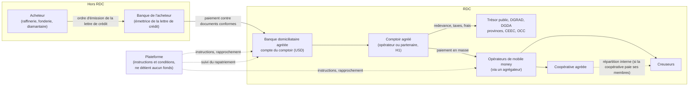
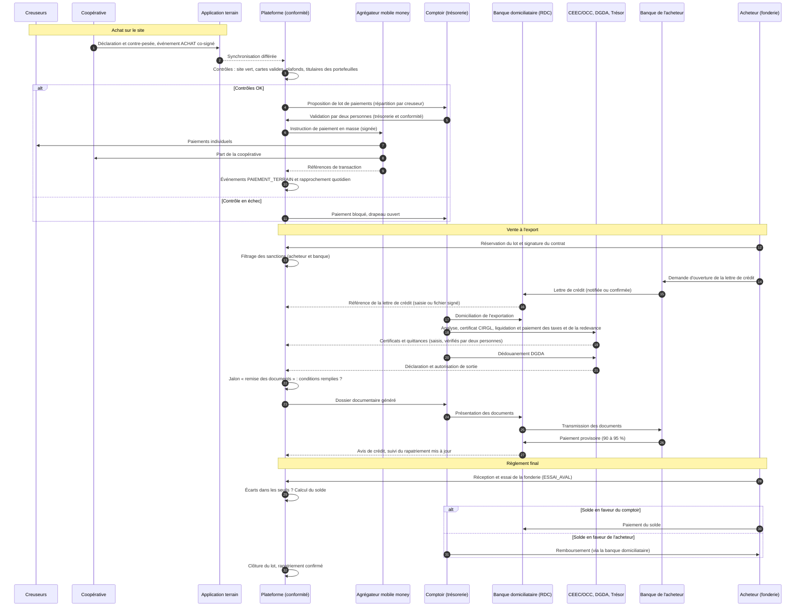
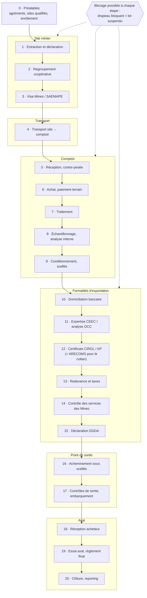
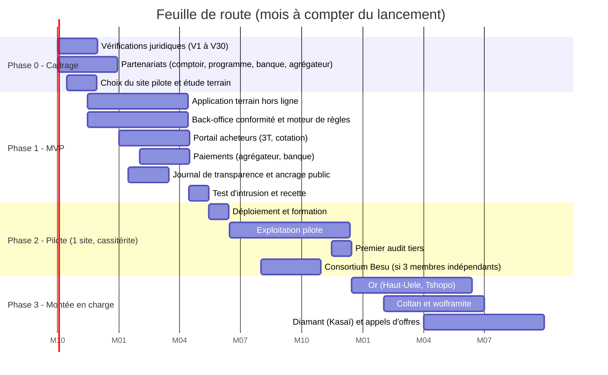

# Comptoir de vente en ligne de minerais certifiés issus de l'exploitation artisanale en RDC

## Dossier de spécifications fonctionnelles et techniques. Partie 3/3 : sections 5, 6 et 7

| Élément | Valeur |
|---|---|
| Version | 0.1 (projet, à relire) |
| Date | 23 septembre 2026 |
| Périmètre de cette partie | §5 Flux financiers ; §6 Workflow de conformité de la mine au port ; §7 Risques et plan de mise en œuvre |
| Prérequis | Parties 1 et 2, validées par le porteur de projet le 23 septembre 2026 |
| Relecture obligatoire | Banque domiciliataire et conseil en réglementation des changes (§5.2 à §5.4) ; responsable LBC/FT (§5.4.3) ; juriste minier et transitaire agréé (§6) ; comité de pilotage (§7) |

Les étiquettes **[LÉGAL-RDC]**, **[LÉGAL-EXT]**, **[NORME]**, **[BP]** et **⚠ À vérifier** ont le sens défini au §0.1 de la partie 1.

---

## 5. Flux financiers

### 5.0 Principes

| # | Principe | Conséquence |
|---|---|---|
| F1 | **La plateforme ne détient jamais de fonds pour le compte de tiers.** Recevoir, conserver ou transférer des fonds pour autrui est une activité d'établissement de crédit, d'institution de paiement ou d'émetteur de monnaie électronique, soumise à l'agrément de la BCC [LÉGAL-RDC]. | Tous les fonds transitent par des comptes du **comptoir agréé** ouverts dans des **banques agréées** et par des **opérateurs de mobile money agréés**. La plateforme émet des **instructions** et des **conditions de déblocage** ; ce sont la banque et l'opérateur qui exécutent. ⚠ À vérifier : qualification juridique d'un séquestre conventionnel (§5.2.2). |
| F2 | **Chaque paiement est rattaché à un événement de traçabilité.** Pas de paiement terrain sans événement `ACHAT` ; pas de paiement acheteur sans lot `RESERVE` et contrat signé. | Un paiement sans contrepartie physique identifiée est impossible par construction ; il est aussi le premier indicateur de blanchiment. |
| F3 | **Le déblocage des fonds dépend de l'état de conformité**, calculé par le moteur de règles. Un lot `SUSPENDU` gèle tout déblocage qui le concerne. | Voir la matrice §5.2.3. |
| F4 | **Paiement électronique par défaut, espèces par exception encadrée.** | Plafonds, justificatifs photographiés, réduction progressive de la part des espèces (indicateur de pilotage, §7.3). |
| F5 | **Rapprochement quotidien** entre les instructions émises par la plateforme et les relevés de la banque et des opérateurs de mobile money. | Tout écart non expliqué sous 48 heures ouvre un drapeau `CONTREPARTIE_LBCFT`. |

### 5.1 Vue d'ensemble des flux

### 5.2 Paiement par l'acheteur

#### 5.2.1 Modalités comparées

| Modalité | Fonctionnement | Protection du comptoir | Protection de l'acheteur | Usage recommandé |
|---|---|---|---|---|
| **Lettre de crédit documentaire irrévocable**, de préférence **confirmée** par une banque de premier rang (règles RUU 600 de la Chambre de commerce internationale) | La banque de l'acheteur s'engage à payer contre la remise de documents conformes dans un délai donné | Élevée (engagement bancaire ; élevée si confirmée) | Élevée : paiement seulement contre les documents exigés | **Or et 3T**, contrats importants et nouveaux acheteurs. Contrainte : coût et délai de mise en place ; les banques correspondantes appliquent une diligence renforcée aux minerais de la RDC. |
| **Séquestre (compte bloqué)** auprès d'une banque agréée en RDC | L'acheteur verse les fonds sur un compte bloqué ; déblocage sur instruction conjointe ou selon des conditions contractuelles vérifiées par la banque | Élevée une fois les fonds versés | Élevée : déblocage conditionnel | Nouveaux acheteurs sans accès à une lettre de crédit ; **diamant** (versement du prix d'adjudication avant l'export). ⚠ À vérifier : existence du produit de séquestre dans les banques congolaises et compatibilité avec la réglementation de change. |
| **Paiement contre documents** (encaissement documentaire, règles RUE 522) | La banque du comptoir remet les documents à la banque de l'acheteur contre paiement | Moyenne : l'acheteur peut refuser les documents, la marchandise étant déjà expédiée | Moyenne | Acheteurs réguliers, bien notés, après au moins 3 transactions sans incident |
| **Paiement anticipé** (avant expédition) | L'acheteur paie tout ou partie avant l'expédition | Maximale | Faible | Petits lots ; acomptes de réservation |
| **Préfinancement** de la production par l'acheteur | L'acheteur avance des fonds au comptoir ou aux coopératives, remboursés en minerais | — | — | **Exclu du MVP** [BP]. Le préfinancement crée une dépendance, rend plus difficile le désengagement exigé par le Guide OCDE et est un vecteur connu de blanchiment dans la filière de l'or. |

**Or et 3T : paiement provisoire, puis règlement final.** La teneur exacte n'est connue qu'après l'essai de la raffinerie ou de la fonderie. Le contrat prévoit :

1. un **paiement provisoire** de 90 à 95 % (proposition) de la valeur calculée sur la meilleure mesure disponible (essai de la CEEC pour l'or, analyse de l'OCC ou de la CEEC pour les 3T), payé contre les documents ;
2. un **règlement final** après l'essai aval, dans les deux sens (complément ou remboursement), selon la formule de cotation du contrat (partie 1, §2.b.3) ;
3. une **procédure de contestation** : analyse d'arbitrage sur l'échantillon scellé conservé, par un laboratoire désigné au contrat ; frais à la charge de la partie dont le résultat s'éloigne le plus de celui de l'arbitre.

**Diamant :** prix ferme issu de l'appel d'offres. Paiement intégral sur un compte du comptoir en RDC (séquestre ou compte courant) **avant l'export** ; le colis n'est remis au transporteur qu'après la confirmation de réception des fonds par la banque.

#### 5.2.2 Documents exigés par une lettre de crédit (liste type)

À adapter au contrat et à l'Incoterm. La plateforme génère le **dossier documentaire** à partir du dossier de lot, sans ressaisie.

| Document | Source | Remarque |
|---|---|---|
| Facture commerciale | Comptoir (plateforme) | Montant cohérent avec la cotation et avec la déclaration en douane |
| Liste de colisage | Comptoir (plateforme) | Nombre de colis, poids bruts et nets, numéros de scellés |
| Lettre de transport aérien ou document de transport | Transporteur | |
| Rapport d'expertise CEEC | CEEC | Or et diamant |
| Certificat d'analyse | OCC ou CEEC, ou laboratoire désigné | 3T ; ⚠ répartition à vérifier (partie 1, V6) |
| Certificat CIRGL | Autorité nationale (⚠ à vérifier) | Or et 3T |
| Certificat du Processus de Kimberley | CEEC (⚠ à vérifier) | Diamant ; accompagne physiquement le colis, n'est généralement pas un document bancaire |
| Déclaration d'exportation en douane | DGDA | |
| Certificat d'origine | ⚠ Organisme émetteur à vérifier (chambre de commerce, administration) | Si exigé par l'acheteur ou par le pays d'importation |
| Police ou certificat d'assurance | Assureur | Selon l'Incoterm |
| Attestation de conformité de la plateforme [BP] | Plateforme, signée par le responsable conformité | Résumé de diligence du lot, lien et preuve d'inclusion vérifiables (partie 2, §3.9.2) |

#### 5.2.3 Conditions de déblocage liées aux statuts de conformité

La plateforme calcule, pour chaque contrat, les **jalons de paiement** et leur condition. Une condition non remplie bloque l'instruction de paiement ou de livraison correspondante.

| Jalon | Condition calculée par la plateforme | Effet |
|---|---|---|
| Réservation d'un lot | Acheteur approuvé (KYB à jour, filtrage des sanctions de moins de 24 heures), lot `VENDABLE` | Acompte éventuel appelé ; lot `RESERVE` |
| Émission ou réception de la lettre de crédit, ou versement au séquestre | Filtrage des sanctions rejoué sur l'acheteur **et sur la banque émettrice** ; pays de la banque cohérent avec le profil de l'acheteur | Le comptoir engage les formalités d'exportation |
| Remise des documents (lettre de crédit, encaissement) | Lot toujours `RESERVE` ; tous les certificats `VERIFIE` ; déclaration DGDA et sortie autorisée enregistrées ; aucun drapeau bloquant ouvert | Transmission des documents à la banque |
| Déblocage du séquestre ou paiement provisoire | Événement `EXPEDITION` enregistré ; scellés intacts ; aucun drapeau bloquant | Instruction de déblocage émise à la banque |
| Règlement final | Événement `ESSAI_AVAL` saisi et validé ; écarts dans les seuils (partie 2, §3.8.2) ou écart expliqué | Calcul et instruction du solde |
| **À tout moment : lot suspendu** | Événement `SUSPENSION` | **Gel de tous les jalons non encore exécutés** ; notification à la banque selon la procédure prévue au contrat |
| **À tout moment : correspondance de sanction** | Nouveau résultat positif au filtrage | Gel ; application des mesures de gel des avoirs prévues par la loi (⚠ modalités à vérifier) ; information du responsable conformité |

### 5.3 Paiement terrain (mobile money)

#### 5.3.1 Modèle retenu

- **Payeur** : le comptoir, depuis un compte marchand ou de décaissement ouvert auprès des opérateurs (M-Pesa, Airtel Money, Orange Money ; ⚠ Africell Money si pertinent dans les zones retenues), idéalement par l'intermédiaire d'un **agrégateur agréé** qui donne accès aux trois réseaux par une seule interface.
- **Bénéficiaires** :
  - **la coopérative**, sur son compte bancaire ou son portefeuille d'entreprise, pour la part qui lui revient (cotisations, frais) ;
  - **les creuseurs directement**, pour leur part de la production déclarée, si la coopérative l'accepte (option recommandée [BP] : elle réduit le risque de détournement et donne une preuve de paiement individuelle).
- **Déclencheur** : l'événement `ACHAT`, co-signé par la coopérative et le comptoir. La plateforme calcule la répartition à partir des parts déclarées par creuseur (partie 2, §3.2, `contributeurs`).
- **Devise** : USD ou francs congolais selon le choix de la coopérative, au taux affiché et horodaté à la date de l'achat. ⚠ À vérifier : règles de la BCC sur les paiements en devises par monnaie électronique.
- **Frais** : les frais de décaissement sont à la charge du comptoir et affichés sur le bon d'achat ; les frais de retrait ne doivent pas réduire la part des creuseurs sans que ce soit dit.

#### 5.3.2 Plafonds et contrôles

| Contrôle | Règle | Qualification |
|---|---|---|
| Plafonds réglementaires des portefeuilles | Plafonds par niveau de vérification d'identité du titulaire (solde, transaction, cumul mensuel) | [LÉGAL-RDC] ⚠ Valeurs à vérifier dans l'instruction de la BCC sur la monnaie électronique ; la plateforme les enregistre comme paramètres |
| Montant ≤ valeur de la contribution | Le paiement d'un creuseur ne peut dépasser sa part × valeur du lot au prix du bon d'achat | [BP] |
| Plafonds internes par creuseur | Par transaction, par jour et par mois, fixés en fonction de la productivité plausible du site (partie 2, §3.8.3) | [BP] |
| Titulaire du portefeuille | Le nom retourné par l'opérateur lors de la vérification du compte doit correspondre au nom du creuseur (tolérance paramétrable pour l'orthographe) ; sinon, paiement bloqué et vérification manuelle | [BP] |
| Portefeuille partagé | Un même numéro ne peut recevoir les paiements de plus de N creuseurs (proposition : 1 ; exceptions justifiées, par exemple un membre de la famille) | [BP] ; indicateur de prête-nom |
| Changement de numéro | Tout changement de numéro exige une validation par le responsable de coopérative et un délai de 48 heures avant le premier paiement ; protection contre la fraude par échange de carte SIM | [BP] |
| Paiement fractionné | Détection des paiements fractionnés pour rester sous un seuil | [LÉGAL-RDC] (indicateur LBC/FT) |
| Accusé de paiement | Référence de transaction de l'opérateur enregistrée dans un événement `PAIEMENT_TERRAIN` ; SMS au bénéficiaire (partie 1, T-15) | [BP] |

#### 5.3.3 Espèces : exception encadrée

La liquidité des agents de retrait de mobile money est souvent insuffisante dans les zones minières isolées. Les creuseurs peuvent donc exiger des espèces. Règles :

- **Plafond** par paiement et par jour (paramétrable), bien en dessous des seuils de déclaration des opérations en espèces de la loi LBC/FT (⚠ seuils à vérifier).
- **Bon de paiement** imprimé ou affiché, signé par le bénéficiaire (signature ou empreinte digitale sur papier), **photographié**, et rattaché à l'événement `PAIEMENT_TERRAIN` avec la mention « espèces ».
- **Deux personnes** du comptoir présentes lors du paiement.
- **Transport de fonds** assuré et journalisé ; rapprochement de la caisse chaque jour.
- **Objectif de réduction** : part des paiements en espèces mesurée et suivie (§7.3), avec un plan d'amélioration de la liquidité (partenariats avec des agents de retrait, paiement en francs congolais si la liquidité en USD manque).

#### 5.3.4 Avances aux coopératives

Les coopératives demandent souvent des avances (achat d'outils, de nourriture pour les équipes). Elles sont **autorisées mais tracées** [BP] : chaque avance est une créance, avec un plafond par coopérative, remboursée par imputation sur les achats futurs. Une coopérative dont les avances dépassent le plafond ne peut pas en recevoir de nouvelles. Les avances ne sont jamais versées **en échange d'une exclusivité** qui empêcherait le comptoir de se désengager d'un site devenu rouge.

### 5.4 Change, fiscalité, LBC/FT

#### 5.4.1 Réglementation de change (BCC)

| Obligation | Contenu | Fonction de la plateforme | Statut |
|---|---|---|---|
| Domiciliation de l'exportation | Chaque exportation est déclarée et domiciliée auprès d'une banque agréée avant l'expédition | Enregistrement de la référence de domiciliation ; condition préalable à la déclaration DGDA | [LÉGAL-RDC] ⚠ Formulaire et procédure à vérifier |
| Rapatriement des recettes | Les recettes d'exportation doivent être rapatriées sur le compte domicilié dans un **délai** et selon une **quotité** fixés par la réglementation | **Suivi de rapatriement** par exportation : montant attendu, échéance, montant encaissé, écart ; alerte à J−15 et J−5 avant l'échéance | [LÉGAL-RDC] ⚠ Délai et quotité à vérifier |
| Paiements à des tiers | Le paiement doit provenir de l'acheteur contractuel (ou de sa banque) | Contrôle : payeur = acheteur contractuel ; sinon, blocage et revue LBC/FT | [LÉGAL-RDC] et [BP] |
| Paiements depuis ou vers l'étranger pour des achats locaux | Les achats aux coopératives sont des opérations intérieures | Aucun paiement terrain depuis un compte étranger | [BP] ⚠ À vérifier |

#### 5.4.2 Fiscalité et redevances

- **Toutes les valeurs viennent de la table fiscale versionnée** (partie 1, §2.c.1). Aucune n'est codée en dur. Une ligne « à vérifier » ne peut pas servir en production.
- **Moment du paiement** : la redevance minière et les taxes à l'exportation sont en général liquidées et payées **avant la sortie** du territoire, au vu de la valeur retenue par l'expertise (CEEC) ou de la valeur déclarée (⚠ assiette et moment à vérifier par substance).
- **Preuve** : chaque quittance est un document `QUITTANCE_TAXE` rattaché au lot, avec son empreinte. L'absence de quittance d'un prélèvement obligatoire bloque l'événement `SORTIE_AUTORISEE`.
- **Contrôle de cohérence** : montant payé = taux × assiette de la table fiscale ; un écart ouvre un drapeau `DOCUMENTS`.
- **Taxes illégales** : un prélèvement payé à une entité non prévue par la table fiscale (barrière routière non officielle, « taxe » d'un groupe armé) est à **déclarer** comme incident de taxation illégale (Annexe II OCDE) et non à comptabiliser comme un frais. La plateforme propose un champ spécifique dans l'événement de transport pour le déclarer sans crainte de sanction interne.
- Autres impôts (impôt sur les bénéfices, TVA sur les achats et prestations locales, exonération à l'export) : relèvent de la comptabilité du comptoir, hors périmètre fonctionnel de la plateforme ; exports comptables prévus (§7.2). ⚠ Régime à vérifier par le conseil fiscal.

#### 5.4.3 Obligations LBC/FT

| Obligation | Mise en œuvre | Qualification |
|---|---|---|
| Approche fondée sur les risques | Évaluation des risques de l'entreprise (clients, produits, pays, canaux) mise à jour chaque année ; niveau de risque de chaque contrepartie (partie 1, §2.b.1) | [LÉGAL-RDC] ; GAFI R.1 |
| Vigilance à l'égard des clients et des fournisseurs | Acheteurs : KYB complet. Coopératives et négociants : agrément, dirigeants, bénéficiaires effectifs. Creuseurs : identité et carte. | [LÉGAL-RDC] ; GAFI R.10, R.22 |
| Vigilance renforcée | PPE, pays à haut risque, structures opaques, transactions inhabituelles ; validation du responsable conformité | [LÉGAL-RDC] ; GAFI R.12, R.19 |
| Surveillance des transactions | Règles de détection (liste ci-dessous) exécutées sur chaque transaction ; revue humaine des alertes | [LÉGAL-RDC] |
| Déclaration de soupçon à la CENAREF | Préparée dans la plateforme (partie 1, C-08), transmise par le responsable conformité selon le canal prévu ; **interdiction d'avertir** la personne concernée | [LÉGAL-RDC] ; GAFI R.20, R.21 ⚠ Canal et délai à vérifier |
| Déclaration des opérations en espèces au-delà des seuils | Détection automatique ; dossier prêt à transmettre | [LÉGAL-RDC] ⚠ Seuil et existence de l'obligation à vérifier |
| Gel des avoirs (sanctions financières ciblées) | Filtrage continu ; en cas de correspondance confirmée, gel immédiat et information des autorités | [LÉGAL-RDC] ; GAFI R.6 ⚠ Autorité et procédure à vérifier |
| Conservation des pièces | Au moins la durée légale (souvent 10 ans ; ⚠ à vérifier) | [LÉGAL-RDC] ; GAFI R.11 |
| Formation et contrôle interne | Formation annuelle des équipes ; audit indépendant de la fonction de conformité | [LÉGAL-RDC] ; GAFI R.18 |

**Indicateurs de détection** (inspirés des typologies publiées par le GAFI sur l'or et les pierres précieuses) :

| Indicateur | Règle proposée |
|---|---|
| Prix anormal | Écart entre le prix convenu et le prix indexé > 5 % (or) ou 10 % (3T) ; pour le diamant, prix d'adjudication inférieur à l'évaluation CEEC (partie 1, §2.b.3) |
| Paiement par un tiers | Payeur différent de l'acheteur contractuel |
| Pays de paiement ou de transit | Banque ou transit par un pays sans lien avec l'acheteur, ou pays à haut risque selon le GAFI |
| Volume inhabituel | Achat ou vente > 3 fois la moyenne de la contrepartie sur 6 mois |
| Fractionnement | Plusieurs paiements juste sous un seuil sur une courte période |
| Nouveau fournisseur à gros volume | Coopérative ou négociant nouvellement agréé déclarant d'emblée des volumes élevés |
| Demande d'espèces répétée | Bénéficiaire qui refuse systématiquement le paiement électronique alors qu'un agent est disponible |
| Insistance sur la rapidité ou l'anonymat | Signalée manuellement par les équipes (bouton « comportement suspect » dans le back-office) |

### 5.5 Diagramme de séquence du paiement de bout en bout

Exemple d'un lot de cassitérite (substance pilote, H9) vendu par lettre de crédit.

---

## 6. Workflow de conformité de la mine au port

### 6.0 Lecture

- Le tableau §6.1 décrit la chaîne commune. Les variantes par substance sont au §6.2.
- La colonne **« Contrôle »** reprend les contrôles qui comblent le problème de l'oracle (partie 1, §2.c.7 ; partie 2, §3.9.3) à l'étape où ils s'appliquent.
- **L'ordre exact des formalités à l'export** (domiciliation, expertise, taxes, dédouanement) et les services présents à chaque point de sortie sont ⚠ **à vérifier** avec un transitaire agréé et les administrations (partie 1, V14). Le workflow est paramétrable pour s'adapter à l'ordre réel.

### 6.1 Chaîne commune

| # | Étape | Acteur | Action | Document produit | Contrôle | Événement enregistré | Blocage possible |
|---|---|---|---|---|---|---|---|
| 0 | Préalables | Comptoir, coopérative, Ministère des Mines, conformité | Vérifier les agréments (coopérative, comptoir, entité de traitement) et les cartes ; enregistrer le statut MRC du site ; enrôler les terminaux et les utilisateurs ; former | Copies des agréments et des arrêtés ; certificats des terminaux | Double validation des référentiels ; acte officiel joint ; attestation de clé du terminal | Événements de référentiel ; inscription des statuts de site et des certificats sur le registre | Site rouge ou non qualifié : aucune vente possible. Agrément expiré : aucune déclaration acceptée. |
| 1 | Extraction et déclaration | Creuseurs, agent de coopérative, co-signataire | Peser le lot, photographier la balance et le lot, poser l'étiquette ou le scellé, désigner les contributeurs, signer | Déclaration électronique ; étiquette du programme (3T) ; fiche de production papier si exigée | Position GNSS dans le périmètre de la ZEA ; détection de position fictive ; âge et carte des contributeurs ; unicité de l'étiquette ; plausibilité du volume (site, creuseur) | `LOT_DECLARE` | Mineur détecté, étiquette réutilisée, site rouge : lot rejeté ou suspendu |
| 2 | Regroupement à la coopérative | Agent et responsable de coopérative | Regrouper des déclarations du même site ; peser | — | Bilan de masse du regroupement ; règles de compatibilité (partie 2, §3.7.3) | `REGROUPEMENT`, `PESEE` | Écart hors seuil : lot en contrôle |
| 3 | Visa de l'administration | Agent de la Division des Mines ou du SAEMAPE | Constater la production et renseigner la fiche ou le cahier de traçabilité officiel | Fiche de traçabilité ou attestation d'origine (⚠ formulaire à vérifier) | Photo du document officiel, empreinte ; concordance poids et site ; visa électronique facultatif (partie 1, T-13) | `LOT_DECLARE` (visa) ou `CERTIFICAT_ENREGISTRE` (document) | Document officiel absent quand il est obligatoire : lot `ATTENTE_DOCUMENTS` |
| 4 | Transport site → comptoir | Coopérative, négociant ou transporteur | Remettre le lot sous scellé ; transporter | Bordereau de transport ; éventuel document de circulation (⚠ à vérifier) | Scellés photographiés au départ ; durée de transport plausible ; déclaration des prélèvements illégaux rencontrés | `TRANSFERT_GARDE_INITIE` | Transit non confirmé sous 72 h : drapeau |
| 5 | Réception au comptoir | Agent du comptoir | Vérifier les scellés ; contre-peser ; photographier | Bon de réception | Scellés intacts ; bilan de masse de transport ; comparaison des photos du lot | `TRANSFERT_GARDE_CONFIRME`, `SCELLE_VERIFIE`, `PESEE` | Scellé rompu sans explication ou écart hors seuil : lot bloqué |
| 6 | Achat et paiement terrain | Comptoir, coopérative | Fixer le prix ; signer le bon d'achat ; payer | Bon d'achat ; preuves de paiement | Prix dans la fourchette du jour ; plafonds et titulaires des portefeuilles (§5.3.2) ; agréments valides | `ACHAT`, `PAIEMENT_TERRAIN` | Paiement bloqué si un contrôle échoue |
| 7 | Traitement (s'il y a lieu) | Entité de traitement, comptoir | Fonte (or), lavage ou concentration (3T) | Certificat de fonte ou de traitement | Bilan sur le contenu utile (poids fin, métal contenu) ; rejets pesés ; présence de deux personnes | `TRAITEMENT` | Écart hors seuil : lot en contrôle |
| 8 | Échantillonnage et analyse interne | Comptoir, laboratoire | Prélever un échantillon représentatif, le diviser en trois (analyse, contre-analyse, arbitrage), le sceller | Rapport d'analyse interne ; échantillons scellés | Procédure d'échantillonnage documentée ; scellés des échantillons | `ANALYSE_RESULTAT`, `SCELLE_POSE` | — |
| 9 | Conditionnement et scellés du comptoir | Comptoir | Conditionner pour l'export ; poser les scellés du comptoir | Liste de colisage | Poids par colis = poids du lot ; photos | `SCELLE_POSE`, `PESEE` | — |
| 10 | Domiciliation bancaire | Comptoir, banque domiciliataire | Déclarer et domicilier l'exportation | Déclaration d'exportation domiciliée (⚠ formulaire à vérifier) | Acheteur approuvé, contrat signé, lot `RESERVE` | `CERTIFICAT_ENREGISTRE` (type `DECLARATION_EXPORT_BANCAIRE`) | Acheteur non approuvé : aucune domiciliation proposée |
| 11 | Expertise et analyse officielles | CEEC (or, diamant) ; OCC ou CEEC (3T, ⚠ à vérifier) | Peser, analyser ou classer, évaluer ; poser les scellés officiels | Rapport d'expertise et d'évaluation ; certificat d'analyse | Rapprochement avec la contre-pesée et l'analyse interne (partie 2, §3.8.2) ; référentiel des signataires | `EXPERTISE_CEEC` ou `ANALYSE_RESULTAT`, `SCELLE_POSE` (officiel) | Écart hors seuil ; valeur CEEC supérieure au prix de vente (sous-facturation) |
| 12 | Certificats | Autorité émettrice (⚠ à vérifier par certificat) ; ARECOMS pour le coltan | Émettre le certificat CIRGL (or, 3T) ou KP (diamant) ; autorisation ARECOMS (coltan, ⚠ à vérifier) | Certificat CIRGL, certificat KP, autorisation | Numéro unique ; concordance avec le lot ; statut MRC du site à la date d'émission | `CERTIFICAT_ENREGISTRE` | Certificat incohérent ou déjà utilisé : lot non vendable |
| 13 | Redevance et taxes | Comptoir, DGRAD, DGDA, provinces, CEEC, OCC | Liquider et payer | Notes de perception ; quittances | Montant = taux × assiette de la table fiscale ; quittances enregistrées | `CERTIFICAT_ENREGISTRE` (type `QUITTANCE_TAXE`) | Quittance manquante : sortie bloquée |
| 14 | Contrôle des services des Mines | Service des Mines (à l'export ; ⚠ service compétent et moment à vérifier) | Vérifier la conformité du dossier minier et des scellés | Visa ou procès-verbal de contrôle | Dossier complet ; scellés officiels intacts | `SCELLE_VERIFIE`, `CERTIFICAT_ENREGISTRE` | Dossier incomplet : lot bloqué |
| 15 | Déclaration en douane | Comptoir (déclarant ou transitaire agréé), DGDA | Déposer la déclaration d'exportation ; contrôle documentaire et, le cas échéant, physique | Déclaration en douane ; autorisation de sortie (bon à enlever) | Concordance valeur, poids, certificats et domiciliation ; quittances | `DECLARATION_DGDA`, `SORTIE_AUTORISEE` | Autorisation de sortie manquante : `EXPEDITION` impossible |
| 16 | Acheminement vers le point de sortie | Transporteur, convoyeur | Transporter sous scellés officiels | Document de transport ; plombage des camions ou conteneurs (3T) | Suivi du transport ; scellés photographiés à l'arrivée ; délai plausible | `TRANSFERT_GARDE_INITIE`, `TRANSFERT_GARDE_CONFIRME` | Rupture de scellé : lot bloqué, nouvelle expertise |
| 17 | Contrôles de sortie et embarquement | DGDA, services des Mines, sûreté aéroportuaire ou poste frontière | Contrôle final ; embarquement | Lettre de transport aérien ou document de transport ; visa de sortie | Scellés intacts ; documents originaux accompagnant la marchandise | `EXPEDITION` | Refus de sortie : retour au comptoir, incident |
| 18 | Réception par l'acheteur | Acheteur | Vérifier les scellés ; peser ; (diamant) confirmer la réception du certificat KP à l'autorité KP d'origine | Rapport de réception ; confirmation d'importation KP | Bilan de masse de transport international ; scellés | `RECEPTION_ACHETEUR` | Écart ou scellé rompu : litige, drapeau |
| 19 | Essai aval et règlement final | Raffinerie, fonderie ; comptoir | Essai de teneur ; calcul du solde ; paiement | Rapport d'essai ; décompte final | Écart d'essai dans les seuils ; analyse d'arbitrage en cas de contestation | `ESSAI_AVAL`, `PAIEMENT_*` | Écart hors seuil : drapeau `SUBSTITUTION` |
| 20 | Clôture et reporting | Conformité | Clôturer le lot ; confirmer le rapatriement ; intégrer au rapport de diligence | Rapport annuel (étape 5 OCDE) ; registres réglementaires | Rapatriement dans le délai ; aucune anomalie ouverte | Clôture ; ancrage | Rapatriement en retard : alerte, gel des nouvelles ventes à l'acheteur concerné |

### 6.2 Variantes par substance

#### 6.2.1 Or

| Étape | Particularité |
|---|---|
| 1 | Pesée au milligramme sur balance de précision (résolution ≤ 10 mg) ; estimation du titre sur site par pierre de touche ou par densité, marquée « estimation » ; information sur l'usage du mercure. |
| 2 | **Aucun regroupement de plusieurs sites** avant l'expertise CEEC (partie 2, §3.7.3). |
| 4 | Transport de faibles volumes à forte valeur : convoyeur identifié, contenant scellé, trajet enregistré ; transport aérien intérieur possible vers Kinshasa (⚠ règles de transport de l'or à l'intérieur du pays à vérifier). |
| 7 | Fonte en lingots dorés : bilan sur le **poids fin** ; perte au feu dans la plage attendue ; présence de deux personnes et vidéo de la fonte [BP]. |
| 11 | Expertise CEEC : pesée, essai du titre, évaluation ; scellés CEEC. |
| 12 | Certificat CIRGL. |
| 15 à 17 | Export par **l'aéroport de N'Djili** (H6) ; colis scellés accompagnés du dossier original. |
| 19 | Essai au feu par la raffinerie ; règlement final ; la raffinerie peut demander le dossier de diligence renforcée LBMA (visites de site, plan de gestion des risques). |

#### 6.2.2 Diamant brut

| Étape | Particularité |
|---|---|
| 0 | **Pas de qualification MRC** : évaluation de risque du site selon l'Annexe II OCDE (partie 1, §1.3.2). |
| 1 | Dénombrement **et** pesée au centième de carat ; photos individuelles des pierres au-dessus du seuil de suivi individuel. |
| 5 | Contre-pesée et **recomptage** au comptoir ; comparaison des photos des grosses pierres. |
| 7 | Pas de traitement. Tri et classement en colis par le comptoir, avant l'expertise. |
| 11 | Expertise et **évaluation** CEEC ; la valeur CEEC sert de référence pour le prix de réserve et pour le contrôle de sous-facturation. |
| 11 bis | **Appel d'offres sous plis scellés** (partie 1, §2.b.4) : visite des colis dans une salle sécurisée, dépôt des offres chiffrées, ouverture à deux détenteurs de clé, adjudication. Paiement intégral **avant** l'export (§5.2.1). |
| 12 | **Certificat du Processus de Kimberley** ; conteneur inviolable. |
| 15 à 17 | Export par l'aéroport de N'Djili. |
| 18 | Confirmation d'importation par l'autorité KP du pays importateur, puis retour de la confirmation à l'autorité KP d'origine ; la plateforme enregistre la confirmation quand elle est communiquée. |
| 19 | Pas d'essai aval ; pas de règlement final (prix ferme). |

#### 6.2.3 Minerais 3T

| Étape | Particularité |
|---|---|
| 0 | Site qualifié vert ou jaune ; **couverture par un programme en amont** (ITSCI ou Better Mining) pour être accepté par les fonderies RMAP (hypothèse du pilote, H9). |
| 1 | Pesée au kilogramme ; **étiquette « mine » du programme** posée sur chaque sac par l'agent habilité (selon les règles du programme) ; la plateforme enregistre le numéro. |
| 4 | Transport routier ou lacustre de volumes importants ; déclaration des barrières et prélèvements rencontrés. |
| 5 | Mesure de l'humidité pour comparer des poids **secs**. |
| 7 | Concentration (lavage, séparation magnétique) : étiquette « traitement » ; bilan sur le **métal contenu** ; rejets pesés. |
| 8 | Échantillonnage en trois parts ; pour le **coltan**, mesure de la **radioactivité**. |
| 11 | Analyse officielle (OCC ou CEEC, ⚠ à vérifier) ; plombage des conteneurs ou des camions. |
| 12 | Certificat CIRGL ; **coltan : autorisation ou visa de l'ARECOMS** (⚠ à vérifier) ; documents de transport des matières radioactives si le seuil est dépassé (⚠ à vérifier). |
| 13 | Coltan : redevance des substances stratégiques (⚠ taux à vérifier). |
| 15 à 17 | Sortie par **Kasumbalesa** (route vers Durban ou Dar es Salaam) ou **Kalemie** (lac Tanganyika vers Kigoma et Dar es Salaam) (H6) ; régime de transit dans les pays traversés (⚠ à vérifier). |
| 18 à 19 | Réception par la fonderie RMAP ; essai ; règlement final ; la fonderie reçoit l'export « données étape 2 OCDE » et, pour les importateurs de l'UE, les informations exigées par le Règlement 2017/821. |

### 6.3 Contrôles inopinés et vérifications indépendantes

Ces contrôles complètent la chaîne documentaire : ils testent la **réalité physique** derrière les enregistrements.

| Contrôle | Fréquence proposée | Déclenchement | Responsable |
|---|---|---|---|
| Contre-pesée inopinée d'un lot en stock | 5 % des lots par mois, pondéré par le risque | Tirage aléatoire (partie 1, C-13) | Conformité |
| Contre-analyse d'un échantillon d'arbitrage par un laboratoire indépendant | 2 % des lots, et tout lot au-dessus d'un écart d'analyse | Tirage ou alerte | Conformité |
| Visite de site non annoncée | Au moins 1 par site et par trimestre au pilote | Calendrier et alertes | Conformité, avec la société civile ou le programme en amont |
| Comparaison de la production déclarée avec les statistiques du SAEMAPE et des Mines | Mensuelle | Automatique, sur données transmises ou saisies | Conformité |
| Inventaire physique complet du comptoir | Mensuel | Calendrier | Comptoir, sous la supervision de la conformité |
| Audit tiers de la diligence (étape 4 OCDE) | Annuel | Calendrier | Auditeur indépendant |
| Test d'intrusion et audit de sécurité | Annuel et avant chaque version majeure | Calendrier | RSSI |

---

## 7. Risques et plan de mise en œuvre

### 7.1 Matrice des risques

Échelles : **Probabilité (P)** de 1 (rare) à 5 (presque certain) ; **Impact (I)** de 1 (mineur) à 5 (critique : arrêt de l'activité, sanction pénale, atteinte aux personnes). **Score = P × I** ; critique si ≥ 15, élevé de 10 à 14, modéré de 5 à 9, faible en dessous. Cotation initiale proposée par l'équipe projet, **avant mesures**, à revoir en comité de pilotage.

| # | Risque | Scénario type | P | I | Score | Mesures préventives | Détection | Réponse | Propriétaire |
|---|---|---|---|---|---|---|---|---|---|
| R1 | **Fraude documentaire** | Faux rapport d'expertise, certificat CIRGL ou KP falsifié ou réutilisé ; carte d'exploitant falsifiée | 4 | 5 | **20** | Rapprochement systématique des données ; numéros uniques ; référentiel des signataires ; confirmation directe auprès de l'émetteur pour les cas douteux ; double validation | Règles `DOCUMENTS` ; unicité des numéros ; écarts entre documents et mesures | Lot suspendu ; confirmation auprès de l'émetteur ; signalement à l'autorité ; désengagement du fournisseur si la fraude est avérée | Responsable conformité |
| R2 | **Blanchiment d'origine** (production non conforme présentée comme venant d'un site vert) | Or d'une zone contrôlée par un groupe armé déclaré sur un site vert voisin | 4 | 5 | **20** | Capacité estimée par site ; plafonds par creuseur ; géolocalisation ; visites inopinées ; programmes en amont ; signature minéralogique (phase C) | Contrôles de plausibilité (partie 2, §3.8.3) ; alertes de la société civile et des programmes | Blocage des déclarations du site ; enquête ; désengagement | Responsable conformité |
| R3 | **Blanchiment de capitaux** par le commerce des minerais | Surfacturation ou sous-facturation ; paiement par un tiers ; acheteur servant de façade | 3 | 5 | **15** | KYB renforcé ; filtrage continu ; contrôle des prix ; payeur = acheteur contractuel ; pas de préfinancement au MVP | Indicateurs §5.4.3 ; revue des alertes | Blocage ; déclaration de soupçon à la CENAREF ; fin de la relation | Responsable conformité (LBC/FT) |
| R4 | **Contrebande** et concurrence du circuit informel | Les coopératives vendent aux circuits qui évitent les taxes et paient plus cher ; ou une partie de la production contourne le comptoir | 5 | 3 | **15** | Prix transparent et payé rapidement ; paiement électronique sûr ; services aux coopératives (avances tracées, formation) ; valeur ajoutée de l'accès aux acheteurs « conformes » | Chute des volumes par rapport aux statistiques des Mines et du SAEMAPE | Revue du modèle de prix ; dialogue avec les coopératives ; signalement aux autorités si une contrebande organisée est constatée | Direction commerciale |
| R5 | **Substitution de lots** | Remplacement d'un sac ou d'une pierre en cours de route ; mélange d'un lot déclaré avec du minerai d'origine inconnue | 4 | 4 | **16** | Scellés et étiquettes uniques ; contre-pesée à chaque transfert ; photos ; blocage des lots en transit ; échantillons scellés | Bilan de masse ; comparaison des photos ; écarts d'analyse entre étapes et avec l'essai aval | Lot bloqué ; nouvelle expertise ; enquête ; désengagement si substitution avérée | Responsable conformité |
| R6 | **Corruption** | Agent qui vise des déclarations fictives ; demande de paiement pour délivrer un document ; collusion entre un agent du comptoir et un fournisseur | 4 | 4 | **16** | Séparation des tâches ; quatre yeux ; rotation des agents ; politique anticorruption et formation ; canal d'alerte anonyme ; aucune dépense en espèces sans justificatif | Analyse des écarts par agent ; alertes ; audits | Enquête interne ; sanctions ; signalement ; révision des procédures | Direction générale ; conformité |
| R7 | **Cyberattaque** | Rançongiciel sur le serveur ; vol de données des creuseurs ; compromission d'une clé de signature ; prise de contrôle d'un compte de conformité | 3 | 5 | **15** | Stack et mesures du §4.5 (partie 2) ; WebAuthn ; HSM ; sauvegardes hors ligne ; tests d'intrusion | SIEM ; alertes d'intégrité (chaînes d'événements, ancrage) | Plan de réponse aux incidents ; procédure de compromission de clé ; notification aux personnes et aux autorités selon la loi (⚠ à vérifier) | RSSI |
| R8 | **Rejet par les raffineries et les fonderies** | Politique « pas d'ASM de la RDC » d'une raffinerie ; dossier jugé insuffisant ; incident médiatisé sur un site | 3 | 5 | **15** | Diligence conforme aux normes LBMA et RMAP dès la conception ; programme en amont ; audit tiers ; dialogue préalable avec 2 à 3 raffineries ou fonderies cibles avant le pilote | Retours des acheteurs ; refus de lots | Diversification des acheteurs ; plan d'amélioration ; transparence sur les incidents | Direction commerciale ; conformité |
| R9 | **Extension des conflits armés** aux zones d'approvisionnement | Groupe armé présent sur un site pilote ou sur une route de transport | 3 | 5 | **15** | Choix de provinces hors conflit actif (H3) ; veille sécuritaire ; suivi des rapports de l'ONU | Signalements ; déclassement du site | Suspension ; désengagement ; sécurité des équipes en priorité | Direction générale |
| R10 | **Changement réglementaire** | Suspension des exportations ou quotas (comme pour le cobalt en 2025) ; nouveau statut stratégique ; modification des taxes | 3 | 4 | **12** | Veille juridique ; table fiscale et règles paramétrables ; plusieurs substances | Veille | Adaptation des paramètres ; information des acheteurs ; clauses contractuelles de force majeure | Juriste |
| R11 | **Dépendance au comptoir partenaire** (H1) | Fin du partenariat ou retrait de l'agrément du partenaire avant l'agrément propre de l'opérateur | 2 | 5 | **10** | Contrat de partenariat avec préavis, réversibilité des données, transfert des relations avec les coopératives ; dépôt rapide de la demande d'agrément propre | Suivi du dossier d'agrément | Recherche d'un autre comptoir agréé ; plan de continuité | Direction générale |
| R12 | **Faible adoption sur le terrain** | Les agents ne remplissent pas les déclarations ; saisies bâclées ; terminaux abandonnés | 4 | 3 | **12** | Conception avec les utilisateurs ; formation ; agents de terrain formateurs ; incitations (paiement plus rapide pour les lots bien documentés) | Indicateurs d'usage (§7.3) | Formation complémentaire ; simplification des écrans | Chef de produit |
| R13 | **Liquidité et défaillance du mobile money** | Agents de retrait sans liquidité ; panne d'un opérateur ; frais élevés | 4 | 3 | **12** | Trois opérateurs via un agrégateur ; espèces encadrées en secours ; paiement en CDF possible | Taux d'échec des paiements ; plaintes | Bascule d'opérateur ; paiement en espèces encadré | Trésorerie |
| R14 | **Non-rapatriement ou retard de rapatriement des devises** | Paiement de l'acheteur en retard ; sanctions de la BCC | 2 | 4 | **8** | Lettre de crédit ou séquestre ; suivi des échéances | Alertes J−15 et J−5 | Relance ; gel des nouvelles ventes à l'acheteur ; information de la banque | Trésorerie |
| R15 | **Atteinte aux personnes et aux données des creuseurs** | Données personnelles utilisées pour racketter des creuseurs ; représailles contre un lanceur d'alerte | 2 | 5 | **10** | Mesures du §4.6 (partie 2) : pseudonymisation, coffre séparé, accès restreint, anonymat des alertes | Journal des consultations ; alertes | Enquête ; notification ; mesures de protection | Délégué à la protection des données ; conformité |
| R16 | **Sécurité physique** (vol, attaque de convoi) | Attaque d'un convoi d'or ou vol au comptoir | 3 | 4 | **12** | Transport sécurisé ; coffres ; assurance ; discrétion sur les horaires ; peu de stock au comptoir | Suivi du transport ; vidéosurveillance | Plan d'urgence ; déclaration ; assurance | Sécurité ; comptoir |
| R17 | **Travail des enfants non détecté** | Enfants travaillant sur le site sans être déclarés comme membres | 4 | 4 | **16** | Visites inopinées ; société civile ; formation des coopératives ; clause contractuelle | Signalements ; visites | Plan de remédiation (scolarisation, avec des partenaires spécialisés) plutôt qu'une exclusion sèche qui pousserait les familles vers le circuit informel ; suspension en cas de refus de la coopérative | Conformité |

Synthèse des risques critiques et élevés (score ≥ 12) : **R1, R2, R5, R6, R17** (score de 16 à 20) puis **R3, R4, R7, R8, R9** (15) et **R10, R12, R13, R16** (12). Les premiers sont principalement couverts par les fonctions de conformité du MVP ; R4 et R12 relèvent du modèle économique et de l'accompagnement du terrain plus que de la technique.

### 7.2 Feuille de route

Hypothèses de départ : budget du MVP de 450 000 à 600 000 USD, 9 mois jusqu'au pilote (H7) ; équipe de 7 ETP (H8) ; substance pilote cassitérite (H9).

#### Phase 0 : cadrage (mois 1 à 3)

| Élément | Contenu |
|---|---|
| Objectifs | Lever les incertitudes juridiques qui changent la conception ; signer les partenariats indispensables |
| Livrables | Note juridique répondant aux points V1 à V30 ; contrat avec le comptoir partenaire ; accord avec le programme en amont du site pilote ; ouverture du compte domicilié ; contrat avec un agrégateur de mobile money ; choix du site pilote ; analyse d'impact sur la protection des données ; politique de chaîne d'approvisionnement conforme à l'Annexe II OCDE |
| Indicateurs | 100 % des points marqués « priorité » (V2, V4, V5, V6, V19, V22) tranchés ; partenariats signés |
| Critère de passage | **Pas de lancement du développement des fonctions réglementées sans la note juridique sur V2 (statut de l'opérateur) et V19 (localisation des données)** |

#### Phase 1 : MVP (mois 2 à 8)

| Élément | Contenu |
|---|---|
| Périmètre | Cassitérite uniquement. Portail terrain (T-01 à T-12, T-16) ; back-office (C-01 à C-09) ; portail acheteurs (A-01 à A-07, A-11) ; paiements terrain par mobile money ; journal de transparence et ancrage public ; reporting de base |
| Hors périmètre | Or, diamant, coltan, wolframite ; appels d'offres ; consortium du registre ; comparaison automatique des visages ; USSD |
| Livrables | Application Android signée ; portails web ; documentation d'exploitation ; plan de continuité testé ; rapport de test d'intrusion avec corrections ; manuels et supports de formation dans les 4 langues |
| Indicateurs | Couverture de tests des règles de conformité ≥ 90 % ; 0 vulnérabilité critique ou élevée ouverte ; test d'utilisabilité : 8 utilisateurs sur 10 réussissent T-01 sans aide ; synchronisation fonctionnelle en 2G simulée |
| Critère de passage | Recette signée par le responsable conformité ; restauration complète testée ; formation des équipes du site pilote |

**Budget indicatif du MVP** (ordres de grandeur, à confirmer) :

| Poste | Hypothèse | Montant indicatif (USD) |
|---|---|---|
| Équipe de développement et d'exploitation | 7 ETP × 8 mois, coût complet moyen de 5 500 à 7 000 USD par mois (équipe mixte locale et régionale) | 310 000 à 390 000 |
| Conformité et juridique | Responsable conformité, juriste minier à temps partiel, conseil LBC/FT et protection des données | 50 000 à 80 000 |
| Infrastructure (8 mois) | Partie 2, §4.8 | 30 000 à 60 000 |
| Équipements du site pilote | Terminaux, balances, imprimantes, énergie solaire | 15 000 à 30 000 |
| Sécurité | Test d'intrusion, audit | 25 000 à 40 000 |
| Formation et accompagnement du terrain | 2 agents formateurs, déplacements | 20 000 à 30 000 |
| **Total** | | **450 000 à 630 000** |

Le haut de la fourchette dépasse légèrement le budget maximum (H7). Leviers d'ajustement : report du portail acheteurs complet (vente de gré à gré assistée au pilote), infrastructure plus légère au pilote (un seul site actif avec sauvegardes), part plus importante de l'équipe recrutée localement.

#### Phase 2 : pilote sur un site (mois 9 à 15)

| Élément | Contenu |
|---|---|
| Objectifs | Prouver la chaîne complète sur des lots réels, de la déclaration à l'essai de la fonderie ; calibrer les seuils ; mesurer l'adoption |
| Livrables | Au moins 10 expéditions exportées avec dossier complet ; seuils recalibrés (partie 2, §3.8) ; premier audit tiers de la diligence ; premier rapport de diligence (étape 5 OCDE) ; consortium du registre si au moins 3 membres indépendants se sont engagés ; retour d'expérience |
| Indicateurs cibles | Voir §7.3 |
| Critère de passage | Aucune non-conformité majeure à l'audit tiers ; au moins une fonderie RMAP ayant accepté les lots ; seuils recalibrés approuvés ; indicateurs d'adoption atteints à 80 % |

#### Phase 3 : montée en charge (mois 15 à 30)

| Élément | Contenu |
|---|---|
| Étapes | 1) **Or** (Haut-Uele, Tshopo) : diligence renforcée LBMA, fonte, export par N'Djili. 2) **Coltan et wolframite** : ARECOMS, radioactivité. 3) **Diamant** (Kasaï) : appels d'offres sous plis scellés, Kimberley, langue tshiluba. 4) Extension à d'autres sites par substance. |
| Livrables | Modules par substance ; consortium de 5 à 7 validateurs ; nœuds d'observation pour les acheteurs ; intégrations par fichiers signés avec les administrations qui l'acceptent ; agrément propre de l'opérateur (si obtenu) |
| Indicateurs | Volumes de l'hypothèse H4 atteints à 50 % à la fin de la phase ; mêmes indicateurs de qualité qu'au pilote |
| Critère de passage à chaque nouvelle substance | Revue juridique propre à la substance ; accord d'au moins un acheteur aval ; audit de la nouvelle chaîne dans les 6 mois |

### 7.3 Indicateurs de pilotage

| Domaine | Indicateur | Cible au pilote |
|---|---|---|
| Traçabilité | Lots exportés avec dossier documentaire complet | 100 % |
| Traçabilité | Déclarations avec position GNSS valide dans le périmètre de la ZEA | ≥ 95 % |
| Traçabilité | Écart médian de bilan de masse entre la déclaration et la contre-pesée (poids sec, 3T) | ≤ 1 % |
| Traçabilité | **Gains de poids inexpliqués** | **0** |
| Conformité | Drapeaux critiques traités dans le délai (48 h) | ≥ 95 % |
| Conformité | Délai médian entre la déclaration et l'état « vendable » | ≤ 15 jours |
| Conformité | Constats majeurs à l'audit tiers | 0 |
| Commerce | Lots acceptés par la fonderie sans contestation de conformité | ≥ 95 % |
| Commerce | Écart moyen entre l'analyse officielle et l'essai de la fonderie | ≤ 1,5 point de Sn % |
| Terrain | Déclarations faites sans aide après formation | ≥ 80 % |
| Terrain | Délai médian de synchronisation | ≤ 48 h |
| Finances | Paiements terrain par mobile money (en valeur) | ≥ 70 % au mois 3, ≥ 85 % au mois 6 |
| Finances | Délai médian entre l'achat et le paiement du creuseur | ≤ 24 h |
| Finances | Rapatriements dans le délai réglementaire | 100 % |
| Technique | Disponibilité du portail acheteurs et de l'API de synchronisation | ≥ 99,5 % |
| Technique | Restauration testée | Chaque trimestre |
| Social | Creuseurs ayant reçu leur SMS de paiement | ≥ 90 % |

### 7.4 Gouvernance du projet

| Instance | Composition | Rôle | Fréquence |
|---|---|---|---|
| Comité de pilotage | Direction de l'opérateur, comptoir partenaire, chef de projet, responsable conformité | Arbitrages de périmètre, de budget et de calendrier ; décisions de passage de phase | Mensuelle |
| **Comité de conformité** | Responsable conformité, juriste, un membre indépendant (auditeur ou expert de la société civile) | Validation des politiques, des seuils, des décisions de désengagement ; revue des incidents majeurs | Mensuelle, et à la demande |
| Comité technique | Architecte, RSSI, équipe | Choix techniques, sécurité, qualité | Toutes les deux semaines |
| Comité du consortium du registre | Membres validateurs | Admission, mises à jour des contrats intelligents | Trimestrielle (à partir du pilote) |

Le comité de conformité doit pouvoir **bloquer une vente ou un passage de phase** indépendamment des objectifs commerciaux [BP] : c'est la condition pour que la diligence soit crédible auprès des raffineries et des auditeurs.

---

## Hypothèses formulées dans cette partie

1. La plateforme ne détient jamais de fonds : tous les flux passent par les comptes du comptoir dans des banques agréées et par des opérateurs de mobile money agréés.
2. Or et 3T : paiement provisoire de 90 à 95 % contre documents, puis règlement final après l'essai aval ; diamant : paiement intégral avant l'export.
3. Préfinancement des acheteurs exclu du MVP ; avances aux coopératives autorisées, plafonnées et tracées.
4. Paiement direct des creuseurs par mobile money recommandé ; espèces en secours avec plafonds et justificatifs.
5. Un portefeuille de mobile money par creuseur (exceptions justifiées) ; délai de 48 heures après un changement de numéro.
6. Seuils LBC/FT proposés : écart de prix de 5 % (or) et 10 % (3T) ; volume > 3 fois la moyenne sur 6 mois.
7. Ordre des formalités d'exportation présenté au §6.1 : à confirmer, le workflow étant paramétrable.
8. Fréquences des contrôles inopinés : 5 % de contre-pesées, 2 % de contre-analyses, 1 visite par site et par trimestre.
9. Cotation des risques proposée par l'équipe projet, à revoir en comité de pilotage.
10. Calendrier : phase 0 de 3 mois, MVP de 6 mois (mois 2 à 8), pilote de 6 mois, montée en charge sur 15 mois ; coût complet moyen de 5 500 à 7 000 USD par ETP et par mois.
11. Cibles des indicateurs du pilote (§7.3) : à confirmer en comité de pilotage.

## Points à vérifier auprès des autorités et des experts

La numérotation prolonge celle des parties 1 et 2 (V1 à V30).

| # | Point | Interlocuteur |
|---|---|---|
| V31 | Qualification juridique d'une plateforme qui émet des instructions de paiement sans détenir de fonds ; absence d'obligation d'agrément comme institution de paiement | BCC ; juriste |
| V32 | Existence et conditions d'un produit de séquestre dans les banques congolaises ; compatibilité avec la domiciliation et le rapatriement | Banques agréées ; BCC |
| V33 | Réglementation de la monnaie électronique : plafonds par niveau de vérification d'identité, paiements en USD, paiements en masse aux personnes physiques | BCC ; opérateurs de mobile money ; agrégateur |
| V34 | Seuils de déclaration des opérations en espèces ; délai et canal des déclarations de soupçon ; procédure de gel des avoirs | CENAREF |
| V35 | Ordre exact des formalités d'exportation par substance et par point de sortie (domiciliation, expertise, certificats, taxes, contrôle des Mines, DGDA), et service des Mines compétent à l'export | Transitaire agréé ; DGDA ; CEEC ; Ministère des Mines |
| V36 | Assiette et moment de paiement de la redevance minière et des taxes à l'export pour la filière artisanale ; régime de TVA sur les achats locaux et à l'export | DGRAD ; DGDA ; DGI ; conseil fiscal |
| V37 | Règles de transport intérieur de l'or (autorisation, escorte, transport aérien intérieur) | Ministère des Mines ; autorités aéroportuaires |
| V38 | Régime de transit des 3T par la Zambie, la Tanzanie ou l'Afrique du Sud (Kasumbalesa, Kalemie) | Transitaire ; autorités douanières des pays de transit |
| V39 | Procédure de confirmation d'importation KP entre autorités et moyen pour le comptoir d'en obtenir la preuve | Autorité KP nationale ; CEEC |
| V40 | Obligation de notification des violations de données personnelles (autorité, délai) | Autorité de protection des données ; juriste |
| V41 | Politique d'acceptation de la cassitérite ASM de RDC par 2 à 3 fonderies RMAP cibles, et de l'or ASM par les raffineries cibles, avant le lancement du pilote | Fonderies et raffineries cibles |

---

## Synthèse des trois parties et suites

| Partie | Contenu | Fichier |
|---|---|---|
| 1 | §1 Acteurs et cadre réglementaire ; §2 Architecture fonctionnelle et user stories | `partie-1-acteurs-reglementation-architecture-fonctionnelle.md` |
| 2 | §3 Modèle de données, événements, bilan de masse, registre ; §4 Architecture technique, sécurité, données personnelles, hébergement | `partie-2-modele-donnees-architecture-technique.md` |
| 3 | §5 Flux financiers ; §6 Workflow de la mine au port ; §7 Risques et feuille de route | `partie-3-flux-financiers-workflow-risques-feuille-de-route.md` |

**Actions immédiates proposées :**

1. Transmettre les points à vérifier V1 à V41 au juriste minier, à la banque domiciliataire et au conseil LBC/FT, en commençant par les points prioritaires : V2, V4, V5, V6, V19, V22, V31 et V35.
2. Engager les discussions avec le comptoir partenaire, le programme en amont du site pilote, 2 à 3 fonderies RMAP et un agrégateur de mobile money.
3. Faire valider la politique de chaîne d'approvisionnement (Annexe II OCDE) et la matrice des risques par le comité de conformité.
4. Lancer l'étude terrain du site pilote (connectivité, énergie, langues, pratiques de pesée) avant de figer les écrans de l'application.

*Fin du dossier de spécifications, version 0.1.*
